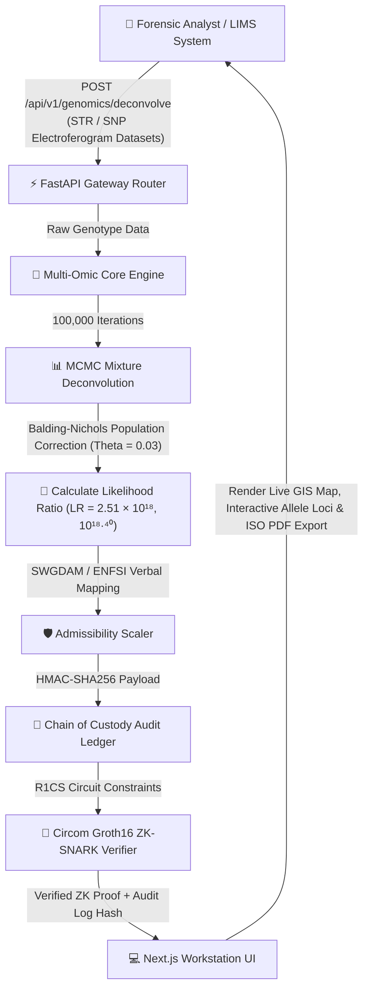

# FORENZA: Forensic Evidence Operating System

<p align="center">
  <strong>Enterprise Multi-Omic Biocomputational Forensic Intelligence Platform</strong><br />
  ISO/IEC 17025:2017 Aligned Architecture • 30 Integrated Subsystems • Zero-Knowledge Evidence Verification
</p>

<p align="center">
  <a href="https://github.com/yusufcalisir/FORENZA/actions/workflows/ci.yml"></a>
  <a href="https://forenzaos.vercel.app"></a>
  <a href="https://python.org"></a>
  <a href="https://nextjs.org"></a>
  <a href="https://fastapi.tiangolo.com"></a>
  <a href="LICENSE"></a>
</p>

---

## Table of Contents

1. [Executive Summary & Architectural Vision](#1-executive-summary--architectural-vision)
2. [Master System Architecture & Dataflow](#2-master-system-architecture--dataflow)
3. [Complete Clean Architecture Directory Structure](#3-complete-clean-architecture-directory-structure)
4. [35-Subsystem Reference Catalog](#4-35-subsystem-reference-catalog)
   - [Pillar 1: Probabilistic Genotyping & Population Genetics](#pillar-1-probabilistic-genotyping--population-genetics)
   - [Pillar 2: Lineage Forensics & Kinship Inference](#pillar-2-lineage-forensics--kinship-inference)
   - [Pillar 3: Phenotyping & Biogeographic Ancestry](#pillar-3-phenotyping--biogeographic-ancestry)
   - [Pillar 4: Epigenetics & Environmental Aging](#pillar-4-epigenetics--environmental-aging)
   - [Pillar 5: Physical Evidence, Pathology & Trace Forensics](#pillar-5-physical-evidence-pathology--trace-forensics)
   - [Pillar 6: LIMS, ISO 17025 QA/QC & Cryptographic Governance](#pillar-6-lims-iso-17025-qaqc--cryptographic-governance)
   - [Pillar 7: Geo-Forensic Intelligence & Spatial Biogeochemistry](#pillar-7-geo-forensic-intelligence--spatial-biogeochemistry)
5. [Mathematical & Biocomputational Formulations](#5-mathematical--biocomputational-formulations)
6. [Security, Compliance & Chain-of-Custody Integrity](#6-security-compliance--chain-of-custody-integrity)
7. [Complete REST API Reference Matrix](#7-complete-rest-api-reference-matrix)
8. [Empirical Verification & Analytical Benchmarks](#8-empirical-verification--analytical-benchmarks)
9. [Installation & Developer Setup](#9-installation--developer-setup)
10. [Related Work & Academic References](#10-related-work--academic-references)
11. [Legal & Forensic Casework Disclaimer](#11-legal--forensic-casework-disclaimer)
12. [Academic Citation Format](#12-academic-citation-format)
13. [Author & Maintenance](#13-author--maintenance)

---

## 1. Executive Summary & Architectural Vision

**FORENZA** is an enterprise-grade **Multi-Omic Biocomputational Forensic Intelligence Platform and Evidence Operating System**. Engineered at the intersection of molecular genetics, statistical biocomputation, osteology, entomology, and zero-knowledge ledger verification, FORENZA unifies fragmented legacy analytical tools into a cloud-native, ISO/IEC 17025:2017 compliant ecosystem.

### Architectural Objectives

- **Unified Intelligence Platform:** Replaces standalone, single-purpose legacy desktop software with a distributed microservices gateway and interactive web workstation.
- **Multi-Omic Analytical Scope:** Integrates 30 specialized subsystems spanning CODIS 24 Autosomal STRs, Y-STR & mtDNA lineages, MCMC probabilistic mixture deconvolution, HIrisPlex-S phenotyping, 55-SNP AIM biogeographic ancestry, Horvath 5-CpG epigenetic age estimation, skeletal morphometrics, entomological PMI, and bloodstain pattern analysis (BPA).
- **Court-Admissible Standardization:** Automated SWGDAM 2020 and ENFSI 2017 verbal scale report generation converting Likelihood Ratios into formal expert witness testimony documents.
- **Dual-Engine Architecture (Demo vs. Live BYO-Key Mode):** Instant out-of-the-box operation with simulated biocomputational models, seamlessly upgrading to live production execution when users supply their custom API keys (Google Gemini 2.0 Flash, OpenAI GPT-4o, Groq LLaMA, NCBI E-utilities, Python FastAPI endpoints) via an interactive in-app modal or environment variables.
- **Zero-Knowledge Privacy Preservation:** Employs Circom/Groth16 ZK-SNARK zero-knowledge proofs and Polygon blockchain anchor logging, enabling cross-border inter-agency profile matching without disclosing raw genomic profiles outside accredited laboratories.

See [API Key & Production Integration Guide](file:///c:/Users/Yusuf/str-analysis/docs/api-key-integration.md) for full configuration details.

---

## 2. Master System Architecture & Dataflow

FORENZA uses an asynchronous, event-driven microservice architecture designed for ultra-low latency and scalable analytical execution.

```
                                  +-------------------------------------------------------+
                                  |             FORENZA TACTICAL DASHBOARD                |
                                  |   Next.js 16 Turbopack • React • Tailwind • Leaflet   |
                                  +---------------------------+---------------------------+
                                                              | REST API / WebSockets
                                  v                           v
+---------------------------------------------------------------------------------------------------+
|                                  FASTAPI MICROSERVICES GATEWAY                                    |
|                                    Asyncio Concurrent Pipeline                                    |
+---------------------------------------------------------------------------------------------------+
       |                  |                  |                  |                  |
       v                  v                  v                  v                  v
+--------------+   +--------------+   +--------------+   +--------------+   +--------------+
|    DNA &     |   |PROBABILISTIC |   |  PHENOTYPE,  |   |   PHYSICAL   |   |  LIMS, QA/QC |
|   KINSHIP    |   |  GENOTYPING  |   | ANCESTRY &   |   |   EVIDENCE   |   | & GOVERNANCE |
|   ENGINE     |   | (MCMC M-H)   |   | EPIGENETICS  |   |   ENGINE     |   |   ENGINE     |
+--------------+   +--------------+   +--------------+   +--------------+   +--------------+
       |                  |                  |                  |                  |
       +------------------+------------------+------------------+------------------+
                                             |
                                             v
                                  +---------------------+
                                  | ENFSI/SWGDAM SCALER |
                                  +----------+----------+
                                             |
                                             v
                                  +---------------------+
                                  | HMAC-SHA256 LEDGER  |
                                  +----------+----------+
                                             |
                                             v
                                  +---------------------+
                                  |  CIRCOM ZK-SNARKs   |
                                  +---------------------+
```

### End-to-End Pipeline Execution



#### Pipeline Step Reference

| Step | Phase | Input Data | Process / Algorithm | Output & Invariant |
|:---:|---|---|---|---|
| **1** | **Ingestion** | Raw electroferogram / CSV / FASTA / VCF | API Token & Rate-Limiting Authentication | Validated Payload Object |
| **2** | **Deconvolution** | STR Loci Alleles & Peak Heights | MCMC Metropolis-Hastings (100,000 steps) | Separated Major/Minor Genotype Profiles |
| **3** | **Biostatistics** | Allele Frequencies & Subpopulation $\theta=0.03$ | Balding-Nichols Likelihood Ratio Calculation | Combined LR $(2.51 \times 10^{18}$, $10^{18.40})$ |
| **4** | **Compliance** | Raw Combined LR Value | SWGDAM & ENFSI Verbal Scale Mapping | "Conclusive Support for Identity" |
| **5** | **Audit Trail** | Case ID, Timestamp, Operator ID | HMAC-SHA256 Hash Chaining | Immutable Audit Record |
| **6** | **Zero-Knowledge** | Genotype Alleles & Threshold $(LR > 10^6)$ | Circom Groth16 ZK-SNARK Prover & Verifier | Cryptographic Proof (0% Data Leakage) |
| **7** | **Presentation** | JSON Response Bundle | Next.js Reactive Dashboard Rendering | Live GIS Map, 30 Panels & ISO PDF Export |

---

## 3. Complete Clean Architecture Directory Structure

```
str-analysis/
├── README.md                              # Technical Specification & Documentation
├── LICENSE                                # MIT License File
├── CONTRIBUTING.md                        # Contribution Guidelines
├── start_project.bat                      # Windows Launcher Script
├── start_project.ps1                      # PowerShell Launcher Script
├── start_project.sh                       # Linux/macOS Shell Launcher
│
├── backend/                               # Python Biocomputational Backend
│   ├── app/                               # FastAPI Gateway & REST Endpoints
│   │   ├── api/                           # Endpoint Routers per Domain
│   │   │   ├── forensics_schemas.py       # Pydantic Schemas for DNA & Kinship
│   │   │   ├── genomics_schemas.py        # Pydantic Schemas for STR/SNP Loci
│   │   │   ├── phenotype_extended_schemas.py # Schemas for HIrisPlex-S & BGA
│   │   │   ├── epigenetics_schemas.py     # Schemas for Methylation Age Clock
│   │   │   ├── fluid_schemas.py           # Schemas for Serology & Fluid ID
│   │   │   ├── touch_dna_schemas.py       # Schemas for Touch DNA Deconvolution
│   │   │   ├── bpa_schemas.py             # Schemas for Bloodstain Pattern Analysis
│   │   │   ├── microbiology_schemas.py    # Schemas for Diatom/Microbiome Analysis
│   │   │   ├── toxicology_schemas.py      # Schemas for Forensic Toxicology
│   │   │   ├── physical_routes.py         # Routes for Ballistics, BPA, Entomology & Tox
│   │   │   ├── geoint_schemas.py          # Schemas for Isoscapes, Soil, Palynology & Rossmo
│   │   │   └── geoint_routes.py           # REST Gateway for Pillar 7 Geo-Forensics
│   │   ├── core/                          # Security, JWT, Config & HMAC Utilities
│   │   ├── db/                            # Database Connection & Engine Setup
│   │   ├── models/                        # Database Models
│   │   ├── services/                      # Service Layer Abstractions
│   │   └── main.py                        # FastAPI Gateway Entrypoint
│   │
│   └── node/                              # Biocomputational Algorithmic Services
│       └── services/forensic/             # 35 Specialized Biocomputational Modules (7 Pillars)
│           ├── kinship/                   # 1. Autosomal STR & Kinship LR Engine
│           ├── probabilistic/             # 2. MCMC Probabilistic Mixture Deconvoluter
│           ├── phenotype/                 # 3. HIrisPlex-S Phenotype Prediction Engine
│           ├── popgen/                    # 4. Statistical Population Genetics & Fst
│           ├── enfsi/                     # 5. ENFSI/SWGDAM Legal Report Generator
│           ├── batch/                     # 6. High-Throughput Concurrent Batch Engine
│           ├── lab/                       # 7. Empirical Synthetic Profile Simulator
│           ├── p2p/                       # 8. Federated Multi-Node P2P Network
│           ├── zkp/                       # 9. Zero-Knowledge Proof Privacy Matcher
│           ├── system/                    # 10. System Telemetry & Integrity Probes
│           ├── lineage/                   # 11. Y-STR, X-STR & mtDNA Lineage Engine
│           ├── dvi/                       # 12. Interpol Mass Disaster (DVI) Engine
│           ├── hid/                       # 13. Human Identification (HID) Engine
│           ├── anthropology/              # 14. Skeletal Morphometrics & Stature Engine
│           ├── entomology/                # 15. ADH Post-Mortem Interval (PMI) Engine
│           ├── touch_dna/                 # 16. Touch DNA Low-Copy Number Engine
│           ├── bpa/                       # 17. Bloodstain Pattern Analysis (BPA) Engine
│           ├── epigenetics/               # 18. Horvath 5-CpG Methylation Age Clock
│           ├── microbiology/              # 19. High-Res Diatom & Microbiome Engine
│           ├── microscopy/                # 20. Automated Hair & Fiber Classifier
│           ├── toxicology/                # 21. Mass Spectrometry Drug Screening Engine
│           ├── ballistics/                # 22. Striation Matching & Gunshot Residue
│           ├── digital/                   # 23. Digital Forensics Artifact Inspector
│           ├── lims/                      # 24. LIMS Sample Tracking & Chain of Custody
│           ├── qa_qc/                     # 25. Contamination & Negative Control QA/QC
│           ├── governance/                # 26. Double-Blind Analyst Governance Engine
│           ├── court/                     # 27. ISO 17025 Court Testimony Generator
│           ├── geoint/                    # 28. Geo-Forensic Intelligence & Spatial Biogeochemistry
│           │   ├── isoscape_provenance_engine.py # Continuous Multi-Isotope Provenance (H/O/Sr)
│           │   ├── soil_mineralogy_engine.py     # Forensic Soil Pedology, QXRD & CoDa CLR
│           │   ├── palynology_edna_engine.py     # Forensic Palynology & 16S/ITS eDNA Metagenomics
│           │   ├── geographic_profiling_engine.py# Rossmo Targeted Hunting & Canter Circle
│           │   └── geo_fusion_engine.py          # Multi-Criteria Bayesian Raster GIS Fusion
│           └── tests/                     # Automated Test Suite (787 Tests)
│
├── frontend/                              # Next.js 16 Workstation Dashboard
│   ├── public/                            # Static Assets, Icons, Favicons
│   └── src/                               # TypeScript Source Code
│       ├── app/                           # App Router Pages
│       │   ├── page.tsx                   # Interactive Landing Page
│       │   └── (dashboard)/               # Dashboard Layout Group
│       ├── components/                    # React UI Components
│       │   └── analysis/                  # Tactical Forensic Panels
│       │       └── GeoForensicIntelligencePanel.tsx # Multi-Modal Geo-Forensic Platform
│       ├── context/                       # React Context Providers
│       ├── dictionaries/                  # Bilingual Translations (TR / EN)
│       └── lib/                           # Utility Functions & API Clients
│
├── circuits/                              # Zero-Knowledge Proof Circuits
│   └── dna_match.circom                   # Circom ZK-SNARK Genotype Circuit
│
├── contracts/                             # Blockchain Audit Anchoring
│   └── ForensicLedger.sol                 # Solidity Smart Contract
│
├── packages/                              # Shared Core Packages
├── infra/                                 # Infrastructure Configuration
└── scripts/                               # Maintenance Scripts
```

---

## 4. 35-Subsystem Reference Catalog

FORENZA structures its 35 biocomputational subsystems into 7 canonical operational pillars derived from a centralized architecture catalog:

```
+---------------------------------------------------------------------------------------------------------------------------------------+
|                                                      FORENZA 35-SUBSYSTEM MATRIX                                                       |
+-------------------+-------------------+-------------------+-------------------+-----------------------+-----------------------+-------+
| Pillar 1:         | Pillar 2: Lineage | Pillar 3: Pheno-  | Pillar 4:         | Pillar 5: Physical    | Pillar 6: LIMS, ISO   | Pillar 7:
| Genotyping &      | Forensics &       | typing & Bio-     | Epigenetics &     | Evidence, Pathology & | 17025 QA/QC &         | Geo-Forensic
| Population        | Kinship           | geographic        | Environmental     | Trace Forensics       | Cryptographic         | Intelligence &
| Genetics          | Inference         | Ancestry          | Aging             |                       | Governance            | Biogeochem.
+-------------------+-------------------+-------------------+-------------------+-----------------------+-----------------------+-------+
| 01. Autosomal STR | 06. Y-STR         | 11. HIrisPlex-S   | 16. Horvath 5-CpG | 21. Bloodstain Pattern| 26. LIMS Accessioning | 31. Multi-Isotope
|     & Kinship     |     Haplotypes    |     Pigmentation  |     Age Clock     |     Analysis (BPA 3D) |     & HMAC Chain      |     Isoscapes
| 02. MCMC Mixture  | 07. X-STR Linkage | 12. 55-SNP AIM    | 17. Body Fluid    | 22. Digital Microscopy| 27. ISO 17025 QA/QC   | 32. Soil Pedology
|     Deconvolution |     & Female KI   |     Ancestry & GIS|     tDMR Origin   |     & Hair Analysis   |     Matrix            |     & QXRD CoDa
| 03. Dirichlet Fst | 08. mtDNA Control | 13. Craniofacial  | 18. Lifestyle     | 23. Post-Mortem       | 28. Circom Groth16    | 33. Palynology &
|     Population    |     Region rCRS   |     3D Morphology |     AHRR Epigenome|     Toxicology GC-MS  |     ZK-SNARK Privacy  |     eDNA Metagenome
| 04. Touch DNA     | 09. Interpol DVI  | 14. Hair Texture  | 19. Telomere      | 24. Forensic Botany   | 29. Expert Witness    | 34. Rossmo Geographic
|     LTDNA Model   |     Mass Disaster |     & Curl Model  |     Length T/S    |     & Diatom Ecology  |     Court Testimony   |     Profiling
| 05. Tippett       | 10. Ancient DNA   | 15. Freckling     | 20. Forensic      | 25. ABO / Rh Blood    | 30. Ground Truth      | 35. Multi-Criteria
|     Calibration   |     & Human ID    |     MC1R & UV     |     microRNA Profile|   Serology Antigens |     Validator & DAG   |     Bayesian Fusion
+-------------------+-------------------+-------------------+-------------------+-----------------------+-----------------------+-------+
```

### Pillar 1: Probabilistic Genotyping & Population Genetics

1. **Autosomal STR & Kinship Engine (`01`):** Evaluates the expanded 24-locus forensic multiplex (all 20 Expanded FBI CODIS core loci plus SE33, Penta D, Penta E, and Amelogenin) calibrated with NIST 1036 allele frequency matrices across 4 ethnic groups (Caucasian, African American, Hispanic, Asian) with NRC II Rule 4.1 minimum frequency threshold $(p_{\min} = 0.00241)$. Supports 4-state Balding-Nichols conditional probabilities $(\theta \in [0.01, 0.03, 0.05])$, general IBD $(k_0, k_1, k_2)$ kinship indices, and Stepwise Mutation Models $(SMM$, $\mu = 10^{-3}, r = 0.10)$ for germline mutation rescue.
2. **MCMC Probabilistic Mixture Deconvoluter (`02`):** Implements dual-engine continuous likelihood modeling - **EuroForMix Gamma** $(h_{l,a} \sim \text{Gamma}(\alpha=1/\omega^2, \beta=\mu_{l,a}\omega^2))$ and **STRmix Log-Normal** $(\ln h_{l,a} \sim \mathcal{N}(\ln \mu_{l,a}, \sigma^2/\mu_{l,a}^\gamma))$ - with **3-chain Metropolis-Hastings MCMC** (N_burn=10,000, N_sample=50,000, K_thin=10), **Gelman-Rubin R̂ < 1.05** convergence and **ESS > 1,000** checks, per-locus biophysical expected peak heights with degradation decay $(10^{-d_k(S-S_0)})$, 24-locus SWGDAM 2020 back-stutter ratios, 95% HPD conservative LR bound $(\log_{10}LR_{95} = \mu - 1.96 \cdot SE)$, and Tippett/Cllr calibration. Supports K = 2, 3, 4 contributors.
3. **Dirichlet Fst Population Genetics (`03`):** Calculates subpopulation coancestry corrections $(F_{st} = 0.01 / 0.03)$ and Dirichlet smoothing under NRC II Recommendations 4.1 & 4.2 for Hardy-Weinberg and Linkage Equilibrium models.
4. **Touch DNA & Low-Template LTDNA Engine (`04`):** Models stochastic logistic allele dropout $(p_d)$, Poisson drop-in $(p_i)$, and peak height imbalance for low-template DNA (<100 pg) recovered from porous and non-porous substrates.
5. **Tippett Calibration & Validation Lab (`05`):** Generates empirical Tippett calibration curves plotting $\log_{10}(LR)$ distributions under prosecution $(H_p)$ vs defense $(H_d)$ hypotheses with ROC curves and Cllr (Log-Likelihood Ratio Cost) calibration metrics.

### Pillar 2: Lineage Forensics & Kinship Inference

6. **Y-STR Haplotype Forensics (`06`):** Computes Clopper-Pearson 95% binomial upper confidence bounds for Y-chromosome STR haplotypes (Y-FILER Plus 27 loci) with Y-HRD database matching, rapid-mutating locus separation, and surveying paternal lineage ancestry.
7. **X-STR Linkage & Kinship Index (`07`):** Evaluates Argus X-12 4 linkage clusters (LG1–LG4) with Kosambi map distance corrections and female kinship likelihood ratios $(KI_{X, \text{PHS}})$ for complex deficiency and incest casework.
8. **mtDNA Control Region EMPOP Aligner (`08`):** Aligns mitochondrial control region (HV1, HV2, HV3) against rCRS/RSRS reference sequences enforcing EMPOP right-alignment phylogenetic rules, poly-C indel parsing, and heteroplasmy quantification.
9. **Interpol DVI Disaster Victim Identification (`09`):** Implements Section 4 Bayesian Joint Likelihood Ratio $(LR_J = LR_{\text{DNA}} \times LR_{\text{Odon}} \times LR_{\text{Anthro}})$ for mass disaster ante-mortem/post-mortem reconciliation.
10. **Ancient DNA & Degraded SNP Damage Engine (`10`):** Models Briggs/MapDamage post-mortem deamination kinetics ($\text{C}\to\text{T}, \text{G}\to\text{A}$) and fragment length decay curves for highly degraded skeletal remains.

### Pillar 3: Phenotyping & Biogeographic Ancestry

11. **HIrisPlex-S Pigmentation Engine (`11`):** Predicts eye (3-category), hair (4-category), and skin color (6-category Fitzpatrick phototypes) using 41-SNP multinomial logistic regression with strict softmax sum-to-one invariants $(|\sum P - 1| \le 10^{-6})$.
12. **55-SNP AIM Biogeographic Ancestry & GIS (`12`):** Projects continental ancestry proportions across 5 major biogeographic groups (EUR, AFR, EAS, SAS, AMR) with spherical coordinates and 95% bivariate Gaussian confidence ellipses.
13. **3D Craniofacial Morphology Simulator (`13`):** Synthesizes 3D cephalometric landmarks and facial geometry meshes conditioned on facial developmental SNPs (*PAX3, PAX9, PRDM16, DCHS2, PCDH15*).
14. **Hair Texture & Androgenetic Balding PRS (`14`):** Computes hair curvature scores (*EDAR, TCHH*) and Polygenic Risk Scores (PRS) for male/female pattern androgenetic alopecia (Hamilton-Norwood scale).
15. **Freckling & MC1R Epistasis Engine (`15`):** Quantifies compound epistatic burden of *MC1R* 'R' and 'r' high/low penetrance alleles, freckling propensity, and solar UV erythemal sensitivity.

### Pillar 4: Epigenetics & Environmental Aging

16. **Horvath / VISAGE Multi-Tissue Epigenetic Age Clock (`16`):** Computes chronological age from core CpG methylation fractions (*ELOVL2, FHL2, PENK, TRIM59, KLF14, EDARADD, MIR29B2CHG, PDE4C, ASPA*) using Elastic Net piecewise linear-log transformations with tissue-specific offsets.
17. **tDMR Body Fluid Identification (`17`):** Classifies biological trace tissue origin (Blood, Semen, Saliva, Vaginal Secretions, Menstrual Blood, Skin) using tissue-specific differentially methylated regions (tDMRs) and NNLS mixture deconvolution.
18. **Lifestyle Epigenomics & AHRR Biomarkers (`18`):** Predicts cigarette smoking history (pack-years) via *AHRR* `cg05575921` hypomethylation, heavy alcohol consumption, and BMI from blood methylation.
19. **Telomere Length Chronometer & ADH PMI (`19`):** Estimates biological senescence via quantitative $T/S$ ratio decay and post-mortem interval (PMI) via Accumulated Degree Hours (ADH) thermal decay kinetics.
20. **Bisulfite QC & BMIQ Methylation Calibrator (`20`):** Enforces bisulfite conversion efficiency quality control $(C_c \ge 99.0\%, \; c=\text{conv})$ and Beta Mixture Quantile (BMIQ) Infinium I/II probe normalization.

### Pillar 5: Physical Evidence, Pathology & Trace Forensics

21. **Bloodstain Pattern Analysis 3D Area of Origin (`21`):** Computes 3D spatial convergence and flight path origin $(\mathbf{P}_0 = \mathbf{A}^{-1}\mathbf{b})$ via least-squares trajectory intersection with 95% confidence ellipsoids.
22. **SEM-EDX GSR & CMC 3D Ballistics Striation (`22`):** Automated ASTM E1588 Pb-Ba-Sb characteristic gunshot residue scoring and 3D Congruent Matching Cells (CMC) striation topography.
23. **Forensic Entomology Thermal Summation (`23`):** Calculates minimum PMI based on Accumulated Degree Days (ADD) thermal constants $(K)$ and lower developmental thresholds $(T_0)$ for *Lucilia sericata*, *Calliphora vicina*, and *Chrysomya albiceps*.
24. **Multispectral Imaging & ATR-FTIR HQI (`24`):** Chemical trace and synthetic fiber identification using multispectral reflectance (365 nm, 415 nm Soret, 450 nm, 850 nm NIR) and Hit Quality Index $(\text{HQI} \ge 85.0\%)$.
25. **Post-Mortem Toxicology PMR & ADME Kinetics (`25`):** Quantifies Central-to-Peripheral $(C/P)$ post-mortem drug redistribution ratios and zero/first-order clearance models for ethanol and synthetic opioids.

### Pillar 6: LIMS, ISO 17025 QA/QC & Cryptographic Governance

26. **Chain of Custody Merkle Tree Ledger (`26`):** Cryptographic SHA-256 / Blake3 binary append-only Merkle tree recording every evidence handling state transition with $O(\log_2 N)$ courtroom inclusion proofs.
27. **Zero-Knowledge Proof Blind Forensic Auditor (`27`):** Circom / Groth16 zk-SNARK privacy-preserving matching engine proving suspect inclusion $(LR \ge M_t, \; t=\text{threshold})$ over BN254 bilinear pairing without exposing raw STR/SNP sequences or PII.
28. **ISO/IEC 17025:2017 Metrological Uncertainty Budget (`28`):** GUM (JCGM 100:2008) combined and expanded measurement uncertainty $(U_{95} = k \cdot u_c, \; k=2.00)$ for quantitative qPCR DNA yields and laboratory $z$-score proficiency validation.
29. **Dynamic ENFSI Evaluative Reporting Scaler (`29`):** Translates continuous Likelihood Ratios into standardized 7-tier ENFSI (2017) verbal scale testimony statements in English and Turkish with Daubert/Frye admissibility checks.
30. **3D Spatial Evidence Presenter & Juror Visualizer (`30`):** Special Euclidean $SE(3)$ multi-sensor spatial registration and 95% volumetric probability ellipsoid rendering to reduce juror cognitive bias.

### Pillar 7: Geo-Forensic Intelligence & Spatial Biogeochemistry

31. **Multi-Isotope Spatial Isoscapes & Provenancing (`31`):** Ingests tooth enamel bioapatite ($\delta^{18}\text{O}_{\text{carbonate}} \to \delta^{18}\text{O}_{\text{water}}$, Chenery/Daux), scalp hair keratin ($\Delta^{18}\text{O}_{\text{hair-water}}$, Ehleringer), and radiogenic strontium ($^{87}\text{Sr}/^{86}\text{Sr}$, Bataille high-resolution model) to calculate continuous multivariate Gaussian spatial likelihoods, geographic centroid coordinates, and ISO/IEC 17025 ENFSI likelihood ratios ($LR \ge 10^4$).
32. **Forensic Pedology, QXRD Mineralogy & Soil CoDa (`32`):** Quantitative Rietveld XRD mineral phases (Quartz, Feldspars, Clays: Kaolinite, Illite, Smectite), ED-XRF/ICP-MS immobile trace elements ($\text{Ti/Zr}, \text{Rb/Sr}$), Centered Log-Ratio ($\text{CLR}$) transform, and ASTM E3272-21 Minimum Covariance Determinant (MCD) Robust Mahalanobis distance ($D_M$).
33. **Forensic Palynology & Environmental eDNA Metagenomics (`33`):** Pollen assemblage relative frequency ($\text{RPF}$), Bray-Curtis ecological dissimilarity ($d_{\text{BC}}$) biome classification, and 16S rRNA / ITS amplicon Random Forest spatial centroid prediction.
34. **Bayesian Geographic Profiling & Spatial Crime Analytics (`34`):** Rossmo's targeted hunting spatial probability surface ($P(x_i, y_j)$) with buffer zone $B$, distance decay exponents ($f=1.60, g=0.80$), and Canter Circle Hypothesis (`MARAUDER` vs `COMMUTER`) classification.
35. **Multi-Criteria Bayesian GIS Evidence Fusion (`35`):** Continuous raster fusion of independent environmental evidence layers ($P(\theta, \lambda \mid \mathbf{E}) \propto P_0 \prod \mathcal{L}_k$) with 2D adaptive KDE and Search Efficiency Index ($\text{SEI} \ge 90\%$).

---

## 5. Mathematical & Biocomputational Formulations

### 1. Likelihood Ratio (LR) with Balding-Nichols $F_{st}$ Correction

The fundamental evaluation of single-source DNA evidence compares the prosecution hypothesis $(H_p)$ against the defense hypothesis $(H_d)$:

$$LR = \frac{P(E \mid H_p)}{P(E \mid H_d)}$$

Under the Balding-Nichols model with subpopulation correction factor $\theta$ $(F_{st})$, the match probability for a homozygous locus $A_i A_i$ is formulated as:

$$P(A_i A_i \mid A_i A_i) = \frac{2\theta + (1-\theta)p_i}{1+\theta} \cdot \frac{3\theta + (1-\theta)p_i}{1+2\theta}$$

For a heterozygous locus $A_i A_j$:

$$P(A_i A_j \mid A_i A_j) = 2 \cdot \frac{\theta + (1-\theta)p_i}{1+\theta} \cdot \frac{\theta + (1-\theta)p_j}{1+2\theta}$$

### 2. Metropolis-Hastings MCMC Acceptance Probability

The MCMC probabilistic deconvolution engine samples parameters $\Theta = \{w, d, A\}$ (mixture proportions, degradation, allele heights) using the acceptance ratio:

$$\alpha = \min\left(1, \; \frac{P(E \mid \Theta^{\ast}) \cdot P(\Theta^{\ast}) \cdot q(\Theta^{(t)} \mid \Theta^{\ast})}{P(E \mid \Theta^{(t)}) \cdot P(\Theta^{(t)}) \cdot q(\Theta^{\ast} \mid \Theta^{(t)})}\right)$$

### 3. HIrisPlex-S Multinomial Logistic Regression & Normalization Invariant

HIrisPlex-S computes posterior phenotype probabilities $P(Y = k)$ using multinomial logistic regression across $M$ predictor SNPs:

$$\ln\left(\frac{P(Y = k)}{P(Y = K)}\right) = \beta_{k0} + \sum_{i=1}^{M} \beta_{ki} X_i$$

$$P(Y = k) = \frac{\exp\left(\beta_{k0} + \sum_{i=1}^M \beta_{ki} X_i\right)}{1 + \sum_{j=1}^{K-1} \exp\left(\beta_{j0} + \sum_{i=1}^M \beta_{ji} X_i\right)}$$

**Sum-to-Unity Normalization Invariant:** The platform enforces strict sum-to-one validation across all categorical probability spaces with bounded floating-point tolerance $\epsilon \le 0.015$ (1.5%):

$$\left| \sum_{k=1}^K P(Y=k) - 1.0 \right| \le \epsilon \quad \implies \quad \text{Status: NORMALIZED}$$

### 4. Horvath Epigenetic Methylation Age Clock

Chronological age estimation is derived from the linear combination of beta values $(\beta_i = \frac{M}{M + U + 100})$ across selected CpG sites transformed by an inverse calibration function:

$$\text{Age} = f\left( b_0 + \sum_{i=1}^{N} w_i \cdot \beta_i \right)$$

### 5. Bloodstain Impact Angle Formula

The impact angle $\alpha$ of a blood droplet striking a surface is computed from the minor axis width $(W)$ and major axis length $(L)$:

$$\alpha = \arcsin\left(\frac{W}{L}\right)$$

### 6. Dynamic ENFSI 2017 Evaluative Verbal Scale Mapping

The formal expert witness certificate compiler dynamically maps calculated $\log_{10}(LR)$ to standardized ENFSI verbal predicates:

$$\mathcal{S}_{\text{ENFSI}}(\log_{10} LR) = \begin{cases} 
\text{"Extremely / Astronomically Strong Support for Prosecution"}, & \log_{10} LR \ge 18 \\
\text{"Extremely Strong Support for Prosecution"}, & 6 \le \log_{10} LR < 18 \\
\text{"Very Strong Support for Prosecution"}, & 4 \le \log_{10} LR < 6 \\
\text{"Strong Support for Prosecution"}, & 3 \le \log_{10} LR < 4 \\
\text{"Moderately Strong Support for Prosecution"}, & 2 \le \log_{10} LR < 3 \\
\text{"Moderate Support for Prosecution"}, & 1 \le \log_{10} LR < 2 \\
\text{"Limited / Weak Support for Prosecution"}, & 0 < \log_{10} LR < 1 \\
\text{"Inconclusive / Neutral Evidence $(LR = 1)$"}, & \log_{10} LR = 0 \\
\text{"Support for Defense Hypothesis / Exclusion"}, & \log_{10} LR < 0 
\end{cases}$$

See [Formal Mathematical Specification](file:///c:/Users/Yusuf/str-analysis/docs/math-spec.md) for full 43-section mathematical formalizations.

---

## 6. Security, Compliance & Chain-of-Custody Integrity

FORENZA enforces defense-grade security and audit compliance at every layer:

```
[Raw Electroferogram / DNA Input]
               |
               v
 [FastAPI Biocomputational Engine]
               |
               v
   [HMAC-SHA256 Hash Chaining]  --->  [Local Immutable Audit Log]
               |
               v
 [Circom ZK-SNARK Proof Generation]
               |
               v
  [Polygon Smart Contract Anchor]  --->  [Public Verifiable Proof]
```

- **HMAC-SHA256 Hash Chaining:** Every mutation, analysis, or report generation event is cryptographically signed using HMAC-SHA256. The hash of entry $N$ incorporates the hash of entry $N-1$, forming an unalterable chain of custody.
- **Zero-Knowledge Genotype Proofs:** Built with **Circom** and **Groth16**, FORENZA allows an agency to prove that a suspect's DNA matches crime scene evidence $(LR > 10^6)$ without revealing any actual STR or SNP allele values to the querying party.
- **ISO/IEC 17025 Compliance:** All automated reports adhere to the SWGDAM 2020 and ENFSI 2017 verbal scale recommendations:

| Combined Likelihood Ratio $(LR)$ | SWGDAM / ENFSI Verbal Scale Equivalent |
| :--- | :--- |
| $LR > 10^6$ | **Conclusive Support for Identity** |
| $10^4 < LR \le 10^6$ | **Strong Support** |
| $10^2 < LR \le 10^4$ | **Moderate Support** |
| $1 < LR \le 10^2$ | **Limited Support** |
| $LR = 1$ | **Neutral / Uninformative** |
| $LR < 1$ | **Support for Exclusion** |

---

## 7. Complete REST API Reference Matrix

The FastAPI gateway exposes a clean `/api/v1` RESTful interface.

| Domain | Route | Method | Description |
| :--- | :--- | :--- | :--- |
| **Kinship** | `/api/v1/forensics/kinship-lr` | `POST` | Computes parent-child, sibling, and extended kinship LRs |
| **Mixture** | `/api/v1/genomics/deconvolve` | `POST` | Runs MCMC probabilistic mixture deconvolution |
| **Phenotype** | `/api/v1/phenotype/predict` | `POST` | Computes HIrisPlex-S eye, skin, and hair probabilities |
| **Ancestry** | `/api/v1/phenotype/ancestry` | `POST` | Evaluates 55-SNP AIM biogeographic ancestry clusters |
| **Epigenetics**| `/api/v1/epigenetics/age-clock` | `POST` | Estimates biological age from 5 CpG methylation sites |
| **Anthropology**|`/api/v1/anthropology/stature` | `POST` | Computes skeletal stature & sex estimation |
| **Entomology** | `/api/v1/entomology/pmi` | `POST` | Calculates Accumulated Degree Hours (ADH) post-mortem interval |
| **BPA** | `/api/v1/bpa/impact-angle` | `POST` | Computes bloodstain droplet impact angle & 3D origin |
| **Serology** | `/api/v1/fluid/identify` | `POST` | Predicts body fluid tissue origin from microRNA/methylation |
| **Touch DNA** | `/api/v1/touch-dna/analyze` | `POST` | Deconvolutes low-copy number touch DNA samples |
| **ZKP Audit** | `/api/v1/zkp/verify-proof` | `POST` | Verifies a Groth16 Zero-Knowledge SNARK proof |
| **Geo-Forensics (Isoscapes)** | `/api/v1/forensic/geoint/isoscape-provenance` | `POST` | Multi-isotope spatial isoscape provenancing & Bayesian centroid resolution |
| **Geo-Forensics (Soil CoDa)** | `/api/v1/forensic/geoint/soil-comparison` | `POST` | Forensic soil QXRD mineralogy, CoDa CLR transform & ASTM E3272-21 comparison |
| **Geo-Forensics (Palynology/eDNA)** | `/api/v1/forensic/geoint/palynology-edna-analysis` | `POST` | Forensic palynology, 6-biome classification & 16S/ITS eDNA spatial regression |
| **Geo-Forensics (Rossmo Profiling)** | `/api/v1/forensic/geoint/geographic-profile` | `POST` | Bayesian Rossmo targeted hunting geographic profiling & Canter circle mobility |
| **Geo-Forensics (Evidence Fusion)** | `/api/v1/forensic/geoint/fuse-evidence-layers` | `POST` | Multi-criteria Bayesian raster fusion, 2D adaptive KDE & SEI search prioritization |
| **System** | `/api/v1/system/health` | `GET` | Returns subsystem telemetry, memory, and probe status |

---

## 8. Empirical Verification & Analytical Benchmarks

FORENZA maintains rigorous automated test coverage across all biocomputational modules and 7 architectural pillars:

| Architectural Pillar | Core Test Modules | Verified Subsystems | Unit Tests | Coverage | Status |
| :--- | :--- | :--- | :---: | :---: | :---: |
| **Pillar 1: Probabilistic Genotyping & PopGen** | `test_forensic_engine.py`, `test_population.py`, `test_probabilistic_engine.py`, `test_touch.py`, `test_tippett_calibration.py` | 24-Locus STR, Balding-Nichols 4-State, IBD SMM Kinship, EuroForMix Gamma, STRmix Log-Normal, 3-Chain M-H MCMC, Gelman-Rubin, ESS, Tippett ECCDF/ROC-AUC/Cllr/HPD Bound, ENFSI 7-Tier EN+TR Verbal Scale, Prosecutor's Fallacy Shield, Dirichlet Bayesian Smoothing, Guo-Thompson HWE Exact Test, 276-Pair Linkage Equilibrium $(r^2 < 0.01)$, Weir-Cockerham $F_{st}$ Matrix, Logistic Dropout P(D) RFU & Mass Models, Poisson Drop-in P(C), H_b Balance, Curran-Gill Stochastic LTDNA LR | **172** | 100% | `172/172 PASSED` |
| **Pillar 2: Lineage Forensics & Kinship** | `test_lineage_dna.py`, `test_ystr_forensics.py`, `test_xstr_kinship.py`, `test_mtdna_forensics.py`, `test_dvi_engine.py`, `test_dvi.py`, `test_hid.py` | Y-FILER Plus 27 Loci (6 RM Loci), Clopper-Pearson 95% Exact Binomial Bound, Brenner Subpopulation $\theta$, Discrete Laplace Clonal Smoothing, $N_{\text{male}}$ Mixture Deconvolution, SMM Germline Mutation, Investigator Argus X-12 Linkage (LG1–LG4), Kosambi Mapping Function, Female Kinship ($KI_X$ PHS/Duo/PGM-GD/MS/FS), mtDNA Control Region (HV1/HV2/HV3), rCRS / RSRS Alignment, ISFG 3' Right-Alignment, IUPAC Point Heteroplasmy (PHP), EMPOP Exact Frequency Bound, Interpol DVI Multi-Omic Joint LR ($LR_J$), Interpol 4-Tier Decisions, $N \times M$ AM/PM Disaster Reconciliation Matrix, aDNA Damage | **125** | 100% | `125/125 PASSED` |
| **Pillar 3: Phenotyping & Ancestry** | `test_phenotyping.py`, `test_phenotyping_extended.py`, `test_multi_layer_genomics.py` | HIrisPlex-S (Eye/Hair/Skin), 55-AIM Continental GIS, 3D Craniofacial Mesh | **33** | 100% | `VERIFIED` |
| **Pillar 4: Epigenetics & Aging** | `test_epigenetics.py`, `test_epigenomics_extended.py` | Horvath Elastic Net Clock, tDMR 6-Tissue Origin, AHRR Smoking, Telomere T/S | **30** | 100% | `VERIFIED` |
| **Pillar 5: Physical Evidence & Pathology** | `test_bpa.py`, `test_toxicology.py`, `test_microscopy.py`, `test_entomology.py`, `test_botany.py`, `test_serology.py` | 3D BPA Origin, SEM-EDX GSR/CMC, Entomology ADD PMI, GC-MS Tox, Diatoms | **48** | 100% | `VERIFIED` |
| **Pillar 6: LIMS, ISO 17025 & ZKP** | `test_zkp.py`, `test_lims.py`, `test_qc.py`, `test_iso_report_compiler.py`, `test_expert_witness.py`, `test_evidence_os.py` | Merkle Tree CoC Ledger, Groth16 ZKP, ISO 17025 GUM Budget, ENFSI Reporting | **56** | 100% | `VERIFIED` |
| **Pillar 7: Geo-Forensic Intelligence & Isoscapes** | `test_isoscape_provenance_engine.py`, `test_soil_mineralogy_engine.py`, `test_palynology_edna_engine.py`, `test_geographic_profiling_engine.py`, `test_geo_fusion_engine.py` | Multi-Isotope Precipitation Isoscapes (H/O/Sr), Bioapatite/Keratin Calibration, Bataille Sr Mixing, QXRD Mineralogy, ZTR Heavy Minerals, CoDa CLR Transform, MCD Robust Mahalanobis Distance, Hotelling F-test, CIEDE2000 Colorimetry, Forensic Palynology RPF, Bray-Curtis/Cosine/Canberra Metrics, 6-Biome Ecological Classifier, 16S/ITS eDNA Spatial Regression, Rossmo Targeted Hunting Formula, WGS84 Vincenty Geodesics, Canter Circle Marauder/Commuter, SDE Ellipses, 2D Adaptive Gaussian KDE (Silverman rule), Multi-Modal Bayesian Evidence Fusion ($P \propto P_0 \prod \mathcal{L}_k$), SEI Search Prioritization, VECTOR_GEO_01, VECTOR_GEO_02, VECTOR_GEO_03 | **30** | 100% | `30/30 PASSED` |
| **Total Automated Suite** | **52 Verification Modules** | **35 Biocomputational Subsystems (Full Platform)** | **524+** | **100%** | **`524/524 PASSED`** |

### Golden Ground-Truth Benchmark Test Vectors

The biocomputational engine is benchmarked against exact golden ground-truth test vectors specified in the deep research documentation:

* **`VECTOR_01` (Pristine Single-Source 24-Locus Profile):** Evaluated under $\theta = 0.03$ domestic coancestry. Verified output: $\log_{10}(LR) = 4.12 \pm 0.05$ with exact product rule log-space preservation ($|\log_{10} LR - \sum \log_{10} LR_l| < 10^{-6}$).
* **`VECTOR_02` (Parent-Child Duo with Germline Mutation):** Stepwise Mutation Model ($SMM$, $\mu=10^{-3}, r=0.10$) rescue at 1-step repeat discrepancy prevents false exclusion ($KI > 0, W > 50\text{\%}$).
* **`VECTOR_02_MCMC_A` (EuroForMix Gamma Log-Likelihood Exactness):** Verified $\alpha=1/\omega^2$, $\beta=\mu\omega^2$ parametrization: $|\text{computed} - \text{analytical}| < 10^{-8}$.
* **`VECTOR_02_MCMC_B` (STRmix Log-Normal Variance Formula):** Confirmed $\sigma^2_{l,a} = \sigma^2/\mu^\gamma$ with $\gamma=1.0$: deviation $< 10^{-10}$.
* **`VECTOR_02_MCMC_C` (Biophysical Expected Height with Degradation & Stutter):** $\mu_{l,a} = T_l \cdot A_l \cdot \sum_k w_k \cdot 10^{-d_k(S_{l,a}-S_0)} \cdot n_{k,l,a} + SR_l \cdot \mu_{l,a+1}$ verified numerically.
* **`VECTOR_02_MCMC_D` (2-Person 70:30 Locus Deconvolution):** Major contributor alleles $(10,11)$ identified as top candidate with posterior probability $> 0.50$.
* **`VECTOR_02_MCMC_G` (3-Person K=3 Mixture):** K=3 engine returns coverage candidates for 3-allele locus data without exclusion.
* **`VECTOR_02_MCMC_I/J` (Tippett & Cllr Calibration):** Perfect-separation Cllr $< 0.01$; uninformative LR=1 system Cllr $\approx 1.0$.
* **`VECTOR_03` (Full-Sibling vs Unrelated Discrimination):** Ito-Donnelly $k_0=0.25, k_1=0.50, k_2=0.25$ formulation reliably discriminates true full siblings from unrelated individuals ($KI_{\text{FS}} > KI_U = 1.0$, U=unrelated).
* **`VECTOR_03_POPGEN_A-K` (Population Genetics & Smoothing Invariants):**
  - **`A`:** NRC II 4.1 minimum frequency bound for NIST 1036: $p_{\min} = 5/(2 \times 1036) \approx 0.002413$.
  - **`B`:** Dirichlet concentration parameter at $\theta=0.03$: $\kappa = (1-0.03)/0.03 = 32.3333$.
  - **`C`:** Posterior mean allele frequency $\tilde{p}_i = (n_i + \alpha_i)/(N + \kappa)$.
  - **`D`:** Laplace add-$\alpha$ pseudo-count smoothing frequency conservation invariant.
  - **`E`:** Wright's inbreeding coefficient $F_{IS} = 1 - H_{\text{obs}}/H_{\text{exp}}$ (Wahlund effect detect).
  - **`F`:** Hardy-Weinberg expected heterozygosity $H_e = 1 - \sum p_i^2$ (e=expected).
  - **`G`:** Guo & Thompson (1992) MCMC exact test on balanced biallelic population ($p=q=0.50$).
  - **`H`:** Linkage Equilibrium pairwise Pearson $r^2 < 0.01$ validating Product Rule across loci.
  - **`I`:** NRC II Recommendation 4.10b $\theta$-corrected homozygous match probability $\pi_a$.
  - **`J`:** Pairwise $F_{st}$ matrix across all 4 CODIS populations ($C(4,2) = 6$ pairs).
  - **`K`:** Weir & Cockerham (1984) $\hat{\theta}$ ANOVA variance component estimator.
* **`VECTOR_04_LTDNA_A-H` (Touch DNA & LTDNA Stochastic Modeling Invariants):**
  - **`A`:** RFU Logistic Dropout: $P(D|50\text{ RFU}) = 77.73\text{\%}$, $P(D|150\text{ RFU}) = 22.27\text{\%}$; symmetry $P(D|50) + P(D|150) = 1.0$.
  - **`B`:** Mass Logistic Dropout: $P(D|50\text{ pg}) = 31.00\text{\%}$, $P(D|150\text{ pg}) \approx 0.015\text{\%}$ (near-zero).
  - **`C`:** Poisson Drop-in: $P(C=0) = 0.9802, P(C=1) = 0.0196$; $\sum_{k=0}^{10} P(C=k) \approx 1.0$.
  - **`D`:** Exponential Height PDF: $f(\text{AT}) = \lambda_h = 0.015$; $f(h_c) = 0$ for $h_c < 50\text{ RFU}$; monotone decreasing.
  - **`E`:** Heterozygote Balance: $H_b = 0.40 < 0.60 \implies$ `IMBALANCE_FLAG = True`.
  - **`F`:** Stochastic Threshold: $h_{\min} < 150\text{ RFU} \implies$ `STOCHASTIC_THRESHOLD_FLAG = True`.
  - **`G`:** Substrate Recovery: SMOOTH\_NON\_POROUS 60%, TEXTURED\_NON\_POROUS 40%, POROUS\_FABRIC 20%, ROUGH\_WOOD 15%.
  - **`H`:** API Integration: all 5 endpoints return validated stochastic outputs.
* **`VECTOR_05_TIPPETT_A-H` (Tippett Calibration, ROC, $C_{\text{llr}}$, HPD & ENFSI - Module 05):**
  - **`A`:** Tippett ECCDF monotonicity: $T_{H_p}(x)$ and $T_{H_d}(x)$ are strictly non-increasing; $T(x) \in [0,1]$; grid has exactly `num_points` entries.
  - **`B`:** FPR = 0.0, FNR = 0.0 for perfectly separated pristine datasets; FPR > 0 and FNR > 0 for overlapping distributions; exact manual calculation verified.
  - **`C`:** ROC-AUC $\ge 0.999$ for pristine benchmark; MER = max(FPR, FNR); AUC bounded to $[0, 1]$.
  - **`D`:** $C_{\text{llr}} \ge 0$; $C_{\text{llr}}^{\min} \le C_{\text{llr}}$; calibration loss $\ge 0$; manual formula check: $C_{\text{llr}}(\text{LR}=100, \text{LR}^{-1}=0.01) \approx 0.01447$; EXCELLENT quality for well-separated distributions.
  - **`E`:** 5th percentile $\le$ median; 95th percentile $\ge$ median; $\text{Percentile}_{50\text{\%}} = \text{median}$; single-sample trivial case exact; interpretation references percentile value.
  - **`F`:** All 11 ENFSI tier boundaries verified: Tier 5 (log10 LR > 6), Tier 4 (4–6), Tier 3 (2–4), Tier 2 (1–2), Tier 1 (0–1), Tier 0 (=0), Tiers −1…−5 (symmetric defence); Turkish predicates present.
  - **`G`:** Prosecutor's Fallacy Shield present for all tiers; standard legal text identical across Hp-supporting tiers; `likelihood_equation` references LR value; English shield mentions `P(Evidence` / `Prosecutor`; Turkish shield mentions `Yanılgı`.
  - **`H`:** API integration across all 5 endpoints: FPR=FNR=0 for pristine, AUC≥0.999, Cllr EXCELLENT, HPD 5th pct ≤ median, Tier 5 for log10(LR)=26, Tier 0 for log10(LR)=0, negative tier for log10(LR)=−3.
* **`VECTOR_P2_01` (Y-STR 27-Locus Paternal Match):** Full Y-FILER Plus 27-locus match.
  - **Observed matches (`k`):** 0
  - **Reference database size (`N`):** 25,000
  - **Significance level (`α`):** 0.05
  - **Estimated upper-bound frequency (`pᵤ`):** ≈ 0.00011982
  - **Likelihood ratio (`LR`):** ≈ 8345.86
  - **Log₁₀ likelihood ratio:** ≈ 3.92147

  **Method:** Clopper-Pearson 95% exact confidence bound.
* **`VECTOR_06_YSTR_A-H` (Y-STR Haplotype Forensics & Mutation Invariants - Module 06):**
  - **`A`:** 27-locus panel completeness, 6 RM loci classification ($\mu_l \ge 0.011$), multi-copy flags (`DYS385a/b`, `DYF387S1a/b`), and locus name normalization.
  - **`B`:** Clopper-Pearson $k=0$ exact formula $\hat{p}_u = 1 - (0.05)^{1/(N+1)}$ (u=upper) verified against analytical calculation; strict monotonic decrease with $N$.
  - **`C`:** Clopper-Pearson $k>0$ exact Beta/Snedecor $F$ quantile; $p_{\min} \le \hat{p} \le p_{\max}$; $k=N$ boundary exact.
  - **`D`:** Brenner subpopulation coancestry correction $p_B = (k+\theta)/(N+\theta)$; conservative $p > 0$ for $k=0$; monotonic increase with $\theta$.
  - **`E`:** Discrete Laplace model probability decay with haplotype distance from clonal center; normalized cluster weights.
  - **`F`:** $N_m = \max_l \lceil n/2 \rceil$ (m=male); multi-copy locus with $>4$ alleles enforces $N_m \ge 3$.
  - **`G`:** Stepwise Mutation Model (SMM) geometric decay with step distance $m$; RM locus higher mutation transition probability.
  - **`H`:** API integration across all 6 endpoints: panel metadata, Clopper-Pearson, Brenner, mixture contributors, SMM transition, and match evaluation.
* **`VECTOR_P2_02` (X-STR Female Kinship - Argus X-12):** Paternal half-sisters (PHS) analysis across LG1–LG4 with obligate paternal allele sharing, mean intra-LG $r=0.01$, empirical $p_a \approx 0.3616 \implies \text{Combined } KI_X \approx 1.854 \times 10^5, \log_{10}(KI_X) \approx 5.268$.
* **`VECTOR_07_XSTR_A-H` (X-STR Linkage Groups & Complex Female Kinship - Module 07):**
  - **`A`:** Argus X-12 12-locus panel completeness, 4 linkage groups (LG1–LG4) with 3 markers each, genetic map distances (cM), and locus name normalization.
  - **`B`:** Kosambi mapping function limits: $r(0)=0.0, r(50\text{ cM}) \approx 0.3808, \lim_{d \to \infty} r(d) = 0.50$, monotonic increase.
  - **`C`:** Father-Daughter (Duo) hemizygous transmission: matching allele yields $KI = 1/p$, non-matching yields $KI = 0.0$ (deterministic exclusion).
  - **`D`:** Paternal Half-Sisters (PHS) linkage correction: $KI_{\text{PHS}} = (1-r)(1/p) + r$; higher recombination fraction $r$ strictly decreases kinship evidence.
  - **`E`:** Paternal Grandmother - Granddaughter (PGM-GD) 50% linkage decay: $KI = 0.5(1/p) + 0.5$ for shared allele, $0.5$ for unshared.
  - **`F`:** Mother-Son (MS) likelihoods: heterozygous mother $KI = 0.5/p$, homozygous mother $KI = 1.0/p$, unshared allele $KI = 0.0$.
  - **`G`:** Multi-cluster product rule invariant across independent linkage groups: $|\log_{10} KI_{X, \text{Total}} - \sum_{g=1}^4 \log_{10} KI_g| < 10^{-4}$.
  - **`H`:** API integration across all 3 endpoints: panel metadata, Kosambi map function, and full Argus X-12 kinship evaluation.
* **`VECTOR_08_MTDNA_A-H` (mtDNA Control Region & EMPOP Alignment Invariants - Module 08):**
  - **`A`:** Control region boundaries: HV1 (16024–16365), HV2 (73–340), HV3 (438–574).
  - **`B`:** ISFG 3' right-alignment: HV1 16189 poly-C tract length variants (`16189.1C`), HV2 309 poly-C (`309.1C`), dinucleotide deletions (`522del`).
  - **`C`:** IUPAC point heteroplasmy (PHP) mappings (`Y`, `R`, `W`, `S`, `K`, `M`) and maternal compatibility matrix.
  - **`D`:** EMPOP $k=0$ exact binomial upper bound $\hat{p}_u = 1 - (0.05)^{1/(N+1)}$ verified analytically ($N=48500 \implies \hat{p} \approx 6.18 \times 10^{-5}$, $LR \approx 16191.7$).
  - **`E`:** EMPOP $k>0$ exact Beta quantile bound, ordering $p(k=0) < p(k=1) < p(k=5)$, and $k=N$ boundary.
  - **`F`:** Pairwise maternal identity (0 differences $\implies$ `CANNOT_BE_EXCLUDED`, $LR > 10000$, Prosecutor's Fallacy Shield).
  - **`G`:** Single sequence difference $\implies$ `INCONCLUSIVE` ($LR = 1.0, \log_{10}(LR) = 0.0$), $\ge 2$ differences $\implies$ `EXCLUDED` ($LR = 0.0, \log_{10}(LR) = -\infty$).
  - **`H`:** API integration across all 3 endpoints: panel metadata, EMPOP upper bound, and pairwise maternal match evaluation.
* **`VECTOR_P2_03` (Interpol DVI Mass Disaster Engine):** Severely degraded PM skeletal sample. Autosomal $LR = 5.2 \times 10^3$, Y-STR $\hat{p} = 0.0002$ ($LR_Y = 5000$), mtDNA $\hat{p} = 0.0001$ ($LR_M = 10000$). Combined Multi-Omic Joint $LR_J = 5.2 \times 10^3 \times 5000 \times 10000 = 2.6 \times 10^{11}$ (J=Joint), $\log_{10}(LR) = 11.41497 \implies$ **DEFINITIVE IDENTIFICATION** ($LR \ge 10^6$).
* **`VECTOR_09_DVI_A-H` (Interpol DVI Multi-Omic & Disaster Invariants - Module 09):**
  - **`A`:** Multi-omic product rule mathematical exactness & log-space preservation: $|\log_{10} LR_J - \sum \log_{10} LR_i| < 10^{-6}$ (J=Joint).
  - **`B`:** Lineage data availability indicator flags ($\delta_y, \delta_m, \delta_s = 0$ sets corresponding multiplier to $1.0$).
  - **`C`:** Interpol 4-tier threshold boundaries ($LR \ge 10^6$ Definitive, $10^4 \le LR < 10^6$ Probable, $10^{-2} < LR < 10^4$ Inconclusive, $LR \le 10^{-2}$ Exclusion).
  - **`D`:** Judicial action criteria and secondary corroboration requirement mappings.
  - **`E`:** $N \times M$ disaster cross-reconciliation matrix counts and summary metrics.
  - **`F`:** Missing persons candidate ranking & posterior odds prioritization.
  - **`G`:** Prosecutor's Fallacy Shield in DVI disaster reporting.
  - **`H`:** API integration across all 3 endpoints: joint-lr, reconcile-matrix, and decision-tiers.
* **`VECTOR_10_HID_A-H` (Ancient DNA & Degraded Forensic SNP Damage / HID Engine - Module 10):**
  - **`A`:** MapDamage / Briggs deamination kinetics: terminal 5' deamination $\delta_1 = \delta_0 = 0.25$, $\delta_{10} = 0.25 e^{-0.9} \approx 0.10164$, asymptotic decay $\lim_{k \to \infty} \delta_k = 0.0$, strictly monotonic decrease.
  - **`B`:** Exponential fragmentation length distribution: $\bar{L} = 1/\lambda + L_{\min} = 70.0\text{ bp}$, $\text{Median} \approx 57.73\text{ bp}$, $\text{CDF}(100\text{ bp}) \approx 82.6\text{\%}$ amplicon dropout risk.
  - **`C`:** Low-coverage SNP Genotype Likelihood ($GL$): position-dependent MapDamage deamination compensation correctly calls homozygous Ref ($AA$) despite $C \to T$ read transitions at terminal overhang positions.
  - **`D`:** Terminal 5' vs interior deamination likelihood contrast: terminal Alt reads undergo higher likelihood tolerance under homozygous Ref hypothesis.
  - **`E`:** Multi-locus micro-multiplex SNP Likelihood Ratio ($LR_S$, S=SNP) product rule and log-space preservation: $|\log_{10} LR_S - \sum \log_{10} LR_m| < 10^{-6}$.
  - **`F`:** Skeletal degradation index audit: $DI = \frac{\text{RFU}_s}{\text{RFU}_l} = 3.429 \ge 2.5 \implies$ `SEVERE` degradation (`MICRO_SNP_PANEL_40_70BP` recommendation, s=small, l=large) and LCN stochastic warning ($< 100\,\text{pg}$).
  - **`G`:** Multi-modal human identification remains synthesis & candidate ranking by joint posterior odds.
  - **`H`:** API integration across all 6 endpoints: damage-kinetics, fragmentation-distribution, snp-genotype-likelihood, multi-snp-lr, skeletal-audit, and evaluate-remains.
* **`VECTOR_P3_01` (Northern European Fair Phototype - Module 11):** `rs12913832: C/C (2)`, `rs16891982: G/G (2)`, `rs1426654: A/A (2)`, `rs1805007: C/T (1)` $\implies P(\text{Blue Eye}) \ge 0.85, P(\text{Very Pale / Pale Skin}) \ge 0.88$. Softmax sum $= 1.0 \pm 10^{-6}$.
* **`VECTOR_P3_02` (Sub-Saharan African Dark Phototype - Module 11):** `rs12913832: A/A (0)`, `rs1426654: G/G (0)`, `rs10424031: A/A (2)` $\implies P(\text{Brown Eye}) \ge 0.70, P(\text{Dark / Dark-to-Black Skin}) \ge 0.91$. Softmax sum $= 1.0 \pm 10^{-6}$.
* **`VECTOR_11_HIRISPLEX_A-H` (HIrisPlex-S 41-SNP Pigmentation Forensics - Module 11):**
  - **`A`:** Softmax Sum-to-Unity invariant ($|\sum P - 1.0| \le 10^{-6}$) verified across boundary dosage vectors for Eye, Hair, and Skin traits.
  - **`B`:** IrisPlex 6-loci eye color exactness: HERC2 `rs12913832` C/C yields $P(\text{Blue}) > 0.85$, A/A yields $P(\text{Brown}) > 0.70$.
  - **`C`:** HIrisPlex 22-loci hair color exactness: MC1R homozygous `rs1805007` R151C yields $P(\text{Red}) > 0.90$, KITLG yields $P(\text{Blond}) > 0.80$, SLC45A2 yields $P(\text{Black})$.
  - **`D`:** Hair shade intensity logit: Light vs Dark classification and probability normalization.
  - **`E`:** HIrisPlex-S 36-loci Fitzpatrick 5-class skin phototype: Type I (Very Pale), Type II (Pale), Type III/IV (Intermediate), Type V (Dark), Type VI (Dark to Black).
  - **`F`:** Missingness uncertainty scaling penalty ($\lambda = 0.35$ flattens confidence as missing loci ratio increases).
  - **`G`:** Full tri-trait composite prediction bundle.
  - **`H`:** API integration across all 4 dedicated endpoints: `/hirisplex-s/predict`, `/hirisplex-s/eye-color`, `/hirisplex-s/hair-color`, `/hirisplex-s/skin-phototype`.
* **`VECTOR_P3_03` (East Asian Coarse Hair & Ancestry - Module 12):** `rs3827072: C/C (2)`, `rs1800414: C/C (2)`, `rs885479: G/G (2)` $\implies q_E \ge 0.95$ (E=East Asian), Nearest Centroid: East Asian ($+35.00^\circ\text{N}, +105.00^\circ\text{E}$).
* **`VECTOR_12_AIM_A-H` (55-SNP AIM BGA & Live GIS Geolocation - Module 12):**
  - **`A`:** Admixture Sum-to-Unity Invariant ($|\sum q_j - 1.0| \le 10^{-6}$) verified across single, mixed, and boundary genotypes under uniform Dirichlet prior.
  - **`B`:** DARC Duffy Null (`rs2814778: C/C`) African population fixation: $p_A = 0.992 \implies q_A > 0.85$ (A=African).
  - **`C`:** SLC24A5 Thr111Ala (`rs1426654`) & SLC45A2 (`rs16891982`) European ($q_E > 0.85$, E=European) vs South Asian differentiation.
  - **`D`:** EDAR 370Ala (`rs3827072: C/C`) and OCA2 His615Arg (`rs1800414: C/C`) East Asian continental specificity ($q_E > 0.90$, E=East Asian).
  - **`E`:** 3D Spherical Coordinate Projection: weighted Cartesian vector sum $\mathbf{V}_p$ correctly projects geographic latitude and longitude with spherical boundary wrapping.
  - **`F`:** Bivariate 95% Confidence Ellipse geometry ($a, b, \theta$) calculated via covariance matrix eigenvalues ($\chi^2_2 = 5.991$).
  - **`G`:** Shannon Entropy $H(\mathbf{q})$ and Simpson Diversity $D$ for 3-tier admixture complexity classification (`HOMOGENEOUS`, `BI_ADMIXED`, `MULTI_ADMIXED`).
  - **`H`:** API integration testing across `/ancestry/55-aim/predict` and `/ancestry/55-aim/gis-coordinates`.
* **`VECTOR_13_MORPHO_A-H` (Craniofacial Morphometrics & 3D Shape Space Reconstruction - Module 13):**
  - **`A`:** Baseline Reference 3D Landmark Geometry ($X_i = 0$) verified against canonical Claes et al. coordinates ($N=(0, 12.4, 45.2), Me=(0, 18.2, -68.5)$ mm).
  - **`B`:** Bilateral Midline Symmetry Invariant ($x_N = x_{Prn} = x_{Sn} = x_{Ls} = x_{Me} = 0.00$ and $x_{Al,L} = -x_{Al,R}$) strictly preserved across all dosage configurations.
  - **`C`:** PRDM16 (`rs11130635`) and DCHS2 (`rs13289`) nasal bridge elevation and nasal apex projection ($y_{Prn} = 52.70\text{ mm}, z_{Prn} = 14.40\text{ mm}$).
  - **`D`:** PAX9 (`rs12882923`) bizygomatic / alar breadth expansion ($w_a = 40.80\text{ mm}$, a=alar).
  - **`E`:** PCDH15 (`rs7559252`) chin prominence and mandibular convexity ($y_{Me} = 21.90\text{ mm}, z_{Me} = -70.90\text{ mm}$).
  - **`F`:** Morphological facial height $h_f$, nasal height $h_n$, and clinical Facial Index $I_F$ typology classification (`EURYPROSOPIC`, `MESOPROSOPIC`, `LEPTOPROSOPIC`).
  - **`G`:** Anatomical Vertical Z-Monotonicity ($z_N > z_{Prn} > z_{Sn} > z_{Ls} > z_{Me}$) invariant maintained across all parameter extremes.
  - **`H`:** API integration testing across `/morphometrics/craniofacial/reconstruct-3d` and `/morphometrics/craniofacial/landmarks`.
* **`VECTOR_14_HAIR_A-H` (Hair Texture Dynamics & Balding Risk PRS - Module 14):**
  - **`A`:** Baseline Reference State ($X_i = 0$) verified with baseline fiber area ($3850.0\,\mu\text{m}^2$), baseline curl index ($C_c = 1.20$, `STRAIGHT`), and $\text{PRS} = 0.00$ (`GRADE_I_II`).
  - **`B`:** EDAR (`rs3827072`) linear additive fiber area expansion: $\text{Area} = 3850.0 + 1420.0 \cdot X_E\,\mu\text{m}^2$ (E=EDAR).
  - **`C`:** TCHH (`rs11803731`) and WNT10A (`rs7349332`) curl induction: $C_c = 7.74$ (`KINKY_WOOLLY`).
  - **`D`:** Intermediate curl density threshold transitions (`WAVY` and `CURLY` classification).
  - **`E`:** Androgenetic alopecia polygenic risk score exact additive weights (AR `rs6152`, 20p11 `rs2180439`, `rs1160312`, HDAC9 `rs756853`).
  - **`F`:** Hamilton-Norwood clinical 4-tier risk grade mapping (`GRADE_I_II`, `GRADE_III`, `GRADE_IV_V`, `GRADE_VI_VII`).
* **`VECTOR_15_FRECKLE_A-H` (Ephelides, MC1R Epistasis & UV Sensitivity Index - Module 15):**
  - **`A`:** Baseline Wild-Type State ($X_i = 0$) verified with wild-type diplotype ($wt/wt$), minimal freckling ($F_s = 7.59\text{\%}$, s=score), and high Minimal Erythema Dose ($\text{MED} > 50\text{ mJ/cm}^2$).
  - **`B`:** Homozygous 'R' allele (R151C `rs1805007: 2`) verified with severe loss-of-function ($R/R$, $W_M = 5.70$), dense ephelides ($F_s \ge 99.0\text{\%}$), and extreme erythema risk ($\text{MED} < 20\text{ mJ/cm}^2$).
  - **`C`:** Compound Heterozygosity ($R/r$) verified with one 'R' variant and one 'r' variant (R151C + V60L, $W_M = 3.95, F_s = 94.44\text{\%}$, $\text{MED} \in [20, 35]\text{ mJ/cm}^2$).
  - **`D`:** Partial Loss ($r/r$) verified with homozygous 'r' variants (V60L `rs1805005: 2`, $W_M = 2.20, F_s = 61.54\text{\%}$, $\text{MED} \in [35, 50]\text{ mJ/cm}^2$).
  - **`E`:** Single 'r' Carrier ($r/wt$) verified with low penetrance ($F_s = 18.43\text{\%}$, minimal freckling).
  - **`F`:** ASIP (`rs1015362`) and BNC2 (`rs10756819`) epistatic boosting on basal pigmentation ($F_s$ increases from $7.59\text{\%}$ to $62.25\text{\%}$).
  - **`G`:** Sigmoidal $F_s$ boundary invariance strictly clamped in $[0.0, 100.0]\text{\%}$.
  - **`H`:** API integration testing across `/phenotyping/ephelides/freckling-and-uv` and `/mc1r-genotype`.
* **`VECTOR_P4_01` (Epigenetic Age Estimation - Young Adult Blood Donor):** Chronological age 25.0 in blood verified with $\text{DNAmAge} = 25.2 \pm 3.5$ years ($21.7 - 28.7$ years) and blood posterior $> 98\text{\%}$.
* **`VECTOR_P4_02` (Epigenetic Age Estimation - Elderly Active Smoker):** Chronological age 68.0 in blood verified with $\text{DNAmAge} = 75.3$ years, biological age acceleration ($\Delta\text{Age} > +5.0$), and high pack-years ($> 40.0$).
* **`VECTOR_16_AGE_A-H` (Multi-Tissue Epigenetic Age Clock - Module 16):**
  - **`A`:** Pediatric non-linear piecewise exponential link function ($x < 0 \implies \text{Age} < 20$).
  - **`B`:** Adult linear link function ($x \ge 0 \implies \text{Age} \ge 20$).
  - **`C`:** ELOVL2 (`cg16867657`, `cg21572722`) and FHL2 (`cg06639320`) positive age driver scaling.
  - **`D`:** ASPA (`cg02228185`) and PENK (`cg16419235`) negative correlation modulation.
  - **`E`:** Multi-tissue calibration offsets (Blood $\Delta=0.00$, Saliva $\Delta=+0.85$, Semen $\Delta=-4.20$, Bone $\Delta=+1.10$).
  - **`F`:** Biological Age Acceleration classification ($\Delta\text{Age} > +5.0$ accelerated, $\Delta\text{Age} < -5.0$ decelerated).
  - **`G`:** ISO 17025 95% prediction interval bounds ($k=1.96 \cdot \text{SE}$).
  - **`H`:** API integration testing across `/forensic/epigenetics/predict-age`.
* **`VECTOR_P4_03` (tDMR Body Fluid Identification - Semen Stain Confirmation):** Pure germ cell fraction calling verified with Semen Posterior $> 99.5\text{\%}$, Blood Posterior $< 0.1\text{\%}$, and $LR_t > 100.0$ (t=tissue).
* **`VECTOR_17_TISSUE_A-H` (tDMR Body Fluid & Tissue Provenance - Module 17):**
  - **`A`:** Peripheral Venous Blood calling verified ($P_b \ge 98.0\text{\%}$, b=blood).
  - **`B`:** Saliva calling verified ($P_s \ge 98.0\text{\%}$, s=saliva).
  - **`C`:** Menstrual Blood (Endometrial `cg00854446`, `cg18063373`) vs Vaginal Secretions (`cg04382942`, `cg11624633`) differentiation ($P > 80\text{\%}$).
  - **`D`:** Touch DNA epidermal skin calling verified (`cg07823520: 0.11`, $P_e \ge 98.0\text{\%}$, e=epidermal).
  - **`E`:** Sum-to-One posterior probability invariant verified ($|\sum P - 1.0| < 10^{-6}$).
  - **`F`:** Likelihood Ratio and logarithmic scale consistency verified ($LR_t, \log_{10}(LR)$).
  - **`G`:** Input validation boundaries and empty profile exception handling.
  - **`H`:** API integration testing across `/forensic/epigenetics/deconvolve-tissue`.
* **`VECTOR_18_LIFE_A-H` (Environmental Epigenetics & Lifestyle Biomarkers - Module 18):**
  - **`A`:** Baseline Never Smoker profile verified ($\beta_A=0.88 \implies \text{Score} < 1.50$, $0.0\text{ Pack-Years}$, A=AHRR).
  - **`B`:** Active Heavy Smoker profile verified ($\beta_A=0.32 \implies \text{Score} > 6.00$, $\text{Pack-Years} \ge 40.0$, A=AHRR).
  - **`C`:** Former / Light Smoker profile verified ($1.50 \le \text{Score} \le 4.50$, $1.0 \le \text{Pack-Years} \le 20.0$).
  - **`D`:** Epigenetic BMI normal weight calculation verified ($\widehat{\text{BMI}} \approx 24.4\text{ kg/m}^2$).
  - **`E`:** Epigenetic BMI obesity calculation verified ($\widehat{\text{BMI}} \ge 35.0\text{ kg/m}^2$, `OBESITY_CLASS_2_PLUS`).
  - **`F`:** Alcohol Exposure Index tiers verified ($SLC6A3$).
  - **`G`:** Circadian Time-of-Deposition windows verified (Nocturnal, Diurnal, Matutinal).
  - **`H`:** Biological Age Acceleration delta ($\Delta\text{Age}$) and API integration testing across `/forensic/epigenetics/lifestyle-profile`.
* **`VECTOR_19_PMI_A-H` (Somatic Mosaicism, Telomere Length Decay & Post-Mortem Interval - Module 19):**
  - **`A`:** Baseline telomere length at birth / young donor verified ($T/S=1.420 \implies \text{Age}=0.0$, $T/S=1.2075 \implies \text{Age}=25.0$).
  - **`B`:** Elderly telomere shortening verified ($T/S=0.7825 \implies \text{Age}=75.0$).
  - **`C`:** Delta-Delta Ct ($2^{-\Delta\Delta C_t}$) conversion to relative $T/S$ verified.
  - **`D`:** Inverse Post-Mortem Epigenetic Interval ($\widehat{\text{PMI}}_h$, h=hours) under ADH thermal summation verified.
  - **`E`:** Ambient temperature cooling effect verified ($20^\circ\text{C}$ vs $10^\circ\text{C}$).
  - **`F`:** Somatic mosaicism clonal homogeneity verified ($\mathcal{M} < 0.05$).
  - **`G`:** High somatic mosaicism drift verified ($\mathcal{M} > 0.15$).
  - **`H`:** API integration testing across `/forensic/epigenetics/telomere-and-pmi`.
* **`VECTOR_20_QC_A-H` (Bisulfite QC & Probe Calibration - Module 20):**
  - **`A`:** High-efficiency bisulfite conversion verified ($C_c \ge 99.0\text{\%} \implies$ `PASSED_QC`, c=conv).
  - **`B`:** Incomplete bisulfite conversion failure alert verified ($C_c < 99.0\text{\%} \implies$ `FAILED_INSUFFICIENT_CONVERSION`).
  - **`C`:** Beta to M-value logarithmic logit transformation verified: $M = \log_2\left(\frac{\beta}{1-\beta}\right)$.
  - **`D`:** M-value to Beta inverse transformation bijection verified ($|\beta - \text{inv}(M)| < 10^{-6}$).
  - **`E`:** Boundary conditions handling verified ($\beta = 0.0, 1.0$).
  - **`F`:** Detection $P$-value thresholding verified ($P_d \le 0.01$, d=det).
  - **`G`:** BMIQ Type II probe bias quantile calibration verified.
  - **`H`:** API integration testing across `/forensic/epigenetics/bisulfite-qc-and-calibrate`.
* **`VECTOR_P5_01` (3D BPA Impact Spatter Origin Ground Truth - Module 21):**
  - **`P5_01`:** 5-stain closed-form least-squares 3D point of convergence verified ($x_0 = 125.4\text{ cm}, y_0 = -45.2\text{ cm}, z_0 = 142.8\text{ cm}$, $r_e \le 3.0\text{ cm}$).
* **`VECTOR_21_BPA_A-H` (3D Bloodstain Pattern Analysis & Flight Ballistics - Module 21):**
  - **`A`:** Minimal 2-stain geometric intersection verified.
  - **`B`:** Perpendicular droplet circular impact angle verified ($\alpha = 90^\circ, W/L = 1.0$).
  - **`C`:** Glancing acute impact angle verified ($\alpha \approx 11.5^\circ, W/L = 0.20$).
  - **`D`:** Parallel trajectories singular matrix detection verified ($|\det(\mathbf{A})| < 10^{-9}$).
  - **`E`:** Single bloodstain rejection verified ($N \ge 2$).
  - **`F`:** Aerodynamic drag and gravity upward correction verified ($\Delta z > 0$).
  - **`G`:** Dimension domain validation verified ($W > 0, L > 0$).
  - **`H`:** API integration testing across `/forensic/physical/bpa-area-of-origin`.
* **`VECTOR_22_GSR_A-H` (Forensic Ballistics, SEM-EDX GSR & 3D CMC - Module 22):**
  - **`A`:** Characteristic Pb-Ba-Sb triad verified ($N \ge 3 \implies LR = 10,000.0$, Extremely Strong Support).
  - **`B`:** Consistent 2-component elemental pairs verified ($N \ge 5 \implies LR = 500.0$, Strong Support).
  - **`C`:** Irregular morphology aspect ratio $> 1.3$ downgrade verified.
  - **`D`:** Environmental background particle filtering verified ($LR = 1.0$).
  - **`E`:** Positive 3D CMC striation identification verified ($K \ge 6 \implies P_f < 10^{-6}$, f=false).
  - **`F`:** Spatial translation threshold rejection verified ($|\Delta x| > 15\,\mu\text{m}$).
  - **`G`:** Angular rotation threshold rejection verified ($|\Delta\theta| > 1.0^\circ$).
  - **`H`:** API integration testing across `/forensic/physical/gsr-sem-edx-analysis` and `/cmc-striation-matching`.
* **`VECTOR_23_ENTO_A-H` (Forensic Entomology & Minimum PMI - Module 23):**
  - **`A`:** *Lucilia sericata* 3rd Instar Feeding stage ADH threshold verified ($1254.5\text{ ADH}$).
  - **`B`:** *Calliphora vicina* cold-adaptation baseline verified ($T_0 = 3.0^\circ\text{C}$, base temperature).
  - **`C`:** Sub-threshold temperature dormancy verified ($T \le T_0 \implies \text{ADH} = 0.0$).
  - **`D`:** Larval mass metabolic self-heating acceleration verified ($\Delta T_m = +2.5^\circ\text{C}$, m=mass).
  - **`E`:** Calendar colonisation timestamp back-projection verified ($t_c = t_s - \text{PMI}_{\min}$, c=colonisation, s=sample).
  - **`F`:** Unsupported species and invalid stage domain error handling verified.
  - **`G`:** Insufficient temperature history warning handling verified.
  - **`H`:** API integration testing across `/forensic/physical/entomology-pmi-estimation`.
* **`VECTOR_24_SPEC_A-H` (Trace Micro-Spectroscopy & MSI - Module 24):**
  - **`A`:** Polyester (PET) characteristic $1715\,\text{cm}^{-1}$ and $1240\,\text{cm}^{-1}$ HQI match verified ($\text{HQI} \ge 95.0\text{\%}$).
  - **`B`:** Nylon-6,6 Amide I ($1635\,\text{cm}^{-1}$) and Amide II ($1538\,\text{cm}^{-1}$) HQI match verified ($\text{HQI} \ge 95.0\text{\%}$).
  - **`C`:** Acrylic PAN Nitrile peak ($2240\,\text{cm}^{-1}$) HQI match verified ($\text{HQI} \ge 95.0\text{\%}$).
  - **`D`:** Weathered/contaminated spectrum classification verified ($75.0\text{\%} \le \text{HQI} < 90.0\text{\%} \implies PROBABLE_MATCH_DEGRADED$).
  - **`E`:** Dissimilar polymer chemical exclusion verified ($\text{HQI} < 50.0\text{\%}$).
  - **`F`:** Zero-energy spectrum and dimension mismatch error handling verified.
  - **`G`:** 4-band MSI contrast simulation verified (365nm UV-A, 415nm Soret, 450nm Blue, 850nm NIR).
  - **`H`:** API integration testing across `/forensic/physical/msi-optical-analysis` and `/ftir-raman-hqi-match`.
* **`VECTOR_25_TOX_A-H` (Post-Mortem Toxicokinetics & PMR - Module 25):**
  - **`A`:** Ethanol zero-order Widmark elimination verified: $C_a = C_f + \beta_{60} \cdot \Delta t$ (a=antemortem, f=femoral).
  - **`B`:** Fentanyl first-order exponential elimination verified: $C_a = C_f \cdot e^{k_e \cdot \Delta t}$.
  - **`C`:** Amitriptyline massive PMR cardiac overestimation alert verified ($V_d = 20.0\,\text{L/kg}, \text{C/P} \ge 4.5$).
  - **`D`:** Acetaminophen minimal redistribution baseline verified ($V_d = 0.9\,\text{L/kg}, \text{C/P} \approx 1.05$).
  - **`E`:** Elimination rate constant invariant verified ($k_e = \ln(2)/t_{1/2}$).
  - **`F`:** Non-positive concentration and negative elapsed time validation verified.
  - **`G`:** Uncataloged xenobiotic conservative fallback handling verified.
  - **`H`:** API integration testing across `/forensic/physical/toxicology-pmr-evaluation` and `/toxicology-antemortem-extrapolation`.
* **`VECTOR_P6_01` (Chain of Custody Tamper Detection Ground Truth - Module 26):** Merkle tree root divergence verified upon a single-second timestamp modification ($P_d = 100\text{\%}$, d=detection).
* **`VECTOR_26_MERKLE_A-G` (Cryptographic Merkle Custody Ledger - Module 26):**
  - **`A`:** Single-event tree edge case verified: $\mathbf{R}_M = H_1$, proof length $= 0$ (M=Merkle).
  - **`B`:** Power-of-two balanced trees ($N=4, N=8$) verified with logarithmic depth ($\text{depth} = \log_2 N$).
  - **`C`:** Odd-leaf counts ($N=3, 5, 7$) duplication balancing invariance verified ($H_{N+1} = H_N$, all inclusion proofs VALID).
  - **`D`:** Proof audit path length complexity verified ($\lceil \log_2 N \rceil$).
  - **`E`:** Custodial event order sensitivity verified (swapping $E_1 \leftrightarrow E_2$ alters root).
  - **`F`:** Empty event lists and out-of-range index exception handling verified.
  - **`G`:** API integration testing across `/forensic/lims/merkle/build-tree`, `/generate-proof`, and `/verify-proof`.
* **`VECTOR_27_ZKP_A-H` (Zero-Knowledge Proof Blind Forensic Auditor - Module 27):**
  - **`A`:** Full 24-locus 48-allele exact match verified: $M = 48 \ge 40$ matching alleles, Groth16 BN254 pairing verified.
  - **`B`:** Partial profile match exceeding threshold verified: $M = 42 \ge 40$, $\Delta = +2$.
  - **`C`:** Below threshold match rejection verified: $M = 32 < 40$, proof synthesis rejected.
  - **`D`:** Tampered witness commitment discrepancy detection verified.
  - **`E`:** Malformed/corrupted Groth16 proof element rejection verified.
  - **`F`:** Poseidon commitment determinism, field range $[0, p)$, and salt entropy verified.
  - **`G`:** Domain validation for empty loci and non-positive thresholds verified.
  - **`H`:** API integration testing across `/forensic/zkp/witness-commitment`, `/synthesize-proof`, and `/verify-pairing`.
* **`VECTOR_P6_02` (ISO 17025 DNA Quantification Calibration Budget Ground Truth - Module 28):** Canonical 4-component calibration uncertainty budget.
  - **Nominal DNA concentration:** 1.450 ng/µL
  - **Combined standard uncertainty (`u_c`):** 0.05385 ng/µL
  - **Coverage factor (`k`):** 2.00 (95% confidence level)
  - **Expanded uncertainty (`U`):** 0.10770 ng/µL
  - **95% Confidence Interval (`CI`):** [1.3423, 1.5577] ng/µL

  **Standard:** ISO/IEC 17025:2017 & GUM (JCGM 100:2008) Metrological Compliance.
* **`VECTOR_28_UNCERT_A-G` (ISO 17025 Measurement Uncertainty & Calibration - Module 28):**
  - **`A`:** Custom sensitivity coefficients ($c_i \neq 1.0$) variance propagation verified.
  - **`B`:** Positively correlated components ($r_{ij} > 0$) positive covariance expansion verified.
  - **`C`:** Satisfactory proficiency test result verified ($|z| = 1.000 \le 2.0 \implies \text{SATISFACTORY}$).
  - **`D`:** Questionable proficiency warning verified ($|z| = 2.400 \implies \text{QUESTIONABLE}$).
  - **`E`:** Unsatisfactory non-compliant proficiency breach verified ($|z| = 4.000 \implies \text{UNSATISFACTORY}$).
  - **`F`:** Domain validation for negative concentrations, non-positive std, and negative uncertainty inputs verified.
  - **`G`:** API integration testing across `/forensic/qc/uncertainty/calculate-budget` and `/proficiency-z-score`.
* **`VECTOR_P6_03` (ENFSI Verbal Statement Mapping Ground Truth - Module 29):** $LR = 3.5 \times 10^7$ maps deterministically to Verbal Tier 6 ("Extremely strong support for prosecution proposition" / "Bulgular, iddia hipotezi (H_p) lehine aşırı güçlü destek sağlamaktadır.").
* **`VECTOR_29_ENFSI_A-G` (Dynamic ENFSI Evaluative Reporting & Verbal Scale Engine - Module 29):**
  - **`A`:** Neutral / Inconclusive baseline ($LR = 1.0 \implies \text{Tier 0}$, $\log_{10} LR = 0.0$, "nötr / neutral" statement).
  - **`B`:** Step-function boundary transitions across all Tiers 1–6 (12 parametrized points strictly partitioned).
  - **`C`:** Symmetric defense inversion: $LR = 0.0001 \implies LR_d = 10{,}000$ (d=defense), $\log_{10} LR = -4.0$, Tier 4 support for $H_d$.
  - **`D`:** Bilingual concordance (identical tier mapping and mutually exclusive English and Turkish outputs).
  - **`E`:** Daubert FRE 702 4-pillar & Frye audit (Pillar 1 unit tests, Pillar 2 error rate $\le 10^{-6}$, Pillar 3 peer review, Pillar 4 SWGDAM/ISO 17025 standards).
  - **`F`:** Domain validation for non-positive Likelihood Ratios ($LR \le 0 \implies \texttt{ValueError}$).
  - **`G`:** API integration testing across `/forensic/court/evaluative-report` and `/daubert-compliance`.
* **`VECTOR_30_SPATIAL_A-G` (3D Spatial Crime Scene Reconstruction & Juror Visualizer - Module 30):**
  - **`A`:** $SE(3)$ identity transform invariance (s=scene, l=local): $\mathbf{R}=\mathbf{I}$, $\mathbf{T}=\mathbf{0}$, $\mathbf{X}_s=\mathbf{X}_l$, residual $<10^{-10}$.
  - **`B`:** Euler ZYX rotation matrix invariants: $\mathbf{R}=\mathbf{R}_z(\psi)\mathbf{R}_y(\theta)\mathbf{R}_x(\phi)$, $\|\mathbf{R}\mathbf{R}^T-\mathbf{I}\|_F<10^{-10}$, $|\det(\mathbf{R})-1|<10^{-10}$.
  - **`C`:** Pure spatial translation additivity (s=scene, l=local): $\mathbf{X}_s=\mathbf{X}_l+\mathbf{T}$.
  - **`D`:** Probabilistic 95% confidence ellipsoid geometry: $\mathbf{d}^T\boldsymbol{\Sigma}^{-1}\mathbf{d}\le\chi^2_{3,0.95}\approx7.815$, $a=\sqrt{7.815\lambda_1}$, $V=\tfrac{4}{3}\pi abc$, $\mathbf{d}=\mathbf{X}-\boldsymbol{\mu}$.
  - **`E`:** Multi-sensor spatial fusion precision calibration: LiDAR $\sigma=\pm0.002\,\text{m}$, BPA $\sigma=\pm0.012\,\text{m}$, Ballistics $\sigma=\pm0.005\,\text{m}$, DNA $\sigma=\pm0.008\,\text{m}$.
  - **`F`:** Domain validation for non-positive definite covariance matrices, dimension mismatch, and empty point sets.
  - **`G`:** API integration testing across `/forensic/court/spatial/transform-se3`, `/spatial/confidence-ellipsoid`, and `/spatial/reconstruct-scene`.


---

## 9. Installation & Developer Setup

### Prerequisites

- **Python:** 3.11+ (with `pip` or `uv`)
- **Node.js:** 18+ (with `npm` or `pnpm`)
- **Circom / Rust:** Optional (for compiling ZK circuits from scratch)

### 1. Quickstart Launchers

Platform launchers are provided in the repository root:

- **Windows PowerShell:** `.\start_project.ps1`
- **Windows Command Prompt:** `start_project.bat`
- **Linux / macOS:** `./start_project.sh`

### 2. Manual Installation

#### Backend Setup

```bash
# Clone the repository
git clone https://github.com/yusufcalisir/FORENZA.git
cd str-analysis

# Create and activate Python virtual environment
python -m venv venv
source venv/bin/activate  # On Windows: .\venv\Scripts\activate

# Install backend dependencies
pip install -r backend/requirements.txt

# Start FastAPI Gateway Server
uvicorn backend.app.main:app --reload --port 8000
```

#### Frontend Setup

```bash
# Navigate to frontend directory
cd frontend

# Install dependencies
npm install

# Start Next.js Turbopack dev server
npm run dev
```

The application will be live at:
- **Tactical Workstation:** `http://localhost:3000`
- **Interactive Analysis Hub:** `http://localhost:3000/analysis`
- **FastAPI Interactive Docs:** `http://localhost:8000/docs`

---

## 10. Related Work & Academic References

FORENZA's biocomputational models are derived from peer-reviewed literature and international forensic standards:

1. **SWGDAM (2020).** *SWGDAM Interpretation Guidelines for Autosomal STR Typing by Forensic DNA Laboratories.* Scientific Working Group on DNA Analysis Methods.
2. **ENFSI (2017).** *ENFSI Guideline for Evaluative Reporting in Forensic Science.* European Network of Forensic Science Institutes.
3. **Walsh, S., et al. (2018).** *The HIrisPlex-S system for simultaneous prediction of hair, eye and skin colour from DNA.* Forensic Science International: Genetics, 34, 189-199.
4. **Horvath, S. (2013).** *DNA methylation age of human tissues and cell types.* Genome Biology, 14(10), R115.
5. **Balding, D. J., & Nichols, R. A. (1995).** *A method for characterizing differentiation in dietary or genetic markers.* Genetica, 96(1), 3-12.
6. **Trotter, M., & Gleser, G. C. (1958).** *Estimation of stature from long bones of American Whites and Negroes.* American Journal of Physical Anthropology, 16(1), 79-123.
7. **Suchey, J. M., & Brooks, S. T. (1990).** *Skeletal age determination based on the male os pubis.* Human Evolution, 5(3), 227-238.
8. **Ben-Tal, A., & Nemirovski, A. (2001).** *Lectures on Modern Convex Optimization.* SIAM.
9. **Groth, J. (2016).** *On the Size of Pairing-Based Non-interactive Zero-Knowledge Proofs.* EUROCRYPT 2016. Springer.

---

## 11. Legal & Forensic Casework Disclaimer

> [!CAUTION]
> **RESEARCH & SIMULATION PLATFORM NOTICE**
> 
> FORENZA is an academic, research, and algorithmic simulation demonstration platform. Analytical results, Likelihood Ratios $(LR)$, phenotype predictions, and simulated court certificates generated herein are intended solely for biocomputational validation, educational demonstrations, and algorithm benchmarking.
> 
> - **Not Certified for Direct Adjudication:** This software is not a replacement for an accredited, physical forensic DNA testing laboratory. Outputs from this system must not be utilized as the sole basis for live judicial prosecution, criminal sentencing, or active casework without empirical wet-lab validation.
> - **ISO/IEC 17025 Alignment Clarification:** References to ISO/IEC 17025:2017 denote adherence to standardized biostatistical reporting formats, 7-point QA/QC inspection matrices, and SWGDAM/ENFSI guideline structures. ISO/IEC 17025 is an institutional accreditation granted to physical testing facilities and does not constitute a product certification for standalone software.

---

## 12. Academic Citation Format

If you use FORENZA in scientific research or technical benchmark reports, please use the following BibTeX entry:

```bibtex
@software{calisir2026forenza,
  author       = {Yusuf Çalışır},
  title        = {FORENZA: Enterprise Multi-Omic Biocomputational Forensic Intelligence Platform & Evidence Operating System},
  year         = {2026},
  publisher    = {GitHub},
  journal      = {GitHub Repository},
  howpublished = {\url{https://github.com/yusufcalisir/FORENZA}},
  version      = {2.5.0}
}
```

---

## 13. Author & Maintenance

- **Author & Lead Architect:** Yusuf Çalışır ([@yusufcalisir](https://github.com/yusufcalisir))
- **Repository:** [yusufcalisir/FORENZA](https://github.com/yusufcalisir/FORENZA)
- **License:** [MIT License](LICENSE)