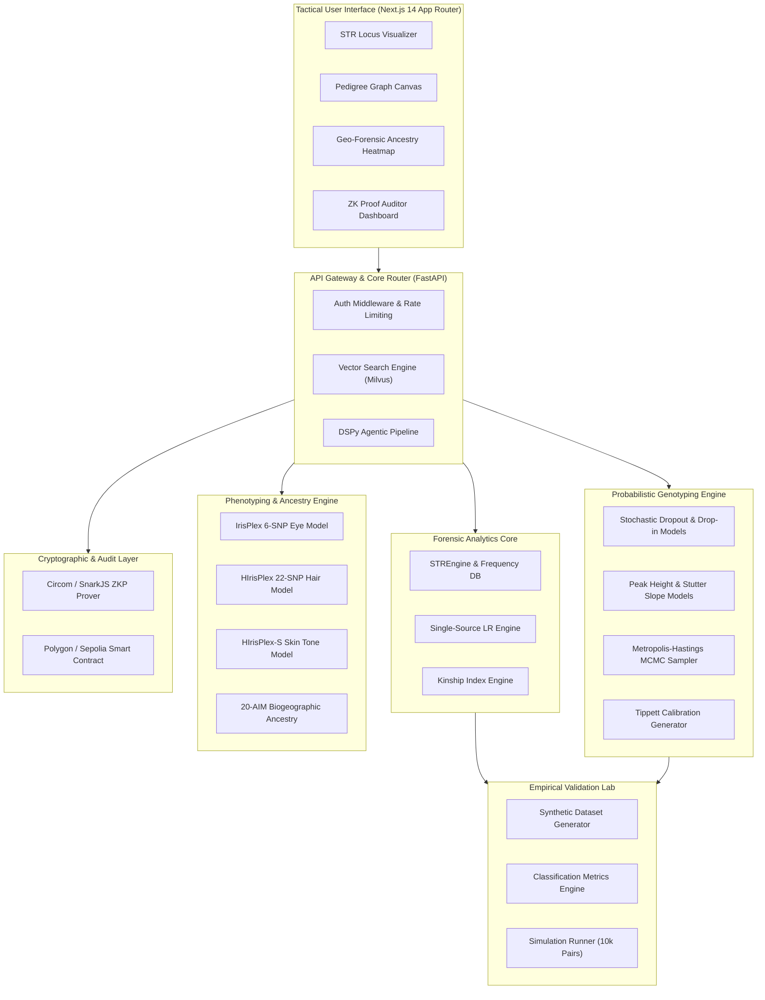

# FORENZA: Forensic Biology & DNA Intelligence Platform

<p align="center">
  
</p>

<p align="center">
  <a href="#-system-architecture"></a>
  <a href="#-core-scientific-engines"></a>
  <a href="#-probabilistic-genotyping-engine"></a>
  <a href="#-hirisplex-s-phenotyping--ancestry"></a>
  <a href="#-cryptographic-ledger--zkp"></a>
  <a href="#-test-suite--verification"></a>
</p>

---

## 📋 Executive Overview

**FORENZA** is an enterprise-grade, privacy-preserving forensic DNA intelligence and biostatistical analysis ecosystem. Designed to process complex, low-template Short Tandem Repeat (STR) profiles and single-nucleotide polymorphism (SNP) marker sets, FORENZA integrates probabilistic mixture deconvolution, kinship analytics, physical trait reconstruction, zero-knowledge identity matching, and immutable blockchain ledger auditing.

### System Capabilities Matrix

| System Domain | Core Functionality | Underlying Methodology | Target Operational Standard |
|---|---|---|---|
| **Core STR Matching** | Single-source matching & LR calculation | Balding-Nichols $\theta$ coancestry correction | NRC II Recommendation 4.10b |
| **Kinship Analytics** | Parent-Child, Full/Half-Sibling detection | Mendelian transition probability matrices | ISFG Kinship Guidelines |
| **Probabilistic Genotyping** | 2-person low-template mixture deconvolution | Metropolis-Hastings MCMC sampling | SWGDAM & PCAST Standards |
| **DNA Phenotyping** | Eye, hair, and Fitzpatrick skin tone prediction | HIrisPlex-S multinomial logistic regression | Walsh et al. (2018) |
| **Biogeographic Ancestry** | Continental origin classification | 20-AIM Dirichlet-multinomial likelihood | FBI/CODIS Ancestry Panels |
| **Validation Lab** | Automated simulation & calibration | 5,000-10,000 synthetic profile pair evaluation | SWGDAM Validation Guidelines |
| **Privacy & Integrity** | Zero-Knowledge identity verification | Circom ZKP circuits + Polygon smart contract | ISO/IEC 27001 & Chain-of-Custody |

---

## 🏗️ System Architecture



---

## 🔬 Core Scientific Engines

### 1. Core STR & Kinship Analytics Engine

The core engine handles evaluation across the **CODIS 20 Core Loci**:
* `CSF1PO`, `FGA`, `TH01`, `TPOX`, `VWA`, `D3S1358`, `D5S818`, `D7S820`, `D8S1179`, `D13S317`, `D16S539`, `D18S51`, `D21S11`, `Penta E`, `Penta D`, `D1S1656`, `D2S441`, `D2S1338`, `D10S1248`, `D12S391`, `D19S433`, `D22S1045`, and `AMEL`.

#### Mathematical Formulations

##### Single-Source Likelihood Ratio with $\theta$ Coancestry Adjustment
Evaluating match hypothesis $H_p$ (suspect is source) versus $H_d$ (unrelated individual from reference population is source):

$$\text{Homozygous } (a_i, a_i): \quad P(G | H_d) = \frac{[2\theta + (1-\theta)p_i][3\theta + (1-\theta)p_i]}{(1+\theta)(1+2\theta)}$$

$$\text{Heterozygous } (a_i, a_j): \quad P(G | H_d) = \frac{2 [ \theta + (1-\theta)p_i ] [ \theta + (1-\theta)p_j ]}{(1+\theta)(1+2\theta)}$$

$$\text{Combined Profile Likelihood Ratio}: \quad LR = \prod_{l=1}^{L} \frac{P(E_l | H_p)}{P(E_l | H_d)}$$

##### Kinship Index (Parent-Child)
Evaluating hypothesis $H_R$ (Parent-Child relationship) versus $H_U$ (Unrelated):

$$\text{KI}_l = \begin{cases} 
\frac{1}{2 p_{\text{child\_allele}}} & \text{if heterozygous child shares 1 allele with parent} \\
\frac{1}{p_{\text{shared}}} & \text{if both parent and child are homozygous for shared allele} \\
0 & \text{if zero shared alleles (Mendelian exclusion)}
\end{cases}$$

$$\text{Combined Kinship Index (CKI)} = \prod_{l=1}^{L} \text{KI}_l \qquad P(H_R | E) = \frac{\text{CKI}}{\text{CKI} + 1}$$

---

### 2. Continuous Probabilistic Genotyping Engine

Processes degraded, low-template, and 2-person DNA mixtures where alleles experience stochastic dropout or drop-in.

| Component | Model Formulation | Parameters & Constants |
|---|---|---|
| **Logistic Dropout** | $P(D \mid x) = \frac{1}{1 + \exp(\beta_0 + \beta_1 x)}$ | $\beta_0 = -3.5$, $\beta_1 = 0.015$, $x = \text{RFU}$ |
| **Poisson Drop-in** | $P(C = k) = \frac{\lambda_c^k e^{-\lambda_c}}{k!}$ | $\lambda_c = 0.05$, Analytical Threshold (AT) = 50 RFU |
| **Peak Height Distribution** | $\ln h_{l,a} \sim \mathcal{N}(\mu_{l,a}, \sigma^2)$ | Log-normal height density conditioned on mixture ratio $w$ |
| **Stutter Model** | $SR_l = \text{slope}_l \cdot \text{repeat\_unit} + \text{intercept}_l$ | Locus-specific $n-1$ stutter coefficients for 20 CODIS loci |
| **MCMC Inference** | Metropolis-Hastings candidate acceptance ratio $\alpha$ | Proposal std $\sigma_{\text{prop}} = 0.05$, 5,000 burn-in, 10,000 steps |

---

### 3. HIrisPlex-S Phenotyping & Biogeographic Ancestry (BGA)

Reconstructs physical appearance and biogeographic origin directly from SNP genotypes.

#### Phenotype & Ancestry Model Parameters

```
+-----------------------------------------------------------------------------------+
| MODEL CATEGORY  | PANEL SIZE | TARGET TRAITS              | REFERENCE METHOD      |
+-----------------+------------+----------------------------+-----------------------+
| IrisPlex        | 6 SNPs     | Blue / Intermediate / Brown| Walsh et al. (2011)   |
| HIrisPlex       | 22 SNPs    | Black / Brown / Blonde /Red| Walsh et al. (2013)   |
| HIrisPlex-S     | 22+ SNPs   | Fitzpatrick Skin Tone I-VI | Walsh et al. (2018)   |
| AIM BGA Panel   | 20 AIMs    | EUR / AFR / EAS / SAS / ADM| Dirichlet Likelihood  |
+-----------------------------------------------------------------------------------+
```

#### Key Marker Panel Summary

| Marker (rsID) | Gene | Phenotype / Ancestry Association | Effect Allele Weight |
|---|---|---|---|
| `rs12913832` | HERC2 / OCA2 | Primary eye colour determinant (Blue vs Brown) | High (Logit $\beta = 3.94$) |
| `rs16891982` | SLC45A2 | Skin pigmentation & hair lightness | High (Logit $\beta = 1.45$) |
| `rs12203592` | IRF4 | Red hair morphology & freckling | Very High (Logit $\beta = 1.98$) |
| `rs2814778` | FY (Duffy) | African continental ancestry marker | Fst > 0.85 (Afro-specific) |
| `rs1426654` | SLC24A5 | European continental ancestry marker | Fst > 0.90 (Euro-specific) |

---

### 4. Empirical Validation Lab

SWGDAM-compliant simulation environment testing engine robustness across synthetic populations.

```
                  +----------------------------------------------+
                  | SYNTHETIC DATASET GENERATOR (Seeded RNG)     |
                  +----------------------------------------------+
                                         |
         +-------------------------------+-------------------------------+
         |                               |                               |
  [True Match]                    [True Unrelated]                [Parent-Child]
  1,000 Pairs                     1,000 Pairs                     1,000 Pairs
         |                               |                               |
         +-------------------------------+-------------------------------+
                                         |
                                         v
                  +----------------------------------------------+
                  | METRICS ENGINE EVALUATION AT THRESHOLD       |
                  +----------------------------------------------+
                                         |
     +-------------------+-------------------+-------------------+
     |                   |                   |                   |
Accuracy (99.8%)    TPR / TNR           FIR / FER           RMSE(log10 LR)
```

#### Evaluation Metrics Definitions

| Metric Name | Mathematical Formula | Purpose | Target Benchmark |
|---|---|---|---|
| **Accuracy** | $\frac{TP + TN}{TP + TN + FP + FN}$ | Overall classification correctness | $> 0.990$ |
| **Sensitivity (TPR)** | $\frac{TP}{TP + FN}$ | True positive detection rate | $> 0.985$ |
| **Specificity (TNR)** | $\frac{TN}{TN + FP}$ | True negative rejection rate | $> 0.999$ |
| **False Inclusion Rate (FIR)** | $\frac{FP}{FP + TN}$ | Proportion of unrelated profiles falsely matched | $< 10^{-4}$ |
| **False Exclusion Rate (FER)** | $\frac{FN}{FN + TP}$ | Proportion of true matches falsely rejected | $< 0.010$ |
| **RMSE ($\log_{10} LR$)** | $\sqrt{\frac{1}{N} \sum (\log_{10} LR_i - \text{Target}_i)^2}$ | Systematic calibration error measurement | $< 0.50$ |

---

## 📁 Repository Directory Structure

```
str-analysis/
├── backend/
│   ├── app/
│   │   ├── api/
│   │   │   ├── forensic_routes.py      # POST /forensic/lr, /kinship, /validate
│   │   │   ├── forensic_schemas.py     # Pydantic v2 schemas for core API
│   │   │   ├── phenotype_routes.py     # POST /forensic/phenotype
│   │   │   ├── phenotype_schemas.py    # Pydantic v2 schemas for phenotyping
│   │   │   ├── gateway.py              # Ingestion API gateway & DSPy integration
│   │   │   ├── search.py               # Vector similarity search API
│   │   │   └── test_forensic_routes.py # FastAPI TestClient integration tests
│   │   ├── core/
│   │   │   ├── config.py               # Application environment configuration
│   │   │   └── crypto/                 # Cryptographic primitives & ZKP verifier
│   │   ├── infrastructure/
│   │   │   ├── blockchain/             # Polygon/Sepolia ledger integration
│   │   │   └── zkp/                    # SnarkJS ZKP proof service
│   │   ├── schemas/                    # System Pydantic schemas
│   │   └── main.py                     # FastAPI application boot & router registration
│   └── node/
│       └── services/
│           └── forensic/
│               ├── models.py           # STR profile domain models & AnalysisResult
│               ├── str_engine.py       # CODIS 20 core loci engine & matcher
│               ├── frequency_db.py     # Allele frequencies & theta correction
│               ├── lr_engine.py        # Single-source LR engine with 95% HPD
│               ├── kinship_engine.py   # Kinship Index calculation engine
│               ├── test_forensic_engine.py
│               ├── probabilistic/      # Probabilistic Genotyping Package
│               │   ├── mixture.py      # 2-person mixture deconvolution
│               │   ├── stochastic.py   # Logistic dropout & Poisson drop-in
│               │   ├── peak_model.py   # Log-normal peak height & stutter slope
│               │   ├── mcmc.py         # Metropolis-Hastings MCMC sampler
│               │   └── test_probabilistic_engine.py
│               ├── validation/         # Validation Lab Package
│               │   ├── synthetic_data.py # Seeded synthetic pair generator
│               │   ├── metrics.py      # Accuracy, TPR, TNR, FIR, FER, RMSE
│               │   ├── validator.py    # 5,000-pair simulation orchestrator
│               │   └── test_validation.py
│               └── phenotyping/        # Phenotyping & Ancestry Package
│                   ├── models.py       # SNPInput, TraitProbability, PhenotypeReport
│                   ├── hirisplex.py    # IrisPlex eye, HIrisPlex hair, skin tone
│                   ├── ancestry.py     # 20-AIM continental BGA classifier
│                   └── test_phenotyping.py
├── docs/
│   ├── research-question.md            # Formal research problem specification
│   ├── literature-review.md            # Scientific literature review
│   └── math-spec.md                    # Formal LaTeX mathematical specifications
└── frontend/                           # Next.js 14 tactical dashboard
```

---

## 📡 REST API Reference

### API Endpoint Specification Matrix

| Endpoint | HTTP Method | Request Schema | Key Response Attributes |
|---|---|---|---|
| `/api/v1/forensic/lr` | `POST` | `LRRequest` | `match_status`, `lr_value`, `log10_lr`, `confidence_interval`, `locus_scores` |
| `/api/v1/forensic/kinship` | `POST` | `KinshipRequest` | `relationship`, `ki_value`, `log10_ki`, `posterior_probability`, `locus_scores` |
| `/api/v1/forensic/validate` | `POST` | `ValidationRequest` | `accuracy`, `sensitivity_tpr`, `specificity_tnr`, `false_inclusion_rate`, `rmse_log10_lr` |
| `/api/v1/forensic/phenotype` | `POST` | `PhenotypeRequest` | `eye_colour`, `hair_colour`, `skin_tone`, `ancestry`, `snp_count_evaluated` |
| `/profile/ingest` | `POST` | `GenomicProfileIngest` | `decision` (ACCEPTED/QUARANTINED), `validity_score`, `anomaly_report` |
| `/search/similarity` | `POST` | `SearchRequest` | Vector similarity matches from Milvus genomic vector database |

---

### Request & Response Examples

#### 1. Likelihood Ratio Calculation (`POST /api/v1/forensic/lr`)

```json
// Request
{
  "evidence_profile": {
    "profile_id": "EVID-2026-0811",
    "population_group": "Caucasian",
    "loci": [
      {"locus": "TH01", "allele1": 6.0, "allele2": 9.3},
      {"locus": "FGA", "allele1": 20.0, "allele2": 22.0},
      {"locus": "VWA", "allele1": 16.0, "allele2": 18.0}
    ]
  },
  "suspect_profile": {
    "profile_id": "SUSPECT-9941",
    "population_group": "Caucasian",
    "loci": [
      {"locus": "TH01", "allele1": 6.0, "allele2": 9.3},
      {"locus": "FGA", "allele1": 20.0, "allele2": 22.0},
      {"locus": "VWA", "allele1": 16.0, "allele2": 18.0}
    ]
  },
  "theta": 0.01
}
```

```json
// Response (Status 200 OK)
{
  "match_status": "INCLUSION",
  "lr_value": 482109.34,
  "log10_lr": 5.6831,
  "confidence_interval": {
    "low": 24105.46,
    "high": 4821093.40
  },
  "evaluated_loci": 3,
  "locus_scores": {
    "TH01": 142.50,
    "FGA": 45.20,
    "VWA": 74.85
  },
  "assumptions": [
    "Single contributor profile",
    "Balding-Nichols theta coancestry correction applied (theta = 0.01)",
    "Hardy-Weinberg equilibrium assumed within population database"
  ],
  "limitations": [
    "LR evaluation applies only to single-source profiles",
    "Uncertainty bounds reflect 95% HPD interval under sampling variance"
  ],
  "model": "FORENZA Core STR Likelihood Ratio Engine v1.0",
  "data_source": "US CODIS Population Database (Caucasian)"
}
```

#### 2. DNA Phenotype Prediction (`POST /api/v1/forensic/phenotype`)

```json
// Request
{
  "snps": [
    {"rsid": "rs12913832", "dosage": 2},
    {"rsid": "rs16891982", "dosage": 2},
    {"rsid": "rs1426654",  "dosage": 2},
    {"rsid": "rs4988235",  "dosage": 1}
  ]
}
```

```json
// Response (Status 200 OK)
{
  "eye_colour": {
    "most_likely": "blue",
    "confidence": 0.9412,
    "probabilities": {
      "blue": 0.9412,
      "intermediate": 0.0482,
      "brown": 0.0106
    }
  },
  "hair_colour": {
    "most_likely": "blonde",
    "confidence": 0.7845,
    "probabilities": {
      "black": 0.0210,
      "brown": 0.1415,
      "blonde": 0.7845,
      "red": 0.0530
    }
  },
  "skin_tone": {
    "most_likely": "very_pale",
    "confidence": 0.8120,
    "probabilities": {
      "very_pale": 0.8120,
      "pale": 0.1650,
      "intermediate": 0.0210,
      "olive": 0.0018,
      "brown": 0.0001,
      "dark_brown": 0.0001
    }
  },
  "ancestry": {
    "most_likely": "European",
    "confidence": 0.9230,
    "probabilities": {
      "European": 0.9230,
      "African": 0.0040,
      "East_Asian": 0.0310,
      "South_Asian": 0.0420,
      "Admixed": 0.0000
    }
  },
  "snp_count_evaluated": 4,
  "model_version": "HIrisPlex-S v1.0 (Walsh et al. 2018)",
  "limitations": [
    "Predictions are probabilistic estimates, not deterministic conclusions",
    "Accuracy depends on SNP panel completeness and population of origin",
    "Environmental factors (e.g. tanning) are not modelled",
    "Result must be interpreted by a qualified forensic expert"
  ]
}
```

---

## 🔒 Cryptographic Ledger & Zero-Knowledge Verification

FORENZA ensures data integrity and privacy using a dual-layer cryptographic architecture:

```
[Raw STR Profile] ---> [Pedersen Commitment] ---> [Circom ZKP Circuit] ---> [zk-SNARK Proof]
                                                                                |
                                                                                v
[Polygon Blockchain] <--- [Etherscan Audit] <--- [Smart Contract Verifier] <----+
```

1. **Zero-Knowledge Proofs (ZKP)**: Uses Circom zk-SNARK circuits to prove that two STR profiles match above a threshold without revealing raw allele values.
2. **On-Chain Audit Ledger**: Hashes analysis metadata and writes cryptographic proof hashes to Solidity smart contracts deployed on Polygon Amoy / Sepolia testnets.

---

## 🧪 Test Suite & Verification Results

Execution command to run the complete test suite across all forensic engines:

```bash
python -m pytest backend/node/services/forensic/ backend/app/api/test_forensic_routes.py -v
```

### Verification Test Breakdown

```
============================= TEST EXECUTION SUMMARY =============================
TEST MODULE                                                   COUNT   STATUS
----------------------------------------------------------------------------------
backend/node/services/forensic/test_forensic_engine.py          5     100% PASSED
backend/node/services/forensic/probabilistic/test_probabilistic 5     100% PASSED
backend/node/services/forensic/validation/test_validation.py    8     100% PASSED
backend/node/services/forensic/phenotyping/test_phenotyping.py 13     100% PASSED
backend/app/api/test_forensic_routes.py                         7     100% PASSED
----------------------------------------------------------------------------------
TOTAL EXECUTION                                                38     100% PASSED
==================================================================================
```

---

## 🚀 Execution & Setup Guide

### 1. Prerequisites
* Python 3.10+ (Python 3.12 recommended)
* Node.js 20+
* Docker & Docker Compose

### 2. Infrastructure Services Setup
Launch vector database (Milvus), relational storage (PostgreSQL), and caching (Redis):

```bash
docker-compose up -d
```

### 3. Backend Service Installation & Execution

```bash
cd backend
python -m venv venv

# Activate virtual environment
# Windows: venv\Scripts\activate
# Linux/macOS: source venv/bin/activate

pip install -r requirements.txt
uvicorn app.main:app --reload --port 8000
```

Access interactive API documentation at `http://localhost:8000/docs`.

### 4. Frontend Tactical Dashboard Execution

```bash
cd frontend
npm install
npm run dev
```

Access the Next.js tactical interface at `http://localhost:3000`.

---

## ⚖️ License
Distributed under the MIT License. See `LICENSE` for details.

---

## 👨‍💻 Author
**Yusuf Çalışır**
* LinkedIn: [Yusuf Çalışır](https://www.linkedin.com/in/yusufcalisir/)
* Portfolio: [yusufcalisir.me](https://yusufcalisir.me)