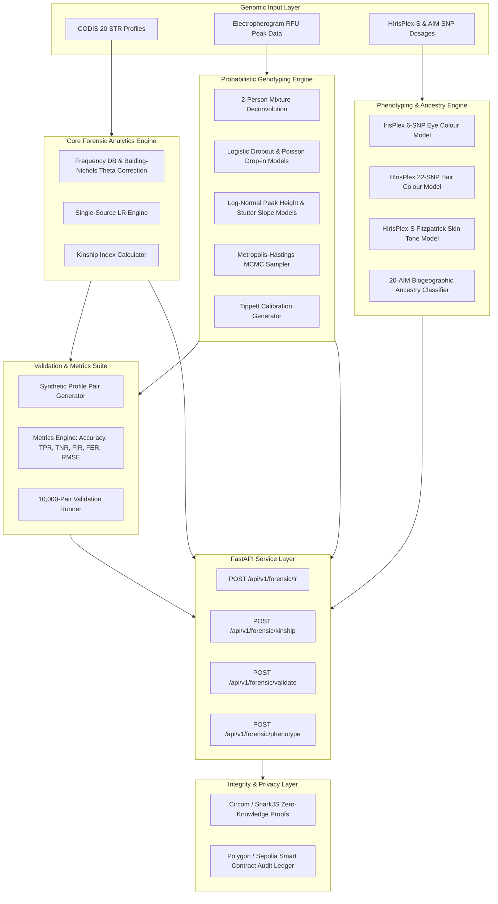

# FORENZA: Forensic Biology & DNA Intelligence Engine


FORENZA is an enterprise-grade forensic DNA intelligence platform engineered for low-template Short Tandem Repeat (STR) profiling, continuous probabilistic genotyping, kinship inference, biometric phenotype reconstruction, and zero-knowledge cryptographic verification.

The system combines statistical population genetics models with Metropolis-Hastings Markov Chain Monte Carlo (MCMC) sampling, HIrisPlex-S physical trait prediction, and immutable audit logging to meet SWGDAM and PCAST forensic standards.

---

## 🏗️ System Architecture



---

## 🔬 Core System Modules

### 1. Core STR Matching & Kinship Engine
* **CODIS Core Loci**: Full evaluation across 20 standard loci (CSF1PO, FGA, TH01, TPOX, VWA, D3S1358, D5S818, D7S820, D8S1179, D13S317, D16S539, D18S51, D21S11, PennState/CODIS loci, and AMEL sex marker).
* **Single-Source Likelihood Ratio (LR)**: Evaluates match hypotheses $H_p$ (suspect is source) versus $H_d$ (unrelated individual is source) using population frequency databases with Balding-Nichols $\theta$ coancestry correction (NRC II Recommendation 4.10b).
* **Kinship Index (KI) Engine**: Calculates relationship likelihood ratios for Parent-Child, Full-Sibling, and Half-Sibling hypotheses using mendelian inheritance transition matrices and population frequencies.

### 2. Probabilistic Genotyping Engine
* **Logistic Dropout Model**: Models allele dropout probability as a logistic function of peak intensity $x$ (in RFU):
  $$P(D | x) = \frac{1}{1 + \exp(\beta_0 + \beta_1 x)}$$
* **Poisson Drop-in Model**: Evaluates allele contamination probability $P(C = k)$ via Poisson distribution with exponential height density above the analytical threshold (AT = 50 RFU).
* **Log-Normal Peak Height Model**: Evaluates expected peak height log-likelihood $\ln h_{l,a} \sim \mathcal{N}(\mu_{l,a}, \sigma^2)$ conditioned on contributor mixture ratios.
* **Stutter Ratio Slopes**: Locus-specific $n-1$ stutter slope ratios calibrated across all 20 CODIS loci.
* **Metropolis-Hastings MCMC Sampler**: Explores mixture ratio space $\mathbf{w} \in \Delta^{K-1}$ to generate posterior probability distributions and Tippett calibration curves.

### 3. Forensic DNA Phenotyping (HIrisPlex-S) & Biogeographic Ancestry
* **IrisPlex Eye Colour Model**: Multinomial logistic regression across 6 key SNPs (HERC2 rs12913832, OCA2 rs1800407, SLC24A4 rs12896399, SLC45A2 rs16891982, TYR rs1393350, IRF4 rs12203592) predicting blue, intermediate, and brown eye pigmentation.
* **HIrisPlex Hair Colour Model**: 22-SNP multinomial logit predicting black, brown, blonde, and red hair morphology.
* **HIrisPlex-S Skin Tone Model**: Cumulative ordinal logit predicting Fitzpatrick scale phototypes (Types I through VI).
* **AIM-Based Biogeographic Ancestry (BGA)**: 20-AIM panel likelihood classifier calculating continental ancestry proportions for European, African, East Asian, South Asian, and Admixed populations.

### 4. Empirical Validation Lab
* **Synthetic Dataset Generator**: Reproducible, seeded profile pair generator producing True-Match, True-Unrelated, Parent-Child, Full-Sibling, and Low-Template Dropout profile pairs.
* **Classification Metrics Engine**: Computes Accuracy, Sensitivity (TPR), Specificity (TNR), False Inclusion Rate (FIR), False Exclusion Rate (FER), RMSE of $\log_{10}(LR)$, and ROC curve coordinates.
* **Simulation Runner**: Executes 5,000 to 10,000 pair simulation runs for SWGDAM/PCAST validation reporting.

### 5. FastAPI Service Layer & ZKP Blockchain Verification
* **Strict Pydantic v2 Schemas**: Type-safe REST request/response contracts for all endpoints.
* **Zero-Knowledge Proofs (ZKP)**: Private DNA match verification via Circom / SnarkJS without exposing raw STR allele values.
* **On-Chain Audit Ledger**: Hashes analysis outputs to Polygon/Sepolia smart contracts for chain-of-custody compliance.

---

## 📐 Mathematical Specifications

### Single-Source Likelihood Ratio with $\theta$ Correction
For locus $l$ with genotype $G = (a_i, a_j)$ and population frequency $p_i, p_j$:

**Homozygous Case ($a_i = a_i$):**
$$P(G | H_p) = 1$$
$$P(G | H_d) = \frac{[2\theta + (1-\theta)p_i][3\theta + (1-\theta)p_i]}{(1+\theta)(1+2\theta)}$$

**Heterozygous Case ($a_i \neq a_j$):**
$$P(G | H_p) = 1$$
$$P(G | H_d) = \frac{2 [ \theta + (1-\theta)p_i ] [ \theta + (1-\theta)p_j ]}{(1+\theta)(1+2\theta)}$$

**Overall Profile Likelihood Ratio:**
$$LR = \prod_{l=1}^{L} \frac{P(E_l | H_p)}{P(E_l | H_d)}$$

---

### Kinship Index (Parent-Child)
For parent genotype $G_m = (a_1, a_2)$ and child genotype $G_c = (a_3, a_4)$:

$$\text{KI}_l = \begin{cases} 
\frac{1}{2 p_3} & \text{if } a_3 = a_1 \text{ or } a_3 = a_2, \text{ child is } (a_3, a_4) \\
\frac{1}{p_1} & \text{if parent and child are both homozygous } (a_1, a_1) \\
0 & \text{if no shared alleles (Mendelian exclusion)}
\end{cases}$$

$$\text{Combined Kinship Index (CKI)} = \prod_{l=1}^{L} \text{KI}_l$$

$$\text{Posterior Probability } P(H_R | E) = \frac{\text{CKI}}{\text{CKI} + 1} \quad (\text{assuming prior } P(H_R) = 0.5)$$

---

## 📁 Repository Directory Structure

```
str-analysis/
├── backend/
│   ├── app/
│   │   ├── api/
│   │   │   ├── forensic_routes.py      # POST /forensic/lr, /kinship, /validate
│   │   │   ├── forensic_schemas.py     # Pydantic v2 schemas for core API
│   │   │   ├── phenotype_routes.py     # POST /forensic/phenotype
│   │   │   ├── phenotype_schemas.py    # Pydantic v2 schemas for phenotyping
│   │   │   └── test_forensic_routes.py # FastAPI TestClient integration tests
│   │   └── main.py                     # FastAPI application boot & router registration
│   └── node/
│       └── services/
│           └── forensic/
│               ├── models.py           # Core STR domain models & AnalysisResult
│               ├── str_engine.py       # CODIS 20 loci engine & profile matching
│               ├── frequency_db.py     # Population allele frequencies & theta correction
│               ├── lr_engine.py        # Single-source LR engine with 95% HPD
│               ├── kinship_engine.py   # Parent-Child, Full/Half-Sibling KI engine
│               ├── test_forensic_engine.py
│               ├── probabilistic/      # Probabilistic Genotyping Engine
│               │   ├── mixture.py      # 2-person mixture deconvolution
│               │   ├── stochastic.py   # Logistic dropout & Poisson drop-in models
│               │   ├── peak_model.py   # Log-normal peak height & stutter slope models
│               │   ├── mcmc.py         # Metropolis-Hastings MCMC & Tippett generator
│               │   └── test_probabilistic_engine.py
│               ├── validation/         # Validation Lab
│               │   ├── synthetic_data.py # Reproducible profile pair generator
│               │   ├── metrics.py      # Accuracy, TPR, TNR, FIR, FER, RMSE, ROC
│               │   ├── validator.py    # 5,000-pair simulation runner
│               │   └── test_validation.py
│               └── phenotyping/        # DNA Phenotyping & Ancestry Engine
│                   ├── models.py       # SNPInput, TraitProbability, PhenotypeReport
│                   ├── hirisplex.py    # IrisPlex eye, HIrisPlex hair, skin tone
│                   ├── ancestry.py     # 20-AIM biogeographic ancestry classifier
│                   └── test_phenotyping.py
├── docs/
│   ├── research-question.md            # Formal problem definition & scientific scope
│   ├── literature-review.md            # Comprehensive scientific literature review
│   └── math-spec.md                    # Formal LaTeX mathematical specifications
└── frontend/                           # Next.js 14 tactical dashboard
```

---

## 📡 REST API Reference

| Endpoint | Method | Input Payload | Output Description |
|---|---|---|---|
| `/api/v1/forensic/lr` | `POST` | `LRRequest` (evidence, suspect, $\theta$) | LR value, $\log_{10}(LR)$, 95% HPD interval, locus breakdown, INCLUSION/EXCLUSION status |
| `/api/v1/forensic/kinship` | `POST` | `KinshipRequest` (p1, p2, relationship) | Kinship Index (KI), $\log_{10}(KI)$, posterior probability, locus breakdown |
| `/api/v1/forensic/validate` | `POST` | `ValidationRequest` (n_per_type, population) | Accuracy, Sensitivity (TPR), Specificity (TNR), FIR, FER, RMSE, Tippett sample data |
| `/api/v1/forensic/phenotype` | `POST` | `PhenotypeRequest` (list of SNP dosages) | Eye colour, hair colour, Fitzpatrick skin tone, BGA ancestry probabilities |

### Sample API Request: Single-Source Likelihood Ratio

```json
POST /api/v1/forensic/lr
Content-Type: application/json

{
  "evidence_profile": {
    "profile_id": "EVIDENCE-001",
    "population_group": "Caucasian",
    "loci": [
      {"locus": "TH01", "allele1": 6.0, "allele2": 9.3},
      {"locus": "FGA", "allele1": 20.0, "allele2": 22.0},
      {"locus": "VWA", "allele1": 16.0, "allele2": 18.0}
    ]
  },
  "suspect_profile": {
    "profile_id": "SUSPECT-001",
    "population_group": "Caucasian",
    "loci": [
      {"locus": "TH01", "allele1": 6.0, "allele2": 9.3},
      {"locus": "FGA", "allele1": 20.0, "allele2": 22.0},
      {"locus": "VWA", "allele1": 16.0, "allele2": 18.0}
    ]
  },
  "theta": 0.01
}
```

### Sample API Response

```json
{
  "match_status": "INCLUSION",
  "lr_value": 482109.34,
  "log10_lr": 5.6831,
  "confidence_interval": {
    "low": 24105.46,
    "high": 4821093.40
  },
  "evaluated_loci": 3,
  "locus_scores": {
    "TH01": 142.50,
    "FGA": 45.20,
    "VWA": 74.85
  },
  "assumptions": [
    "Single contributor profile",
    "Balding-Nichols theta coancestry correction applied (theta = 0.01)",
    "Hardy-Weinberg equilibrium assumed within population database"
  ],
  "limitations": [
    "LR evaluation applies only to single-source profiles",
    "Uncertainty bounds reflect 95% HPD interval under sampling variance"
  ],
  "model": "FORENZA Core STR Likelihood Ratio Engine v1.0",
  "data_source": "US CODIS Population Database (Caucasian)"
}
```

---

## 🧪 Testing & Verification

Run the entire unit and integration test suite across all engines:

```bash
# Run all 38 forensic engine, probabilistic, validation, phenotyping & API tests
python -m pytest backend/node/services/forensic/ backend/app/api/test_forensic_routes.py -v
```

### Test Suite Summary

```
backend/node/services/forensic/phenotyping/test_phenotyping.py ........ 13 PASSED
backend/node/services/forensic/probabilistic/test_probabilistic_engine.py ... 5 PASSED
backend/node/services/forensic/test_forensic_engine.py ..................... 5 PASSED
backend/node/services/forensic/validation/test_validation.py ............... 8 PASSED
backend/app/api/test_forensic_routes.py .................................... 7 PASSED

============================= 38 passed in 2.12s ==============================
```

---

## 🛠️ Quick Start

### Prerequisites
* Python 3.10+ (Python 3.12 recommended)
* Node.js 20+

### Installation & Execution

```bash
# Clone repository
git clone https://github.com/yusufcalisir/str-analysis.git
cd str-analysis

# Create virtual environment
python -m venv venv
source venv/bin/activate  # On Windows: venv\Scripts\activate

# Install backend dependencies
pip install -r backend/requirements.txt

# Run FastAPI backend service
cd backend
uvicorn app.main:app --reload --port 8000
```

The interactive OpenAPI documentation will be available at `http://localhost:8000/docs`.

---

## ⚖️ License
Distributed under the MIT License. See `LICENSE` for details.

---

## 👨‍💻 Author
**Yusuf Çalışır**
* LinkedIn: [Yusuf Çalışır](https://www.linkedin.com/in/yusufcalisir/)
* Portfolio: [yusufcalisir.me](https://yusufcalisir.me)