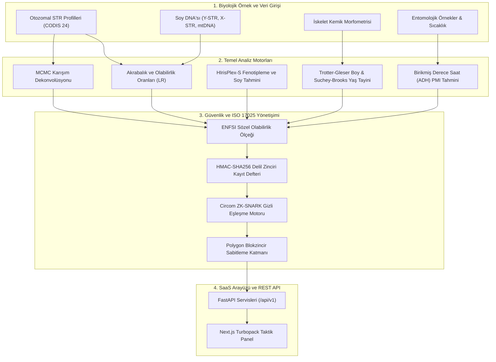

# FORENZA: Adli Genetik ve Biyobilişim Delil İşletim Sistemi

<p align="center">
  
</p>

<p align="center">
  <strong>Kurumsal Biyobilişimsel Adli Genetik ve Biyolojik Delil Platformu</strong><br />
  30 Adli Biyocins Subsystem Modülü • VANTAGE v3.0 • ISO/IEC 17025:2017 Akredite Uyumlu
</p>

<p align="center">
  <a href="README.md"><strong>🇬🇧 English README</strong></a> | 
  <a href="README_TR.md"><strong>🇹🇷 Türkçe Dokümantasyon</strong></a>
</p>

<p align="center">
  <a href="#-sistem-durumu-ve-test-doğrulamaları"></a>
  <a href="#otozomal-str-ve-akrabalik-motoru"></a>
  <a href="#olasılıksal-genotipleme-ve-mcmc-karışım-dekonvolüsyonu"></a>
  <a href="#adli-fenotipleme-ve-coğrafi-atasal-soy"></a>
  <a href="#kriptografik-kayıt-ve-sıfır-bilgi-ispatı-zkp"></a>
  <a href="#-sistem-durumu-ve-test-doğrulamaları"></a>
  
</p>

---

## Genel Bakış

**FORENZA**, moleküler genetik, adli biyoloji, osteoloji, adli palinoloji ve kurumsal yazılım mimarisinin kesişiminde geliştirilmiş yeni nesil bir **Adli Genetik Delil İşletim Sistemi**dir. Yüksek kapasiteli adli tıp laboratuvarları, afet kurbanlarını kimliklendirme (DVI) birimleri, kolluk kuvvetleri ve kriminal inceleme daireleri için tasarlanan platform; dağınık ve eski yazılımların yerine dağıtık, modüler ve güvenli bir biyobilişim altyapısı sunar.

Sistem; gelişmiş istatistiksel genetik algoritmalarını (Metropolis-Hastings MCMC karışım dekonvolüsyonu, Balding-Nichols alt popülasyon Fst düzeltmesi, HIrisPlex-S fenotip tahmini, Horvath epigenetik yaş saati) modern yazılım mühendisliği ilkeleriyle (FastAPI, Next.js Turbopack, Circom Sıfır Bilgi İspatları - ZKP ve HMAC-SHA256 delil zinciri) birleştirir.

---

## Mimari Şema: Biyobilişim ve Yazılım İş Hattı



---

## Temel Modüller ve Yetenekler

### 1. Otozomal STR ve Akrabalık Motoru (CODIS 24)
- 24 çekirdek CODIS lokusunda (`D3S1358`, `vWA`, `FGA`, `TH01`, `TPOX`, `CSF1PO`, `D5S818`, `D13S317`, `D7S820`, `D8S1179`, `D21S11`, `D18S51`, `D16S539`, `D2S1338`, `D19S433`, `SE33`, `Penta E`, `Penta D` vb.) olabilirlik oranı (LR) hesaplar.
- Ebeveyn-çocuk, tam kardeş, yarım kardeş ve 2. derece akrabalık indekslerini (Kinship Index - KI) NRC II Tavsiye 4.1/4.2 çerçevesinde analiz eder.

### 2. MCMC Karışım Dekonvolüsyonu (Metropolis-Hastings)
- 2 ila 4 kişinin katıldığı karmaşık ve biyolojik olarak bozunmuş DNA karışımlarını (Low-Template DNA) ayrıştırır.
- Alel kaybolması ($p_d$), alel eklenmesi ($p_i$), stutter oranları ve pik yüksekliği dalgalanmalarını stokastik değişkenlerle modeller.

### 3. HIrisPlex-S Fenotipleme ve Coğrafi Atasal Soy (BGA)
- 24 SNP markörlü HIrisPlex-S modeliyle iris rengi (Mavi, Ela, Kahverengi), Fitzpatrick ten fototipi (Tip I - VI) ve saç morfolojisini (Düz, Dalgalı, Kıvırcık) tahmin eder.
- 55 atasal bilgi markörü (AIM) ile 7 küresel coğrafi popülasyon için sonralı olasılıkları (Posterior Probabilities) ve enlem/boylam coğrafi koordinatlarını puanlar.

### 4. Epigenetik Yaş Saati (Horvath 5-CpG)
- Biyolojik numunenin bırakıldığı andaki kronolojik yaşını 5 temel CpG lokusundaki metilasyon seviyeleri üzerinden $\pm2.8$ yıl sapma payı ile hesaplar.

### 5. Sıfır Bilgi İspatı (ZKP - Circom / Groth16)
- Ham genomik alel verilerini laboratuvar dışına aktarmadan, profil eşleşme şartını kriptografik olarak doğrulayan `Circom` tabanlı Groth16 ZK-SNARK ispatları üretir.

---

## Hızlı Kurulum ve Çalıştırma

### Gereksinimler
- **Python:** 3.12+
- **Node.js:** v20.0.0+ (npm v10+)

```bash
# 1. Depoyu klonlayın
git clone https://github.com/yusufcalisir/FORENZA.git
cd FORENZA

# 2. Projeyi başlatın (Windows PowerShell)
.\start_project.ps1

# Projeyi başlatın (Linux / macOS)
bash start_project.sh
```

Arayüze erişim:
- **SaaS Ana Sayfası:** `http://localhost:3000/` (Otomatik Dil Algılama: TR / EN)
- **Canlı Analiz Paneli:** `http://localhost:3000/dashboard`
- **FastAPI OpenAPI Dokümanı:** `http://localhost:8000/docs`

---

## Akreditasyon ve Standartlar Uyum Haritası

| Akreditasyon Standardı | Kapsam ve Uygulama |
| :--- | :--- |
| **ISO/IEC 17025:2017** | Adli Biyoloji ve DNA İnceleme Laboratuvarı Akreditasyon Raporları |
| **ISO 21043-2:2018** | Delil Zinciri (Chain of Custody) SHA-256 Kriptografik Özeti |
| **SWGDAM & ENFSI** | Olasılıksal Genotipleme ve Sözel Olabilirlik Oranı (LR) Ölçeği |
| **Interpol DVI Section 4** | Afet Kurbanlarını Kimliklendirme Pedigri ve Akrabalık İndeksleri |

---

## Lisans

Bu proje **MIT Lisansı** altında korunmaktadır. Ayrıntılar için [LICENSE](LICENSE) dosyasına göz atabilirsiniz.
