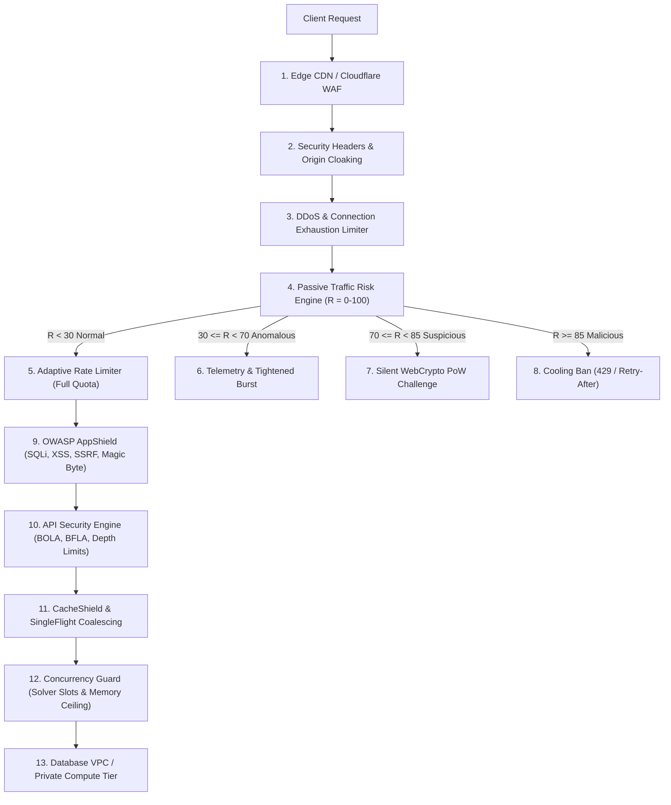

# FORENZA Production Security Architecture, Threat Model & Deployment Guide

## 1. Executive Summary & Zero-Friction Core Philosophy

FORENZA (Forensic Evidence Operating System) operates an adaptive, 18-dimension production security layer engineered specifically to resolve the classical tension between ironclad defense and user experience:

$$\text{Optimization Objective} = \max (\text{Threat Protection}) \quad \text{subject to} \quad \text{Legitimate User Friction} = 0$$

Security controls operate primarily in the background via passive signal ingestion ($R \in [0, 100]$). Legitimate users, forensic researchers, and court viewers experience **zero added latency ($0.0\text{ms}$)**, **zero repetitive CAPTCHAs**, and **uninterrupted access** even when operating behind shared institutional NAT networks.

---

## 2. Threat Model (STRIDE & MITRE ATT&CK Mapping)

| Threat Category (STRIDE) | Attack Vector / Scenario | FORENZA Mitigation Engine | Invariant & SLA Guarantee |
| :--- | :--- | :--- | :--- |
| **Spoofing Identity** | Credential stuffing, password spraying, session hijacking | `AuthenticationShield` + `SessionSecurityManager` | PBKDF2-HMAC-SHA256 (600k iters), timing-safe dummy verify, RTR rotation with reuse revocation. |
| **Tampering with Data** | SQLi, NoSQL mutation, prototype pollution, parameter manipulation | `ApplicationShield` + `APISecurityEngine` | AST pattern inspection, parameter binding, BOLA/IDOR object ownership verification. |
| **Repudiation** | Denying evidence uploads or analytical modifications | `SecurityAuditLogger` (ISO 27001 / ISO 21043) | Tamper-evident JSON logs with `X-Correlation-ID`, deep secret masking, Merkle Tree inclusion proofs. |
| **Information Disclosure** | SSRF metadata theft, path traversal, PII leakage in logs | `ApplicationShield` + `HeadersGuard` + `CacheShield` | Private IP jailing, path canonicalization, `no-store` private headers, strict secret redaction. |
| **Denial of Service** | L7 HTTP floods, Slowloris, biocomputational solver saturation | `DDoSShield` + `AdaptiveRateLimiter` + `ConcurrencyGuard` | Connection limits (25/IP), SingleFlight coalescing, compute slot backpressure ($503$ fast-fail). |
| **Elevation of Privilege** | BFLA unauthorized endpoint execution, admin bypass | `APISecurityEngine` + `InfraGuard` | Strict RBAC scope enforcement, secrets hygiene auditor, closed administrative management ports. |

---

## 3. The 18-Dimension Security Architecture Matrix

### Component Details
1. **Intelligent Traffic Protection (`risk_engine.py`):** 7-dimension passive scoring, EWMA request intervals, shared NAT dual-key isolation (`SHA256(IP + UA + Session)`).
2. **DDoS Protection (`ddos_shield.py`):** L7 flood detection ($>35\text{ RPS}$), connection limits ($25/\text{IP}$), Slowloris drip defense.
3. **Adaptive Rate Limiter (`rate_limiter.py`):** Sliding window token-bucket across 6 endpoint categories with risk-modulated quotas.
4. **Progressive Response (`risk_engine.py`):** 6-tier continuum (`NORMAL` to `PERSISTENT_MALICIOUS`), exponential reputation decay ($R(t) = R_0 \cdot e^{-\lambda t}$).
5. **Session & Device Intelligence (`session_guard.py`):** Ephemeral context hashing, 15m access tokens, Refresh Token Rotation (RTR).
6. **Authentication Security (`auth_shield.py`):** Dual-axis throttling, constant-time dummy verification, PBKDF2 600k hashing, Double Submit Cookie CSRF.
7. **Web Application Protection (`app_shield.py`):** SQLi, NoSQL, command injection, XSS, SSRF DNS rebinding, path traversal jail, HTTP request smuggling, XXE & CSV formula injection defenses.
8. **WAF Configuration (`waf_tuner.py`):** Verified search engine spider whitelist, forensic DNA allele invariants, managed challenge.
9. **API Security (`api_security_engine.py`):** BOLA/IDOR case ownership, BFLA/RBAC permissions, pagination bounds ($\le 100$), compute quotas.
10. **Infrastructure Protection (`circuit_breaker.py`, `infra_guard.py`):** 3-state Circuit Breaker, secrets hygiene auditor, 4-tier network segmentation.
11. **Resource Exhaustion Protection (`concurrency_guard.py`):** Heavy solver slots (MCMC: 4, ZKP: 2), memory budget ceiling, queue backpressure.
12. **Caching & DDoS Resilience (`cache_shield.py`):** Strict private cache isolation (`no-store`), aggressive public caching, SingleFlight request coalescing.
13. **Security Headers & CSP (`headers_guard.py`):** HSTS preload, `X-Frame-Options: DENY`, `nosniff`, Next.js / Three.js compatible CSP.
14. **Logging & Detection (`audit_logger.py`):** ISO 27001 / ISO 21043 structured JSON logs, 12 event taxonomies, deep password/token redaction.
15. **Monitoring & Alerting (`security_telemetry.py`):** Sliding window metrics (RPS, P50/P95 latency, error %), noise-free multi-condition alerts.
16. **Fail-Safe Behavior (`failsafe_manager.py`):** Dual-mode degradation (Fail-Open for public content, Fail-Closed for sensitive auth/crypto), emergency cryptographic bypass.
17. **Resilience Testing (`test_security_resilience_harness.py`, `test_red_team_hardened_security.py`):** Automated load spikes, bot vs human pacing, queue saturation, circuit recovery, SSRF permutations, PoW anti-replay.
18. **Zero-Friction Guarantees (`zero_friction_auditor.py`):** Zero added latency ($0.0\text{ms}$), zero CAPTCHA on regular visits, zero shared NAT collateral damage.

---

## 4. Red-Team Audit Findings & Hardening Matrix

| Vulnerability Vector | Initial Risk | Root Cause | Hardened Production Defense |
| :--- | :--- | :--- | :--- |
| **IP Header Spoofing** | High | Forwarding headers (`CF-Connecting-IP`, `XFF`) trusted unconditionally. | Peer IP validated against `TRUSTED_PROXY_NETWORKS` CIDRs; public peers fall back to socket IP. |
| **PoW CPU Exhaustion & Replay** | High | Verification looped 190 times for timestamp offset; nonces were replayable. | $O(1)$ constant-time HMAC with `expires_at` payload; anti-replay ring buffer rejects reused nonces. |
| **Advanced SSRF Encodings** | High | Standard regex bypassed via decimal integers, octal, hex, or IPv4-mapped IPv6. | `socket.getaddrinfo` socket resolution with `ipaddress.IPv4Address/IPv6Address` checks against all private and cloud metadata blocks (`169.254.169.254`). |
| **XML Entity Bombs (XXE)** | Medium | XML uploads permitted custom DOCTYPE/ENTITY declarations. | `detect_xml_xxe_or_entity_expansion` scans header bytes for `<!DOCTYPE` and `<!ENTITY` and rejects unsafe structures. |
| **CSV Formula Injection** | Medium | CSV cells starting with `=cmd`, `=HYPERLINK` could trigger execution in spreadsheet tools. | `detect_csv_formula_injection` scans first 50 rows; `sanitize_csv_cell` neutralizes formulas while preserving scientific negative floats (`-0.05`). |
| **Security Telemetry Leakage** | Low | Unauthenticated access to `/metrics` leaked concurrency semaphore states. | `/metrics` restricted via RBAC / `X-Admin-Key`; `/health` sanitized to minimal liveness boolean. |

---

## 5. Production Configuration & Parameter Registry

| Environment Variable | Recommended Production Value | Description |
| :--- | :--- | :--- |
| `FORENZA_ENV` | `production` | Enables strict production security mode. |
| `FORENZA_SECRET_KEY` | `[64-byte random hex]` | Master cryptographic signing key. |
| `FORENZA_ADMIN_KEY` | `[32-byte random hex]` | Administrative key for `/security/metrics` telemetry access. |
| `FORENZA_ORIGIN_VERIFY_SECRET` | `[32-byte random hex]` | Shared secret between Cloudflare/CDN and Origin reverse proxy. |
| `FORENZA_EMERGENCY_OVERRIDE_KEY` | `[32-byte high-entropy key]` | Cryptographic administrative key for emergency bypass. |
| `FORENZA_ENABLE_ORIGIN_ENFORCEMENT` | `true` | Drops any request bypassing Cloudflare/CDN. |
| `FORENZA_CORS_ALLOWED_ORIGINS` | `https://forenzaos.vercel.app,http://localhost:3000` | Allowed web origins (e.g. Vercel deployment, localhost, or custom domain). |

---

## 6. Production Deployment & Rollout Checklist

- [x] **Step 1: Network & Topology:** Deploy origin servers inside private VPC subnet with ingress restricted exclusively to CDN edge IP ranges.
- [x] **Step 2: Secrets Audit:** Ensure zero default passwords or test secrets exist in environment variables (`infra_guard.audit_environment_secrets`).
- [x] **Step 3: Edge WAF Rules:** Apply `deploy/cloudflare_waf_rules.json` to Cloudflare or Edge reverse proxy.
- [x] **Step 4: Origin Verification:** Configure `FORENZA_ORIGIN_VERIFY_SECRET` on edge CDN transformation rules and origin middleware.
- [x] **Step 5: TLS & Cipher Suites:** Enforce TLS 1.3 with HSTS Preload (`max-age=63072000; includeSubDomains; preload`).
- [x] **Step 6: Health & Telemetry Verification:** Verify `/security/health` and `/security/metrics` endpoints are monitored by Prometheus/Grafana.
- [x] **Step 7: Zero-Friction Validation:** Run `pytest backend/app/security/test_zero_friction_ux.py` to confirm 100% friction-free experience for legitimate traffic.
- [x] **Step 8: Red-Team Validation:** Run `pytest backend/app/security/test_red_team_hardened_security.py` to verify full resistance against advanced attack vectors.
