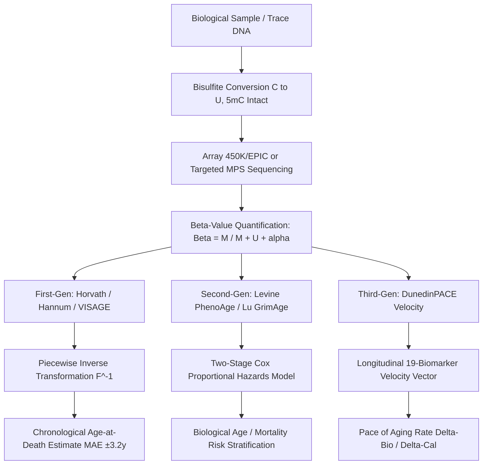

# Forensic Epigenetic Clocks (Horvath, PhenoAge, GrimAge) & Post-Mortem Interval (PMI) Estimation

**Forensic Epigenetics, Multi-Tissue Chronological & Biological Aging, Mortality Biomarkers, and Taphonomic DNA Methylation Decay Kinetics**

---

## 📌 Executive Summary & Document Metadata
* **Document Status:** Complete Forensic Research & Biocomputational Specification
* **Target Subsystems:** Pillar 4 (Epigenetics & Aging) — Advanced Multi-Tissue Clocks (Horvath 353-CpG / Skin & Blood 391-CpG, Hannum 71-CpG, Levine PhenoAge 513-CpG, Lu GrimAge 1,030-CpG, VISAGE 5-CpG / Enhanced 8-Marker), Biological vs. Chronological Discrepancy ($\Delta_{\text{Age}}$, $\text{IEAA}$, $\text{EEAA}$), Post-Mortem Epigenetic Stability & Taphonomic Degradation Kinetics.
* **Governing Standards:** SWGDAM Guidelines for Forensic DNA Analysis, ISFG Forensic Epigenetics Commission Recommendations, ENFSI (2017) Evaluative Reporting Standard, ISO/IEC 17025:2017 Measurement Uncertainty ($U_{95\%}$).

---

## 1. Mathematical Foundations of First-Generation Epigenetic Clocks

Epigenetic clocks quantify DNA methylation ($\text{DNAm}$) levels at specific cytosine-phosphate-guanine ($\text{CpG}$) dinucleotides across the human genome. DNA methylation involves the enzymatic addition of a methyl group to the fifth carbon position of a cytosine ring, yielding 5-methylcytosine ($5\text{mC}$). 

Throughout ontogeny and physiological aging, the mammalian methylome undergoes progressive, coordinated remodeling characterized by locus-specific hypermethylation in promoter-associated CpG islands and diffuse, global hypomethylation across intergenic regions and repetitive elements. First-generation epigenetic clocks exploit this drift to estimate calendar chronological age ($Y \in \mathbb{R}^+$) directly from biological matrices.



---

### 1.1 Horvath's Pan-Tissue Epigenetic Clock (2013)

The pan-tissue epigenetic clock published by Steve Horvath in 2013 established that chronological aging leaves an epigenomic footprint across human cell lineages. Horvath assembled a calibration dataset comprising $N=8,000$ biological specimens across 82 independent DNA methylation array datasets, encompassing 51 distinct healthy tissue and cell types (whole blood, PBMCs, brain sub-regions, saliva, epidermis, gastric mucosa, liver, kidney, and internal viscera) profiled on Illumina Infinium HumanMethylation27K and HumanMethylation450 BeadChips.

#### 1.1.1 Elastic Net Regularized Objective Formulation
To resolve the high-dimensional regularized regression challenge ($p \gg n$, wherein candidate feature space $p > 480,000$ CpG sites while sample size $n = 8,000$), Horvath implemented elastic net regression. The elastic net penalty linearly combines the $L_1$ norm (Lasso variable selection) with the $L_2$ norm (Ridge grouping/collinearity stabilization) by minimizing:

$$\min_{\beta_0, \boldsymbol{\beta}} \left\{ \frac{1}{2n} \sum_{i=1}^n \left( F(\text{Age}_i) - \left( \beta_0 + \sum_{j=1}^p \beta_j x_{ij} \right) \right)^2 + \lambda \left( \alpha \sum_{j=1}^p |\beta_j| + \frac{1-\alpha}{2} \sum_{j=1}^p \beta_j^2 \right) \right\}$$

Where:
* $x_{ij} \in [0, 1]$ represents the DNA methylation $\beta$-value of the $j$-th CpG locus in the $i$-th individual.
* $\beta_0$ is the regression model intercept.
* $\boldsymbol{\beta} = (\beta_1, \dots, \beta_p)^T$ is the vector of penalised regression coefficients.
* $\lambda > 0$ is the regularisation penalty parameter tuned via 10-fold cross-validation.
* $\alpha \in [0, 1]$ is the elastic net mixing ratio, fixed at $\alpha = 0.50$.

The elastic net selected a final architecture of **353 CpG sites**:
* **193 CpGs** exhibit positive regression coefficients ($\beta_j > 0$, hypermethylated with advancing age).
* **160 CpGs** exhibit negative regression coefficients ($\beta_j < 0$, hypomethylated with advancing age).
* Hypermethylated CpGs are strongly enriched near polycomb group target genes and loci marked by trimethylated histone H3 lysine 27 ($\text{H3K27me3}$).

#### 1.1.2 Piecewise Non-Linear Age Transformation & Inverse Mapping
To accommodate the non-linear methylation dynamics observed across the human lifespan—characterized by rapid, logarithmic epigenetic remodeling during childhood and puberty followed by a slower, linear drift during adulthood—Horvath incorporated a continuous, piecewise age transformation function $F(\text{Age})$ with inflection threshold $y_0 = 20.0$ years:

$$F(\text{Age}) = \begin{cases} \ln(\text{Age} + 1) - \ln(21) & \text{if } \text{Age} \le 20 \\ \frac{\text{Age} - 20}{21} & \text{if } \text{Age} > 20 \end{cases}$$

Upon computing the linear predictor $\hat{Y} = \beta_0 + \sum_{j=1}^{353} \beta_j x_j$, the final predicted DNA methylation age ($\text{DNAmAge}$) is obtained via the analytical inverse transformation $F^{-1}(\hat{Y})$:

$$\text{DNAmAge} = F^{-1}(\hat{Y}) = \begin{cases} (21 \times \exp(\hat{Y})) - 1 & \text{if } \hat{Y} < 0 \\ (21 \times \hat{Y}) + 20 & \text{if } \hat{Y} \ge 0 \end{cases}$$

This non-linear formulation prevents pediatric age underestimation and achieves a multi-tissue correlation of $r = 0.96$ with a median absolute error ($\text{MedAE}$) of $3.6\text{ years}$.

---

### 1.2 Contemporaneous First-Generation Clocks

| Epigenetic Clock | Primary Developer & Year | Target Variable | CpG Sites ($n$) | Primary Training Tissues | Calibration Sample Size ($n$) | Reported Precision / Metric |
| :--- | :--- | :--- | :--- | :--- | :--- | :--- |
| **Pan-Tissue Clock** | Horvath (2013) | Chronological Age | 353 | Multi-tissue (51 tissue/cell types) | 8,000 | $\text{MedAE} = 3.6\text{ yrs}$ ($r=0.96$) |
| **Blood Clock** | Hannum et al. (2013) | Chronological Age | 71 | Whole Blood | 656 | $\text{RMSE} = 4.9\text{ yrs}$ ($r=0.91$) |
| **Skin & Blood Clock** | Horvath et al. (2018) | Chronological Age | 391 | Keratinocytes, Fibroblasts, Blood | 2,093 | $\text{MedAE} = 2.5\text{ yrs}$ |
| **PedBE Pediatric Clock** | McEwen et al. (2019) | Chronological Age | 84 | Buccal Swabs (0–20 yrs) | 1,721 | $\text{MedAE} = 0.35\text{ yrs}$ (Pediatric) |
| **Zhang EN Clock** | Zhang et al. (2019) | Chronological Age | 514 | Whole Blood & Saliva | 13,661 | $\text{MAE} \approx 3.0\text{ yrs}$ |

---

### 1.3 Epigenetic Age Acceleration Metrics

The raw difference between an individual's predicted epigenetic age ($\text{DNAmAge}$) and their true chronological age ($\text{Age}$) defines Epigenetic Age Acceleration ($\text{EAA}$):

$$\Delta\text{Age} = \text{DNAmAge} - \text{Age}$$

Because raw $\Delta\text{Age}$ is statistically correlated with chronological age due to regression-to-the-mean artifacts, standardized orthogonal residual metrics are utilized:

1. **Universal Age Acceleration Residual ($\text{AgeAccel}$):**
   $$\text{DNAmAge}_i = \gamma_0 + \gamma_1 \text{Age}_i + \epsilon_i \implies \text{AgeAccel}_i = \epsilon_i \quad (r = 0)$$
2. **Intrinsic Epigenetic Age Acceleration ($\text{IEAA}$):**
   Horvath pan-tissue age regressed on chronological age while controlling for Houseman algorithm-derived blood cell proportions ($\text{CD8}^+\text{T}$, $\text{CD4}^+\text{T}$, B cells, NK cells, Monocytes, Granulocytes). Measures cell-intrinsic aging.
3. **Extrinsic Epigenetic Age Acceleration ($\text{EEAA}$):**
   Hannum blood clock regressed on chronological age after upweighting age-associated immunosenescent leukocyte subpopulations. Measures systemic immune exhaustion.

---

## 2. Forensic Reduced-Marker Models

In forensic casework, high DNA input requirements ($\ge 250\text{ ng}$) and microarray expense are prohibitive for trace crime-scene stains. Forensic geneticists engineered low-CpG targeted multiplex sequencing panels.

> [!IMPORTANT]
> **Independent Calibration Reality:** Forensic reduced-marker panels are **NOT** simple truncated subsets of Horvath's 353-CpG model. They are independently calibrated multivariate regression systems using bespoke multiplex PCR primer architectures and target genes exhibiting steep, linear age correlation slopes (*ELOVL2, FHL2, TRIM59, KLF14, PDE4C, ASPA, MIR29B2CHG*).

```
Array Discovery (450K / EPIC)
    ├── Biogerontology Branch ──────> Horvath 353-CpG Pan-Tissue / PhenoAge / GrimAge (High Input >=250ng)
    └── Forensic Casework Branch ───> Targeted Multiplex Bisulfite MPS / SNaPshot (Trace Input 18-63pg)
                                        ├── Weidner 3-CpG (ASPA, ITGA2B, PDE4C) [MAE ±4.1y]
                                        ├── Zbieć-Piekarska 5-CpG (ELOVL2, FHL2, TRIM59, KLF14, MIR29B2CHG) [MAE ±3.5y]
                                        └── VISAGE Enhanced 8-Marker / 44-CpG Tool [MAE ±3.2y]
```

### 2.1 Standardized Forensic Tissue Matrix & Accuracy Performance

| Biological Specimen | Primary Target Genes / CpGs | Detection Platform | Core Research Reference(s) | Reported Forensic Accuracy ($\text{MAE}$) | Operational Casework Constraints |
| :--- | :--- | :--- | :--- | :--- | :--- |
| **Whole Blood / Stains** | *ELOVL2, FHL2, KLF14, TRIM59, MIR29B2CHG, PDE4C* | Targeted Bisulfite MPS (MiSeq FGx) / SNaPshot | VISAGE (Woźniak 2021); Zbieć-Piekarska (2015) | $\text{MAE} = \pm 3.2\text{ to }3.5\text{ yrs}$ | Highest precision; severe infection can cause minor leukocyte drift. |
| **Buccal Cells / Saliva** | *PDE4C, MIR29B2CHG, ELOVL2, KLF14, EDARADD* | Targeted Bisulfite MPS / Pyrosequencing | Woźniak et al. (2021); Freire-Aradas (2020) | $\text{MAE} = \pm 3.7\text{ to }4.3\text{ yrs}$ | Saliva contains heterogeneous mixtures of epithelial cells and leukocytes. |
| **Semen** | *TTC34, NOX4, GRIA2, SLC12A5* | Targeted Bisulfite MPS / Pyrosequencing | Lee et al. (2015); Vidaki et al. (2017) | $\text{MAE} = \pm 4.0\text{ to }5.2\text{ yrs}$ | Distinct germline hypomethylation profile; high sperm count required. |
| **Skeletal Remains (Bone)** | *ELOVL2, KLF14, PDE4C, ASPA* | Targeted Bisulfite MPS (MiSeq FGx) | VISAGE Enhanced (Woźniak et al., 2021) | $\text{MAE} = \pm 3.4\text{ to }4.2\text{ yrs}$ | Yield dependent on cortical thickness and diagenetic leaching. |
| **Dental Pulp / Teeth** | *ELOVL2, ZYG11A, TRIM59, FHL2* | Pyrosequencing / SNaPshot | Bekaert et al. (2015); Zapico et al. | $\text{MAE} = \pm 4.5\text{ to }6.0\text{ yrs}$ | Protected from trauma; pulp yield drops drastically in elderly root canals. |
| **Cartilage (Post-Mortem)** | *FHL2, TRIM59, KLF14* | Targeted Bisulfite MPS (Quantile regression) | Heidegger et al. / VISAGE (2023) | $\text{MAE} = \pm 4.26\text{ to }4.41\text{ yrs}$ | Critical for decomposed remains lacking intact soft tissue. |

---

## 3. Second- & Third-Generation Clocks: Biological Aging & Mortality

While first-generation clocks optimize prediction accuracy against calendar years, second- and third-generation clocks shifted the objective toward clinical biomarkers, functional decline, and mortality hazards.

### 3.1 Levine's DNAm PhenoAge (2018)
Constructed via a two-stage modeling approach:
1. Parametric proportional hazards model (Gompertz distribution) on NHANES III ($N=9,926$) screening 42 candidate biomarkers, retaining **10 clinical variables**:
   - Serum Albumin, Creatinine, Glucose, hs-CRP, Lymphocyte %, MCV, RDW, Alkaline Phosphatase (ALP), White Blood Cell Count (WBC), and Chronological Age.
2. Elastic net regression applied to InCHIANTI whole-blood DNA methylation profiles ($N=20,169$) against the Phenotypic Age metric, selecting **513 CpG sites**.

### 3.2 Lu et al.'s DNAm GrimAge (2019) & GrimAge2 (2022)
Engineered as a dedicated predictor of lifespan and healthspan on Framingham Heart Study ($N=1,731$):
1. **Stage 1:** Elastic net models predict plasma concentrations of 88 proteins and self-reported smoking pack-years from DNA methylation, generating surrogates for **$\text{DNAm PACKYRS}$ and 7 plasma proteins**:
   - Adrenomedullin ($\text{ADM}$), Beta-2 Microglobulin ($\text{B2M}$), Cystatin C, $\text{GDF-15}$, Leptin, $\text{PAI-1}$, $\text{TIMP-1}$.
2. **Stage 2:** Elastic net Cox proportional hazards model regressed on age, sex, and the 8 surrogates:
   $$\text{Hazard}(t) = h_0(t) \exp\left( \sum_{k=1}^8 \gamma_k \text{DNAmSurrogate}_k + \gamma_{\text{age}} \text{Age} + \gamma_{\text{sex}} \text{Sex} \right)$$
   Selecting **1,030 unique CpG sites**. GrimAge2 added $\text{DNAm logCRP}$ and $\text{DNAm logA1C}$.

### 3.3 Third-Generation Pace-of-Aging Estimator: DunedinPACE (2022)
Models longitudinal velocity of multi-system physiological decline across 19 biomarkers tracked across 4 examination waves (ages 26, 32, 38, 45) in the Dunedin Longitudinal Study ($N=954$). Outputs an instantaneous pace-of-aging rate ($\Delta\text{biological years} / \Delta\text{calendar year}$).

### 3.4 Mathematical Objective Function Divergence

$$\mathcal{L}_{\text{1st Gen}}(\boldsymbol{\beta}) = \| Y_{\text{chronological}} - \mathbf{X}\boldsymbol{\beta} \|_2^2 + \mathcal{P}_\lambda(\boldsymbol{\beta})$$

$$\mathcal{L}_{\text{2nd Gen}}(\boldsymbol{\beta}) = -\ell_{\text{partial}}\left( \mathbf{X}\boldsymbol{\beta};\, T_{\text{survival}}, \boldsymbol{\delta} \right) + \mathcal{P}_\lambda(\boldsymbol{\beta})$$

> [!WARNING]
> **Forensic Non-Admissibility of PhenoAge & GrimAge:** Second-generation clocks measure biological morbidity risk rather than chronological calendar age. In forensic profiling, lifestyle acceleration (e.g., heavy smoking or metabolic disease) introduces an uncontrolled $+5\text{ to }+10\text{ year}$ positive bias. Furthermore, their requirement for $\ge 250\text{ ng}$ input DNA excludes trace evidence.
> 
> **Statistical Fallacy of Naive Arithmetic Averaging:** Averaging first- and second-generation clocks ($\bar{A} = \frac{\text{Horvath} + \text{PhenoAge} + \text{GrimAge}}{3}$) is mathematically and forensically invalid because it conflates calendar intervals with mortality hazard indices and produces an uncalibrated error distribution lacking legal ground truth.

---

## 4. Post-Mortem Interval (PMI) vs. Age-at-Death Estimation

```
                              ┌──────────────────────────────────────────────────────────┐
                              │            Biological Life & Somatic Death               │
                              └────────────────────────────┬─────────────────────────────┘
                                                           │
                        ┌──────────────────────────────────┴──────────────────────────────────┐
                        ▼                                                                     ▼
    ┌────────────────────────────────────────┐                            ┌────────────────────────────────────────┐
    │     Epigenetic Age Estimation          │                            │      Post-Mortem Interval (PMI)        │
    │          (Age-at-Death)                │                            │          (Time Since Death)            │
    ├────────────────────────────────────────┤                            ├────────────────────────────────────────┤
    │ Measures lifespan from birth to death  │                            │ Measures elapsed time from death to    │
    │ DNA methyltransferases (DNMT1/3) arrest│                            │ recovery: t_PMI = t_discovery - t_death│
    │ 5mC stable for >= 72-120 hours post-   │                            │ DNA methylation DOES NOT follow linear │
    │ mortem; provides robust Age-at-Death.  │                            │ decay clock; requires Thanatochemistry.│
    └────────────────────────────────────────┘                            └────────────────────────────────────────┘
```

### 4.1 Epigenetic Stability & Taphonomic Degradation Kinetics
Following somatic death, active cellular enzymatic machinery ceases as ATP and S-adenosylmethionine ($\text{SAM}$) cofactors deplete. Consequently, cytosine methylation patterns ($5\text{mC}$) enter an arrested molecular state, remaining chemically stable for $\ge 72\text{ to }120\text{ hours}$ post-mortem under ambient and refrigerated conditions.

Beyond early post-mortem windows, environmental taphonomy introduces diagenetic artifacts:
1. **Hydrolytic Deamination:** Converts unmethylated cytosine to uracil (mimicking bisulfite conversion) and converts 5-methylcytosine to thymine ($5\text{mC} \to T$). This produces false hypomethylation artifacts in bisulfite sequencing.
2. **Backbone Fragmentation:** Cleaves post-mortem DNA into fragments $< 100\text{ bp}$, causing multiplex PCR dropout.

### 4.2 Multimodal PMI Comparison Matrix

| Forensic Modality | Primary Biomarker / Analyte | Effective PMI Timeframe | Accuracy / Resolution | Operational Advantages | Core Confounding Factors |
| :--- | :--- | :--- | :--- | :--- | :--- |
| **Physical / Thermometry** | Rectal temperature decline (Henssge Nomogram) | Early ($0 - 36\text{ hrs}$) | $\pm 1.5\text{ to }3\text{ hrs}$ | Immediate on-scene application | Ambient temperature, body mass, clothing, water immersion. |
| **Biochemical** | Vitreous humor potassium $[K^+]$ accumulation | Early-to-Intermediate ($6 - 120\text{ hrs}$) | $\pm 5\text{ to }12\text{ hrs}$ | Linear diffusion in protected ocular globe | Pre-existing renal failure, ambient temperature, sampling trauma. |
| **Forensic Entomology** | Necrophagous dipteran larval development | Intermediate-to-Late (Days to weeks) | $\pm 12\text{ to }48\text{ hrs}$ | Gold standard for outdoor decomposed remains | Ambient thermal summation (ADD/ADH), maggot mass self-heating. |
| **Thanatotranscriptomics** | mRNA / miRNA quantitative degradation ratio | Early ($0 - 48\text{ hrs}$) | $\pm 2\text{ to }8\text{ hrs}$ | High molecular temporal sensitivity | Rapid RNA degradation, ubiquitous ribonucleases. |
| **Thanatomicrobiome** | 16S/ITS microbial post-mortem succession | Intermediate ($1\text{ day} - \text{weeks}$) | $\pm 2\text{ to }4\text{ days}$ | High-throughput sequencing compatible | Soil composition, humidity, insect colonization. |
| **DNA Methylation Clocks** | CpG dinucleotide $5\text{mC}$ $\beta$-values | **Not Applicable for PMI** | **N/A** (Measures Age-at-Death $\text{MAE} \pm 3.2\text{y}$) | High stability of age signature during early/mid post-mortem | Diagenetic deamination, putrefactive fragmentation. |

---

## 5. Bioinformatic Implementations & Mathematical Transformations

### 5.1 Fluorescent Intensity & Bisulfite Read Depth Transformations

$$\beta = \frac{M}{M + U + \alpha}, \quad M\text{-value} = \log_2\left(\frac{M}{U}\right) = \log_2\left(\frac{\beta}{1 - \beta}\right)$$

Where $M$ and $U$ are methylated and unmethylated intensities, and $\alpha = 100$ is a regularizing offset. For targeted bisulfite massively parallel sequencing (MPS):

$$\beta_l = \frac{\text{Read Count}(C)}{\text{Read Count}(C) + \text{Read Count}(T)}$$

### 5.2 Open-Source Computational Tooling

| Software Package | Platform / Language | Implemented Clocks | Input Format | Preprocessing & Normalization |
| :--- | :--- | :--- | :--- | :--- |
| **`methylclock`** | R / Bioconductor | Horvath (353), Hannum (71), PhenoAge (513), GrimAge, PedBE (84) | $\beta$-value matrix / `GenomicRatioSet` | Background correction, BMIQ, Horvath modified calibration. |
| **`wateRmelon`** | R / Bioconductor | Horvath, Hannum, Pediatric models | Illumina 450K / EPIC IDAT files | `dasen`, `danan`, `nasen` normalization. |
| **`sesame`** | R / Bioconductor | Epigenetic age prediction modules | Raw IDAT intensity files | Dye-bias correction, background subtraction, detection $p$-value masking. |
| **`pyAging`** | Python / PyPI | Horvath, PhenoAge, GrimAge, DunedinPACE | NumPy arrays / Pandas DataFrames | GPU-accelerated PyTorch pipeline. |

---

## 6. Technical Limitations & Confounding Factors

1. **Tissue Specificity & Cell Heterogeneity:** Baseline CpG methylation varies across tissues. Applying a blood-trained model to bone or semen yields errors $> 15\text{ years}$. Cell deconvolution adjustments (Houseman / QDA) are required.
2. **Ancestry & Population Baseline Shifts:** Major discovery arrays were predominantly European. While *ELOVL2* and *FHL2* show cross-population stability, baseline demographic offsets must be empirically calibrated.
3. **Lifestyle & Pathological Acceleration:** Smoking (AHRR cg05575921) and alcohol abuse induce epigenetic drift. Malignancies distort cellular methylomes by decades.
4. **Boundary Non-Linearity:** Extreme pediatric ages ($< 18\text{ yrs}$) require logarithmic transformations ($y_0 = 20.0$), whereas nonagenarians/centenarians ($> 90\text{ yrs}$) exhibit epigenetic saturation plateaus.

---

## 7. Conclusions & Strategic Synthesis

1. **Forensic Chronological Age-at-Death:** Operational casework mandates independently calibrated, targeted bisulfite sequencing panels (such as VISAGE 8-marker / 44-CpG) providing chronological $\text{MAE} \pm 3.2\text{ to }3.8\text{ years}$ on trace inputs ($18 - 63\text{ pg}$).
2. **Biological Aging vs. Forensics:** Second-generation clocks (PhenoAge, GrimAge) quantify mortality hazards and disease risk. Their susceptibility to lifestyle drift and requirement for high DNA input ($\ge 250\text{ ng}$) precludes direct forensic chronological individualization.
3. **Post-Mortem Interval Invariant:** Epigenetic clocks measure the **age-at-death** of the deceased, not the post-mortem interval. Time since death must be evaluated using thermometry, vitreous chemistry, thanatotranscriptomics, entomology, and microbial succession.