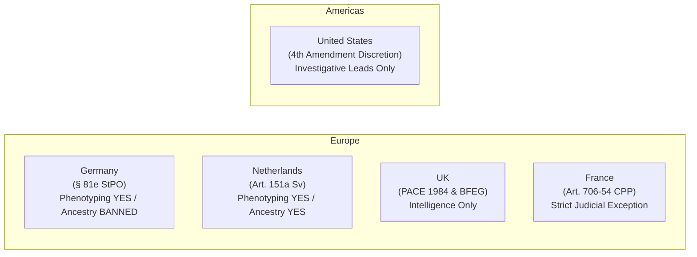

# FORENZA Research Specification: Forensic DNA Phenotyping (HIrisPlex-S) & Biogeographic Ancestry (BGA) Reference Frameworks

## Metadata
- **Module Identifier:** Pillar 3 — Forensic DNA Phenotyping (FDP) & Biogeographic Ancestry (BGA) Infrastructure
- **Status:** APPROVED RESEARCH SPECIFICATION
- **Primary Domain:** HIrisPlex-S 41-SNP Multinomial Logistic Regression (MLR), Kidd 55-AIM vs. Precision ID 165-SNP vs. VISAGE Enhanced vs. Microhaplotypes, Population Reference Databases (gnomAD v4.1, 1000 Genomes NYGC 30x, HGDP-CEPH, SGDP), Statistical Deconvolution (STRUCTURE, ADMIXTURE, PCA/Procrustes), and International Regulatory Governance (ISFG, ENFSI, Germany §81e StPO, Netherlands Art. 151a, UK PACE, US Fourth Amendment).
- **Key References:** Walsh et al. (2018) Forensic Sci Int Genet; Kidd et al. (2014) Forensic Sci Int Genet; Rosenberg et al. (2003) Am J Hum Genet; gnomAD Consortium (2020, 2024) Nature; VISAGE Consortium Guidelines (2020); ISFG (2020) Recommendations.

---

## 1. The HIrisPlex-S System: Assay Architecture, Marker Panels, and Statistical Modeling

Forensic DNA Phenotyping (FDP) refers to the predictive inference of an individual’s externally visible characteristics (EVCs) exclusively from biological traces recovered at crime scenes or from unidentified human remains. Unlike standard forensic short tandem repeat (STR) profiling, which targets hypervariable, non-coding loci to individualize a sample against an existing reference database or suspect profile, FDP assays functionally informative single nucleotide polymorphisms (SNPs) to construct a predictive biological description of an uncharacterized donor.

The primary international standard in operational FDP is the **HIrisPlex-S system**, developed collaboratively by the Department of Genetic Identification at Erasmus MC University Medical Center Rotterdam and the Department of Biology at Indiana University–Purdue University Indianapolis (IUPUI).

### Iterative Molecular Expansion
- **IrisPlex (2011):** A 6-SNP multiplex assay and statistical framework developed for categorical blue and brown eye color prediction.
- **HIrisPlex (2013–2014):** A 24-SNP multiplex combining the 6 IrisPlex markers with 18 hair-predictive SNPs, capable of simultaneously predicting eye color (3 categories) and hair color (4 categories, along with hair shade lightness).
- **HIrisPlex-S (2018–Present):** An integrated 41-SNP system that extends the 24 HIrisPlex markers by incorporating 17 additional skin-predictive SNPs, establishing the first simultaneous prediction platform for eye, hair, and skin pigmentation.

> [!NOTE]
> Official documentation and consortium releases confirm that the **41-SNP panel remains the definitive and most up-to-date standard** of the standalone HIrisPlex-S platform.

---

### Marker Composition and Molecular Configuration
The HIrisPlex-S system interrogates 41 autosomal SNPs across 17 distinct genetic loci involved in melanin biosynthesis (eumelanin and pheomelanin pathways), melanosome biogenesis, and melanocyte differentiation.

| Target Phenotype | Sub-Assay / Multiplex Source | Analyzed SNP Count | Genetic Loci Involved | Key Functional Loci and Marker Breakdown |
| :--- | :--- | :---: | :---: | :--- |
| **Eye Color** | Original IrisPlex Core | 6 SNPs | 6 genes | *HERC2* (`rs12913832`), *OCA2* (`rs1800407`), *SLC24A4* (`rs12896399`), *SLC45A2* (`rs16891982`), *TYR* (`rs1393350`), *IRF4* (`rs12203592`) |
| **Hair Color** | HIrisPlex Module | 22 SNPs (from 24-plex) | 11 genes | *MC1R* (11 variants: `rs1805005`, `rs1805006`, `rs1805007`, `rs1805008`, `rs1805009`, `rs11547464`, `rs885479`, `rs2228479`, `rs1110400`, `N29insA`/`rs312262906`, `Y152OCH`), *HERC2*, *OCA2*, *SLC45A2*, *KITLG*, *EXOC2*, *TYRP1*, *ASIP* |
| **Skin Pigmentation** | HIrisPlex-S Extension | 36 SNPs | 16 genes | *SLC24A5* (`rs1426654`), *SLC45A2* (`rs16891982`, `rs26722`), *HERC2* (`rs12913832`), *OCA2*, *TYR*, *IRF4*, *RALY/EIF2S2/ASIP*, *BNC2*, *DEF8*, *PIGU*, *APBA2*, *MC1R*, *KITLG*, *TRPM1*, *TPCN2*, *ASIP* |
| **Total HIrisPlex-S Panel** | **24-plex + 17-plex SNaPshot / Single MPS Multiplex** | **41 Unique SNPs** | **17 Genes** | **Consolidated marker set covering overlapping epistatic and additive pigmentation pathways** |

In capillary electrophoresis (CE) workflows, the 41 markers are genotyped using two single-base extension (SNaPshot) multiplexes: the original 24-plex assay and the supplementary 17-plex assay targeting the novel skin SNPs. Massively Parallel Sequencing (MPS) adaptations—deployed on platforms such as Thermo Fisher Scientific Ion GeneStudio/Ion Torrent and Illumina MiSeq/ForenSeq—amplify and sequence all 41 markers in a single multiplex library.

---

### Mathematical and Statistical Model Architecture
The statistical engine underlying the HIrisPlex-S platform utilizes multinomial logistic regression (MLR) models parameterized independently for each pigmentation trait, supplemented by binomial logistic regression for hair shade determination.

#### 1. Eye Color Prediction
Eye color is treated as a 3-category nominal response variable ($c \in \{\text{Blue}, \text{Brown}, \text{Intermediate}\}$), where Intermediate encompasses green, hazel, and mixed pigmented irises. The model fits an MLR framework utilizing 6 SNPs. For an individual with genotype vector $\mathbf{x}_{\text{eye}}$, the probability $P(Y_{\text{eye}} = c)$ of belonging to color category $c$ is calculated relative to a reference baseline category ($c_0 = \text{Brown}$):

$$\ln\left(\frac{P(Y_{\text{eye}} = c \mid \mathbf{x}_{\text{eye}})}{P(Y_{\text{eye}} = c_0 \mid \mathbf{x}_{\text{eye}})}\right) = \beta_{0,c} + \sum_{j=1}^{6} \beta_{j,c} x_j$$

$$P(Y_{\text{eye}} = c \mid \mathbf{x}_{\text{eye}}) = \frac{\exp\left(\beta_{0,c} + \mathbf{x}_{\text{eye}}^T \boldsymbol{\beta}_c\right)}{1 + \sum_{k \neq c_0} \exp\left(\beta_{0,k} + \mathbf{x}_{\text{eye}}^T \boldsymbol{\beta}_k\right)}$$

The intronic SNP `rs12913832` in *HERC2*, which regulates the promoter of the neighboring *OCA2* gene, acts as the primary genetic switch: homozygous `GG` genotypes yield high probabilities for blue eyes, whereas `AA` and `AG` genotypes correlate with brown or intermediate irises. The webtool requires the presence of `rs12913832`; missing data at this locus aborts the eye color calculation.

#### 2. Hair Color Prediction
Hair color is evaluated through a hierarchical two-tier process:
1. **Four distinct color classes:** Blond, Brown, Red, and Black, using an MLR model driven by 22 SNPs. Red hair prediction is driven by functional, penetrant loss-of-function variants within the *MC1R* gene (such as `R151C`, `R160W`, and `D294H`), which shift melanin synthesis from dark eumelanin to red/yellow pheomelanin.
2. **Hair shade lightness:** A secondary binomial logistic regression model predicts hair shade lightness (Light vs. Dark) to resolve phenotypic boundary ambiguities between dark blond and light brown hues.

#### 3. Skin Pigmentation Prediction
Skin color is categorized across five hierarchical, phenotypically calibrated classes: **Very Pale, Pale, Intermediate, Dark, and Dark-to-Black**. The model implements an MLR algorithm trained on 36 SNPs. Genotypic encoding incorporates major-effect ancestral divergence alleles (such as *SLC24A5* `rs1426654` and *SLC45A2* `rs16891982`) alongside additive polygenic contributions across the remaining 14 loci.

---

### Training Cohorts and Empirical Validation Metrics
The training and developmental validation of the IrisPlex, HIrisPlex, and HIrisPlex-S systems progressed across expanding global cohorts:
- **IrisPlex & HIrisPlex:** Trained on cohorts of 2,800 to 3,800 European individuals (predominantly Dutch and Polish reference populations) and evaluated using cross-validation.
- **HIrisPlex-S:** Trained on a globally distributed dataset of 2,025 individuals across 5 major geographic regions to capture global skin reflectance variation, and validated under Scientific Working Group on DNA Analysis Methods (SWGDAM) developmental guidelines.

| Trait | Phenotypic Category | Training/Validation AUC | Sensitivity | Specificity | Balanced Accuracy |
| :--- | :--- | :---: | :---: | :---: | :---: |
| **Eye Color** | Blue | $0.94 \pm 0.005$ | $0.928 \pm 0.008$ | $0.866 \pm 0.012$ | $0.899 \pm 0.011$ |
| | Brown | $0.95 \pm 0.004$ | $0.932 \pm 0.007$ | $0.910 \pm 0.009$ | $0.921 \pm 0.008$ |
| | Intermediate | $0.74 \pm 0.012$ | $0.000–0.440$ | $0.980–1.000$ | $0.500–0.720$ |
| **Hair Color** | Red | $0.93–0.96$ | $0.850–0.910$ | $0.960–0.990$ | $0.905–0.950$ |
| | Black | $0.87–0.93$ | $0.820–0.890$ | $0.880–0.940$ | $0.850–0.915$ |
| | Blond | $0.81–0.85$ | $0.680–0.740$ | $0.830–0.890$ | $0.755–0.815$ |
| | Brown | $0.74–0.78$ | $0.620–0.690$ | $0.740–0.810$ | $0.680–0.750$ |
| **Skin Color** | Very Pale | $0.75–0.83$ | $0.580–0.700$ | $0.830–0.900$ | $0.705–0.800$ |
| | Pale | $0.73–0.76$ | $0.570–0.690$ | $0.760–0.840$ | $0.665–0.765$ |
| | Intermediate | $0.75–0.78$ | $0.520–0.650$ | $0.780–0.850$ | $0.650–0.750$ |
| | Dark | $0.84–0.98$ | $0.800–0.920$ | $0.950–0.980$ | $0.875–0.950$ |
| | Dark-to-Black | $0.98–0.99$ | $0.940–0.980$ | $0.980–0.995$ | $0.960–0.988$ |

---

### Documented Model Limitations and Population Generalizability
Independent validation studies across diverse populations have identified clear operational limits:
1. **The Intermediate Phenotype Deficit:** While the system exhibits high discriminatory power for polar phenotypes (dark black vs. pale skin; deep brown vs. pure blue eyes), classification accuracy declines for intermediate phenotypes. For intermediate (green/hazel) eyes, default probability thresholds often result in zero sensitivity in Northern and Central European validation cohorts, requiring adjusted decision thresholds to yield meaningful calls.
2. **Admixed Populations:** In admixed cohorts—such as Latin American, Brazilian, and Mexican populations with complex European, Native American, and African contributions—predictive accuracy declines relative to homogeneous European cohorts. The continuous phenotypic distribution found in admixed genomes is less reliably categorized by discrete multinomial cutoffs.
3. **Unrepresented Population-Specific Alleles:** Pigmentation variants private to non-European groups (such as specific East Asian *OCA2* alleles or African *MFSD12* variants) are not captured in the 41-SNP panel. As a result, skin tone predictions in these groups can show systematic bias.
4. **Non-Genetic and Environmental Confounding:** Static DNA markers cannot account for non-genetic factors such as hair graying (canities), age-related hair darkening during maturation, UV-induced tanning, or chemical cosmetic treatments.

---

## 2. Biogeographic Ancestry Inference: Marker Panels and Statistical Frameworks

Biogeographic Ancestry (BGA) inference estimates the geographic origins of an individual’s ancestors using germline DNA markers. Unlike standard STR profiling, which relies on markers with balanced allele distributions across populations to establish identity, BGA inference targets loci that show substantial allele frequency divergence due to historical genetic drift, geographic isolation, and natural selection.

### The Statistical Logic of Ancestry Informative Markers (AIMs)
Ancestry Informative Markers (AIMs) are genetic loci that display high allele frequency differentiation across geographic regions. The informativeness for assignment ($I_n$) of a biallelic locus across $K$ populations is formalized following Rosenberg et al.:

$$I_n = \sum_{j=1}^{2} \left( -\bar{p}_j \ln \bar{p}_j + \sum_{k=1}^{K} \frac{p_{kj} \ln p_{kj}}{K} \right)$$

where $p_{kj}$ is the frequency of allele $j$ in population $k$, and $\bar{p}_j$ is the mean frequency across all $K$ populations. Similarly, Wright’s fixation index ($F_{ST}$) quantifies the proportion of genetic variance attributable to population differentiation:

$$F_{ST} = \frac{\text{Var}(p)}{\bar{p}(1-\bar{p})}$$

While whole-genome sequencing (WGS) provides comprehensive genomic coverage, forensic casework frequently deals with degraded, low-template, or mixed DNA. Consequently, compact, multiplexed AIM panels that maximize cumulative $I_n$ with minimal template consumption are essential for operational casework.

---

### The Kidd 55-AIM Panel and FROG-kb
The **Kidd 55-AIM panel**, developed by Kenneth K. Kidd and colleagues at Yale University, represents a foundational reference marker set for continental ancestry inference. Selected through global population screening across the Human Genome Diversity Project (HGDP-CEPH) cell lines, the panel contains 55 autosomal SNPs with high global divergence ($F_{ST} > 0.6$ between at least two continental groups) that remain unlinked across the genome.

The panel is implemented computationally within the Forensic Resources/Odds Guide knowledge base (**FROG-kb**), which calculates likelihood ratios and population assignment probabilities across major global reference clusters: European, African, East Asian, Native American, and South Asian/Oceanian.

*Limitation:* While the 55-AIM panel provides robust multiplex amplification and clear continental-level separation on degraded samples, its resolution is limited at sub-continental scales (such as distinguishing Northern from Southern European, or Han Chinese from Japanese ancestries) and when evaluating complex admixed individuals.

---

### Survey of Advanced and Alternative AIM Panels
Advancements in Massively Parallel Sequencing have enabled higher-density AIM panels with finer geographic resolution:
- **Precision ID Ancestry Panel (Thermo Fisher Scientific):** Combines 165 autosomal SNPs (incorporating the Kidd 55-AIMs and 123 Seldin AIMs) to resolve continental ancestry alongside sub-continental regional clines.
- **EUROFORGEN AIM-SNP Panel:** A 128-SNP panel designed by the European Forensic Genetics Network of Excellence, optimized for distinguishing European, African, East Asian, and Oceanian groups, with enhanced power for European sub-structuring.
- **VISAGE Basic Tool (153 Markers):** Developed by the European Union VISAGE Consortium, this panel integrates the 41 HIrisPlex-S appearance SNPs with 112 dedicated AIM SNPs and insertion-deletion markers into a single AmpliSeq assay to evaluate appearance and ancestry simultaneously.
- **VISAGE Enhanced Tool:** Expands marker capacity to provide fine-scale sub-continental resolution across Europe, Asia, and Africa, integrating appearance, ancestry, and epigenetic age estimation markers.
- **Microhaplotypes (MHs):** Emerging as an informative marker class. A microhaplotype consists of a short genomic segment ($<300\text{ bp}$) containing two or more closely linked SNPs that define multiple stable haplotype configurations. Because they are multiallelic, lack PCR stutter artifacts, and do not recombine across forensic generations, panels such as the 74-plex and 153-plex MH systems provide high informativeness for assignment ($I_n$) per locus and allow deconvolution of complex biological mixtures.

---

### Statistical Methodologies for Ancestry Deconvolution
Converting multi-locus AIM genotypes into ancestry estimates relies on three primary statistical frameworks:

#### 1. Bayesian Clustering (STRUCTURE Framework)
STRUCTURE assumes $K$ ancestral populations, each characterized by a set of allele frequencies at each locus. The model uses Markov Chain Monte Carlo (MCMC) sampling to jointly estimate allele frequencies in each ancestral cluster and the individual admixture proportions ($Q$-matrix) using Dirichlet priors:

$$P(G \mid Q, P) = \prod_{i=1}^{N} \prod_{l=1}^{L} \prod_{a=1}^{2} \left( \sum_{k=1}^{K} q_{ik} p_{kl, g_{ila}} \right)$$

where $q_{ik}$ is the proportion of individual $i$'s ancestry derived from cluster $k$, and $p_{kl,g}$ is the frequency of allele $g$ at locus $l$ in population $k$.

#### 2. Maximum Likelihood Estimation (ADMIXTURE Algorithm)
ADMIXTURE implements the same likelihood framework as STRUCTURE but bypasses MCMC sampling. It computes direct point estimates of the allele frequency matrix ($P$) and ancestry fractions ($Q$) using a block relaxation method with quasi-Newton acceleration, significantly increasing computational speed across large reference datasets.

#### 3. Principal Component Analysis (PCA) and Procrustes Projection
PCA is a non-parametric linear dimensionality reduction technique. A standardized genetic relationship matrix $\mathbf{G}$ is constructed from $N$ individuals and $L$ loci, followed by Singular Value Decomposition (SVD):

$$\mathbf{G} = \mathbf{U} \mathbf{\Sigma} \mathbf{V}^T$$

Unknown forensic samples are projected onto orthogonal eigenvectors (principal components) derived from reference populations. Procrustes analysis can then minimize the sum of squared Euclidean distances between projected coordinates and reference clusters, providing a geometric representation of ancestry that does not rely on Hardy-Weinberg equilibrium assumptions.

---

### Hard Classification vs. Soft Probabilistic Admixture Estimation

| Dimension | "Hard" Ancestry Classification | "Soft" / Probabilistic Admixture Estimation |
| :--- | :--- | :--- |
| **Theoretical Concept** | Assigns the individual to a single discrete population or continental group based on maximum likelihood or Bayes factor thresholds. | Estimates fractional proportions of ancestry inherited from multiple ancestral source populations ($q_1 + q_2 + \dots + q_K = 1.0$). |
| **Statistical Mechanics** | Likelihood Ratio (LR) test: $\text{LR} = \frac{P(\mathbf{x} \mid \text{Pop}_A)}{P(\mathbf{x} \mid \text{Pop}_B)}$. Evaluates probability densities under discrete hypotheses. | Optimization of continuous latent variables: Produces a vector $\mathbf{Q} = (q_1, q_2, \dots, q_k)$ reflecting genomic proportions. |
| **Forensic Software Tools** | FROG-kb, Snipper Suite. | STRUCTURE, ADMIXTURE, BGA-Mix, fastSTRUCTURE. |
| **Casework Strengths** | Delivers categorical intelligence (e.g., "Sample donor is classified as East Asian with LR > $10^6$ vs. European"). | Captures demographic admixture (e.g., African Americans, Cape Verdeans, Latin Americans) without forcing artificial classification. |
| **Casework Risks** | Fails on admixed individuals by forcing an erroneous assignment to the genetically dominant or closest reference group. | Continuous admixture fractions can be misinterpreted by investigative agencies as phenotypic descriptions rather than evolutionary genomic history. |

---

## 3. The Population Reference Data Landscape

The calibration, validation, and weight assignment of forensic phenotyping and ancestry panels depend directly on the depth, diversity, and quality of human population genomic reference databases.

### Comprehensive Reference Database Assessment

#### 1. Genome Aggregation Database (gnomAD)
- **Current Version & Scale:** Version 4.0/4.1 aggregates whole exome sequences from 730,947 individuals and whole genome sequences from 76,215 individuals ($N = 807,162$ total), mapped to the GRCh38 human reference assembly.
- **Ancestry Stratification:** Stratified into major genetic ancestry groups: Non-Finnish European (NFE), Finnish (FIN), African/African American (AFR), Latino/Admixed American (AMR), East Asian (EAS), South Asian (SAS), Middle Eastern (MID), Ashkenazi Jewish (ASJ), and "Remaining/Other" (AMI/OTH).
- **Access & Governance:** Open-access variant frequency data; available for non-commercial and research use under the Open Database License (ODC-By 1.0).
- **Forensic Utility & Critiques:** Provides deep allele frequency data for rare variant filtering and background marker evaluation. However, it exhibits significant European ancestry representation bias, contains disease-case/control ascertainment biases from aggregated clinical cohorts, lacks forensic-grade chain-of-custody verification, and relies on broad continental-scale ancestry categories. Furthermore, because exomes comprise $>90\%$ of gnomAD v4, non-coding intronic and intergenic SNPs found in many forensic panels show lower coverage than exonic targets.

#### 2. 1000 Genomes Project (1kG Phase 3 / NYGC High Coverage)
- **Current Version & Scale:** 2,504 individuals across 26 distinct global populations categorized into 5 continental super-populations: African (AFR), Admixed American (AMR), East Asian (EAS), European (EUR), and South Asian (SAS). Data has been re-sequenced at high coverage ($30\times$) by the New York Genome Center (NYGC).
- **Access & Governance:** Open access (Public Domain / CC0-equivalent without access barriers).
- **Forensic Utility & Critiques:** Serves as the primary international reference standard for validating AIM panels, training MLR algorithms, calculating linkage disequilibrium ($r^2$), and performing haplotype phasing. Its primary limitation is an urban, cosmopolitan sampling framework that omits geographically isolated, unadmixed, and indigenous populations.

#### 3. Human Genome Diversity Project (HGDP-CEPH)
- **Current Version & Scale:** 929 high-coverage whole-genome sequenced individuals across 54 indigenous and geographically diverse populations (integrated into gnomAD and 1000G shared analysis pipelines).
- **Access & Governance:** Open access for academic and population research via the Wellcome Sanger Institute and CEPH Foundation.
- **Forensic Utility & Critiques:** Complements 1000 Genomes by providing coverage of isolated and traditional populations across Central/South Asia, the Americas, Siberia, Africa, and Oceania. Because it historically relied on immortalized lymphoblastoid cell lines, early versions suffered from cell-culture somatic mutations, though these have been largely addressed by modern high-depth re-sequencing initiatives.

#### 4. Simons Genome Diversity Project (SGDP)
- **Current Version & Scale:** 300 high-coverage whole genomes from 142 distinct populations across 7 continental regions, sequenced to $>40\times$ depth using PCR-free protocols.
- **Access & Governance:** Open access for academic research via the Simons Foundation.
- **Forensic Utility & Critiques:** Features strict sampling of primary, non-immortalized, native biological tissues, capturing genetic divergence and variants missing from 1000 Genomes and gnomAD. However, its small sample size per population ($N = 1–4$ per ethnic group) restricts its utility for empirical population-level allele frequency estimation.

#### 5. Forensic-Specific Lineage and Marker Repositories
- **FROG-kb / ALFRED:** Curated repository of allele frequencies across validated AIM panels and STR markers explicitly formatted for forensic likelihood ratio calculations.
- **EMPOP (EDNAP Mitochondrial DNA Population Database):** Global reference repository for forensic mitochondrial DNA hypervariable (HVR1/HVR2) and whole-mitogenome sequences. EMPOP applies mathematical network checks and phylogenetic filtering to prevent phantom mutations and sequencing errors from contaminating forensic reference alignments.
- **YHRD (Y-Chromosome Haplotype Reference Database):** Global, quality-controlled repository for Y-chromosomal STR and SNP haplotypes used for male lineage and paternal biogeographical assignment.
- **MicroHapDB:** Standardized open-source repository cataloging published microhaplotype markers, chromosomal coordinates, and population-specific haplotype frequencies.

---

### Structured Comparative Matrix of Reference Systems

| Database | Sample Size ($N$) & Version | Ancestry / Population Granularity | Primary Data Source | Governance & Access | Casework Application | Core Structural Limitations |
| :--- | :--- | :--- | :--- | :--- | :--- | :--- |
| **gnomAD** | 807,162 (v4.1; 730k Exomes / 76k Genomes) | 9 broad continental/sub-continental categories | Aggregated clinical, cohort, & population exomes/WGS | Open Access (ODC-By 1.0) | Background frequency validation & rare variant filtering | European ancestry skew; clinical cohort ascertainment biases; non-coding marker gaps |
| **1000 Genomes** | 2,504 (Phase 3 / NYGC High Coverage $30\times$) | 26 populations across 5 continental groups | Healthy adult population samples (urban cohorts) | Open Access (CC0 Public Domain) | Benchmark standard for AIM validation & phasing | Omits remote/indigenous groups; modest sample size per population ($N \approx 100$) |
| **HGDP-CEPH** | 929 (High-Coverage WGS release) | 54 global indigenous & isolated populations | Anthropological cell lines (CEPH panel) | Open Access (Academic Research) | Deep ancestral divergence & unadmixed reference anchors | Small sample size per sub-group ($N \approx 15–30$); cell-line legacy artifacts |
| **SGDP** | 300 (High-Coverage $40\times$ WGS) | 142 distinct global ethnic populations | High-molecular weight non-cell-line native DNA | Open Access (Simons Foundation) | Fine-scale phylogenetic discovery & mutation mapping | Unsuitable for standalone frequency estimation due to $N=1–4$ per group |
| **EMPOP** | $>48,500$ verified haplotypes | Worldwide geographic, national, & haplogroup bins | Forensic, clinical, and anthropological laboratories | Controlled submission; Open query interface | Forensic mtDNA haplogroup & match likelihood estimation | Restricted solely to matrilineal mitochondrial markers |
| **YHRD** | $>360,000$ minimal profiles | Worldwide geopolitical, ethnic, & haplogroup strata | Accredited forensic testing laboratories | Open query access; strict quality control oversight | Paternal lineage identification & male mixture analysis | Restricted solely to patrilineal Y-chromosomal markers |

---

## 4. Methodological Analysis: Reference Re-Weighting vs. Marker Selection Bottlenecks

A central methodological question in forensic genetics is whether recalibrating existing predictive panels with larger reference datasets (e.g., gnomAD, UK Biobank) meaningfully improves real-world accuracy, or whether the physical composition of the marker panel itself represents the primary operational bottleneck.

### The Mathematical Ceiling of Fixed Panels
The mathematical capacity of a genetic model is fundamentally bounded by the heritability explained ($R^2$) and the collective informativeness ($I_n$) of its constitutive markers:

$$\text{Log-Odds Variance} \propto \sum_{j=1}^{M} \beta_j^2 \text{Var}(x_j)$$

When evaluating fixed panels (such as the 41-SNP HIrisPlex-S or the Kidd 55-AIM panel):
1. **Saturation of Major-Effect Loci:** For eye color, the *HERC2–OCA2* locus explains nearly 80% of phenotypic variance between blue and brown irises in European populations. Adding hundreds of thousands of additional reference subjects tightens the confidence intervals around the regression coefficients ($\beta_j$), but the point estimates of those coefficients remain largely unchanged.
2. **Missing Heritability in Intermediate/Admixed Phenotypes:** The remaining unexplained variance in intermediate eye colors (green, hazel), variable hair tones (medium brown vs. dark blond), and admixed skin pigmentation is driven by unassayed modifier loci, regulatory elements, and non-linear epistatic interactions. Re-weighting the existing 41 SNPs cannot extract variance from variants that are absent from the physical assay.
3. **Information Limits in AIMs:** A panel of 55 biallelic SNPs has an absolute mathematical upper bound on the amount of mutual information it can yield. While 55 AIMs reliably separate major continental groups, they lack the dimensionality required to separate closely related sub-continental populations. Expanding reference sample sizes does not increase the dimensionality of a 55-variable genotype vector.

---

### Published Evidence on Panel Recalibration vs. Marker Extension
Empirical literature confirms that physical marker selection—rather than reference sample size—is the primary operational bottleneck:
- **HIrisPlex-S Extension Benchmarks:** Expanding the model from IrisPlex (6 SNPs) to HIrisPlex (24 SNPs) and HIrisPlex-S (41 SNPs) delivered substantial predictive gains by introducing functional loci (*SLC24A5, SLC45A2, RALY, DEF8*) that directly govern melanin production across global populations. Conversely, re-estimating regression parameters within the 24-plex system without adding the 17 skin-specific SNPs yielded poor skin tone predictive accuracy ($\text{AUC} < 0.70$).
- **Polygenic Risk Score (PRS) Comparisons:** Cabrejas-Olalla et al. demonstrated that applying Polygenic Risk Scores based on thousands of genome-wide SNPs yielded substantial accuracy improvements over HIrisPlex for continuous hair color and shade classification in European cohorts. This established that capturing polygenic variance requires expanding the assayed loci rather than simply re-weighting canonical candidate panels.
- **Latin American Cohort Evaluations:** Palmal et al. and related Latin American studies demonstrated that when HIrisPlex-S was evaluated in admixed populations, recalibrating the multinomial weights against local reference populations yielded only modest accuracy adjustments; true performance improvements required integrating novel Native American-specific and African-specific pigmentation variants into the physical genotyping assay.

---

## 5. Machine Learning and Advanced Computational Approaches

Driven by the limitations of classical generalized linear models, researchers have applied machine learning (ML) architectures to forensic phenotype and ancestry prediction.

### Machine Learning Architectures in Academic Research
- **Tree-Based Ensemble Models (Random Forests & Gradient Boosting):** Random Forests (RF) and Extreme Gradient Boosting (XGBoost) algorithms have been deployed to capture multi-locus non-linear epistatic interactions among pigmentation genes. Studies evaluating large biobank cohorts (such as the UK Biobank, $N > 400,000$) demonstrate that XGBoost and Random Forests achieve modest AUC improvements ($+0.02–0.05$) over standard MLR when predicting intermediate hair shades and complex eye phenotypes, largely by accounting for higher-order SNP interactions without manual parameterization.
- **Deep Neural Networks (DNNs) and Facial Morphology:** Multi-Layer Perceptrons (MLPs) and Convolutional Neural Networks (CNNs) have been applied to high-dimensional genomic arrays to predict continuous 3D facial morphology and craniometric shape. These models ingest hundreds of thousands of SNPs to construct synthetic facial approximations.
- **Missing Data Imputation via Autoencoders:** Deep learning architectures, such as Denoising Autoencoders and generative adversarial networks (GANs), have been tested to impute missing genotypes from low-template, highly degraded forensic samples prior to classification, improving marker recovery by up to 15%.

---

### Comparative Performance: Machine Learning vs. Classical Statistical Models

| Trait / Task | Classical Statistical Approach (MLR / Bayesian LR) | Advanced Machine Learning (RF / XGBoost / DNN) | Observed Performance Delta | Casework Implementation Status |
| :--- | :--- | :--- | :--- | :--- |
| **Categorical Eye Color (Blue / Brown)** | MLR (6 SNPs): $\text{AUC} \approx 0.94–0.95$ | Random Forest / MLP (6–24 SNPs): $\text{AUC} \approx 0.95–0.96$ | Negligible ($\Delta \text{AUC} < +0.01$); performance is dominated by *HERC2* | MLR is casework standard; ML provides no substantial operational gain |
| **Intermediate Pigmentation (Hazel / Green / Blond-Brown)** | MLR (24–41 SNPs): $\text{AUC} \approx 0.74$; Poor intermediate sensitivity | Gradient Boosted Trees / SVM: $\text{AUC} \approx 0.78–0.81$; modest sensitivity gains | Moderate improvement ($\Delta \text{AUC} +0.04–0.07$) via capture of non-linear interactions | Research Stage; pending inter-laboratory developmental validation |
| **Global Ancestry Prediction** | Bayesian Likelihood Ratios (55–165 SNPs): Accurate at continental scale | Deep Neural Networks / Autoencoders: High resolution on admixed clines | Marginal on unadmixed groups; superior continuous cline resolution on complex mixtures | Bayesian LR is casework standard (e.g., FROG-kb, Snipper) |
| **Complex 3D Facial Reconstruction** | Linear multivariate regression: Ineffective ($R^2 < 0.05$) | Deep CNNs & Geometric Deep Learning on dense SNP arrays ($>500\text{k}$ SNPs) | Produces visual composite renders, but validation shows low forensic individualization | Purely Exploratory/Academic; unvalidated for forensic lead generation |

---

### Operational Implementation vs. Research Status
Despite academic interest, deep learning and complex non-linear ML models have seen limited adoption in accredited forensic casework:
1. **The "Black Box" Problem and Evidentiary Admissibility:** Under legal frameworks governed by *Daubert v. Merrell Dow Pharmaceuticals* or *Frye* standards in the United States, and equivalent expert evidence rules across Europe, statistical methodologies must be transparent, interpretable, and mathematically verifiable. Complex neural networks with millions of uninterpretable weights cannot provide standard, auditable likelihood ratios for cross-examination.
2. **Overfitting on Small Forensic Training Cohorts:** High-capacity neural networks are prone to overfitting when trained on standard forensic datasets ($N < 5,000$), failing when applied across genetically divergent target populations.
3. **Regulatory and Quality Assurance Standards:** Forensic accreditation under ISO/IEC 17025 mandates documented developmental validation, blind performance testing, and full algorithmic explainability. Consequently, classical MLR (HIrisPlex-S) and Bayesian likelihood frameworks remain the operational standard for forensic lead generation.

---

## 6. Ethical, Legal, and Regulatory Governance

The deployment of Forensic DNA Phenotyping (FDP) and Biogeographic Ancestry (BGA) inference operates at the intersection of investigative utility, human rights law, and ethical governance. This domain remains distinct from the debate surrounding Forensic Genetic Genealogy (FGG/FIGG), which centers on third-party consumer privacy, recreational database searching (e.g., GEDmatch, FamilyTreeDNA), and familial identity matching.

### Ethical Dilemmas: Profiling, Social Constructs, and Stigmatization
- **Racial Profiling and Suspect Pool Stigmatization:** When an ancestry or phenotypic prediction indicates a specific non-majority ancestral background or appearance, police investigations risk focusing disproportionately on entire ethnic minority communities, subjecting innocent individuals within those demographics to heightened scrutiny.
- **Reification of Social Race:** A primary ethical concern is the conflation of "biogeographical ancestry" (continuous, probabilistic, clinal patterns of geographic genomic variations) with "race" (a socially constructed categorization system). Assigning categorical ancestry labels can reinforce biological essentialism within law enforcement operations.
- **False Investigative Trajectories:** Probabilistic errors—such as misclassifying an intermediate skin tone or failing to predict unexpected admixed characteristics—can misdirect investigative resources and prematurely exclude true perpetrators who deviate from predicted physical appearances.

---

### Jurisdictional and Statutory Comparative Analysis

#### 1. Germany
- **Statutory Framework:** § 81e of the German Code of Criminal Procedure (*Strafprozessordnung* - StPO).
- **Legal Status:** Substantially amended in late 2019 following high-profile cold-case investigations. The amended § 81e (2) StPO explicitly permits DNA phenotyping for eye color, hair color, skin color, and chronological age estimation from evidentiary stains. **However, the statute strictly prohibits biogeographic ancestry testing** due to constitutional concerns over racial categorization and equal protection under the German Basic Law (*Grundgesetz*).

#### 2. The Netherlands
- **Statutory Framework:** Dutch Code of Criminal Procedure (*Wetboek van Strafvordering*), Article 151a, amended in 2003.
- **Legal Status:** Regarded as one of Europe's earliest and most structured legal frameworks for FDP. It explicitly authorizes the prediction of externally visible physical characteristics (eye color, hair color, skin color) and biogeographic ancestry, provided conventional STR database searching yields no matches and formal authorization is granted by an examining magistrate.

#### 3. United Kingdom
- **Statutory Framework:** Common Law police investigative powers regulated via the Police and Criminal Evidence Act (PACE) 1984 and oversight by the Biometrics and Surveillance Camera Commissioner and the Forensic Science Regulator (FSR).
- **Legal Status:** FDP and BGA are legally permissible for intelligence gathering and lead generation. The Biometrics and Forensics Ethics Group (BFEG) has issued advisory guidelines emphasizing proportionate use, transparency, and the restriction of FDP data to investigative lead generation rather than direct court evidence.

#### 4. France and Belgium
- **Statutory Framework:** French Code of Criminal Procedure (*Code de procédure pénale*, Art. 706-54) and Belgian DNA Legislation.
- **Legal Status:** Historically restricted DNA analysis exclusively to non-coding segments for individual identity matching. In France, the Court of Cassation (*Cour de cassation*) rendered landmark decisions allowing the extraction of visible phenotypic traits under strict, exceptional judicial orders in major crimes, though comprehensive statutory codification of routine FDP/BGA remains restricted.

#### 5. United States
- **Statutory Framework:** Highly decentralized; governed by federal and state-level constitutional jurisprudence (Fourth Amendment) with no comprehensive federal statute dedicated to FDP/BGA.
- **Legal Status:** Law enforcement agencies routinely contract private and academic laboratories to generate composite phenotypes and ancestry estimates as unregulated investigative lead intelligence. While states such as Maryland and Montana have enacted specific statutory warrants governing Forensic Genetic Genealogy (FGG), FDP and BGA are deployed under standard police investigative discretion.

---

### Professional Standards: ISFG and ENFSI Consensus Guidelines
The International Society for Forensic Genetics (ISFG) and the European Network of Forensic Science Institutes (ENFSI) have established formal consensus guidelines for the deployment of FDP and BGA:
1. **Investigative Intelligence vs. Evidentiary Proof:** FDP and BGA predictions must be classified solely as intelligence to direct, prioritize, or narrow investigative leads. They cannot serve as direct evidence to establish guilt or individual identification in judicial proceedings.
2. **Standardized Probabilistic Reporting:** Forensic genetics laboratories must report phenotypic outcomes with calibrated probabilities, clear likelihood ratios, and explicit error margins. Binary or deterministic statements (e.g., "the suspect has brown hair") are prohibited; laboratories must report fractional probabilities alongside balanced performance metrics (e.g., "Brown hair probability: 0.76; Blond hair probability: 0.18; Intermediate shade probability: 0.06").
3. **Exhaustion of Standard Methodologies:** Phenotypic and ancestral testing should be pursued only when standard STR profiling has failed to generate a CODIS/national database match, and reasonable investigative leads have been exhausted.
4. **Validation and Quality Assurance:** All testing must occur within laboratories accredited under ISO/IEC 17025 standards, utilizing assays that have undergone formal developmental and inter-laboratory validation (e.g., SWGDAM guidelines).
5. **Mitigation of Social Harm:** Forensic reporting must articulate the biological distinction between continuous biogeographic ancestry and sociological concepts of race. Reports should warn investigators against using ancestry outputs to justify generalized surveillance or ethnic profiling of minority communities.

---

## 7. Synthesis & Strategic Implementation Directive

Forensic DNA Phenotyping and Biogeographic Ancestry inference have evolved from exploratory academic concepts into standardized, forensically validated disciplines. 

### Key Architectural Takeaways for FORENZA:
1. **HIrisPlex-S Fidelity:** The HIrisPlex-S system remains the benchmark tool for categorical eye, hair, and skin color prediction, relying on a 41-SNP panel evaluated via multinomial logistic regression. Model weights and Softmax normalization must remain faithful to Walsh et al. (2018).
2. **AIMs Expansion:** Concurrent developments in biogeographic ancestry inference have transitioned from continental-level panels (such as the Kidd 55-AIM set) to higher-density MPS frameworks (e.g., VISAGE Basic and Enhanced tools) and multi-allelic microhaplotypes, which provide higher sub-continental resolution and mixture deconvolution capabilities.
3. **Marker Selection vs. Sample Size:** Physical composition of the marker panel—rather than the sample size of reference databases like gnomAD—remains the primary determinant of predictive accuracy. Capturing unexplained variance in intermediate phenotypes, admixed populations, and fine-scale ancestry requires assaying novel functional loci, regulatory variants, and polygenic risk profiles.
4. **Explainable AI & Legal Admissibility:** While advanced machine learning architectures show promise in research environments for modeling non-linear epistatic interactions, legal admissibility standards (Daubert/Frye), algorithmic explainability requirements, and ISO/IEC 17025 validation protocols maintain classical regression and Bayesian likelihood frameworks as the operational casework standard.
5. **Ethical Shields:** The operational deployment of these technologies requires adherence to international consensus guidelines (ISFG, ENFSI), ensuring that phenotypic and ancestral inferences function strictly as investigative intelligence, protected by proportionate legal frameworks that balance public safety against civil liberties and the risks of profiling.
