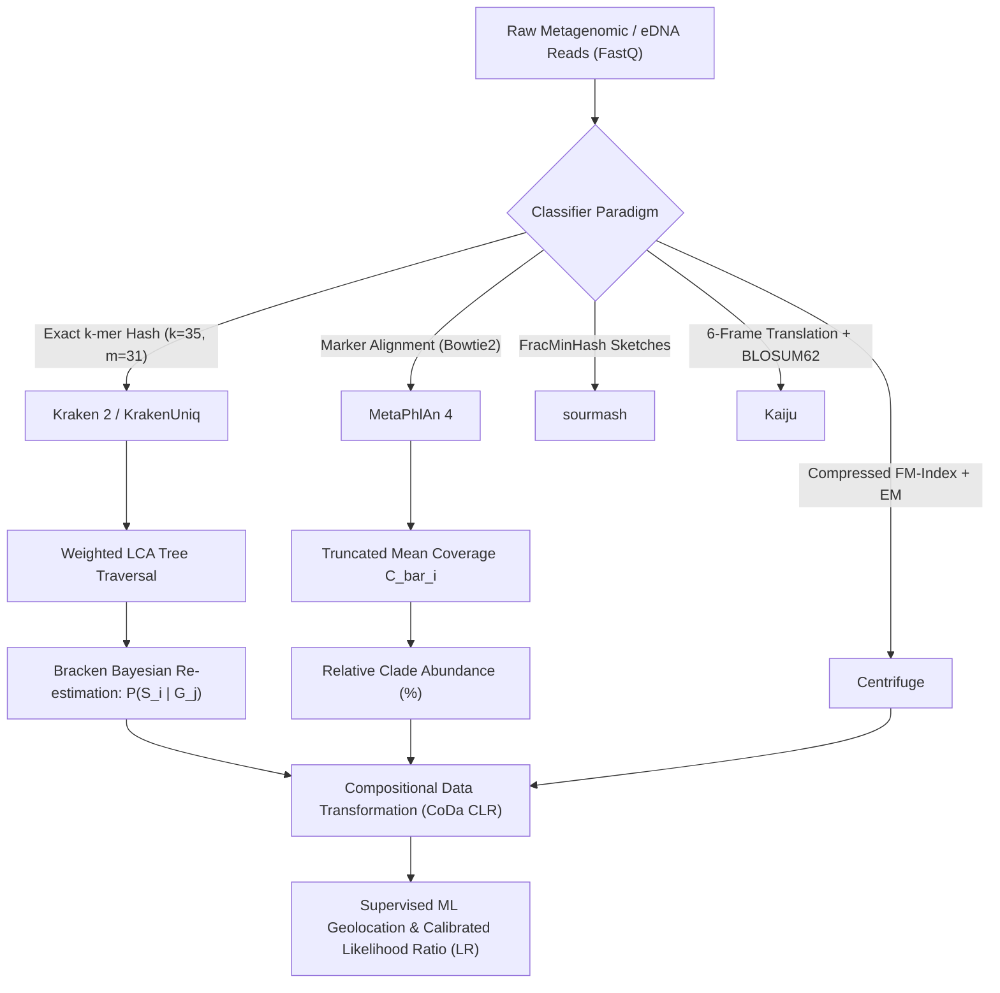
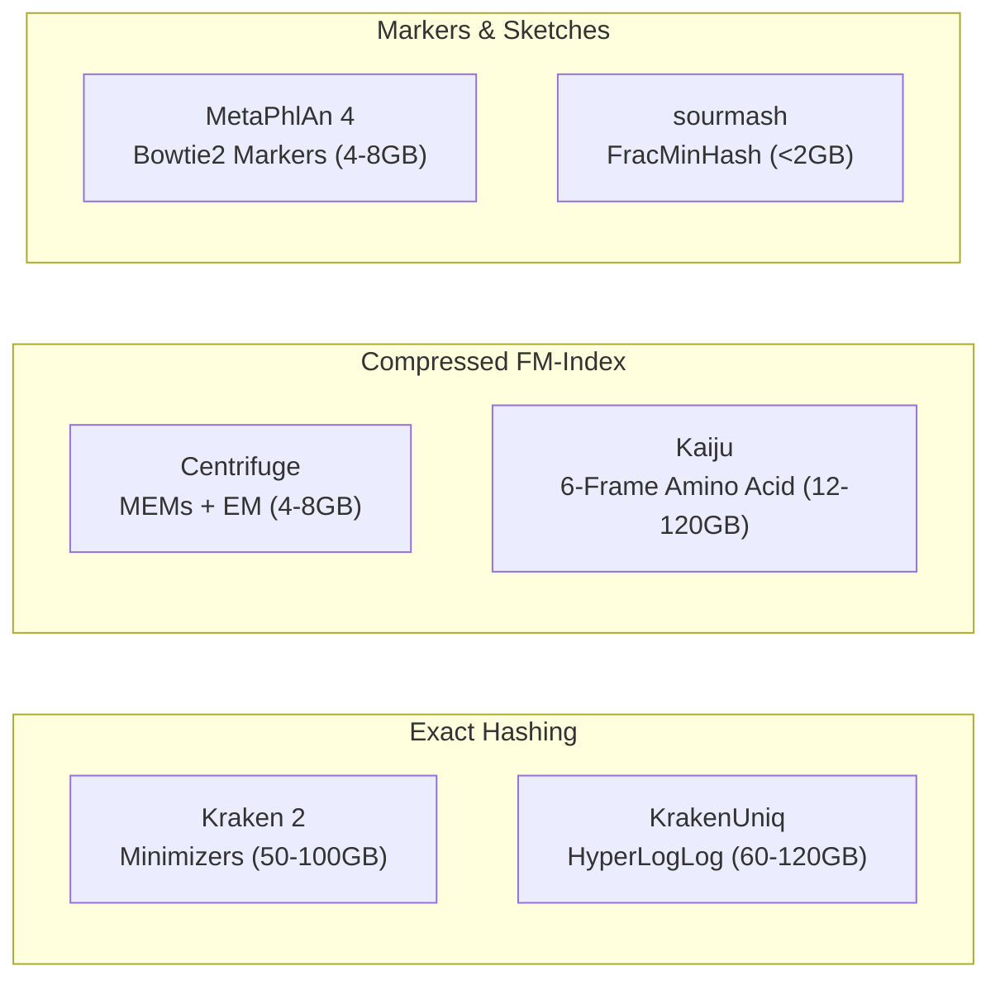
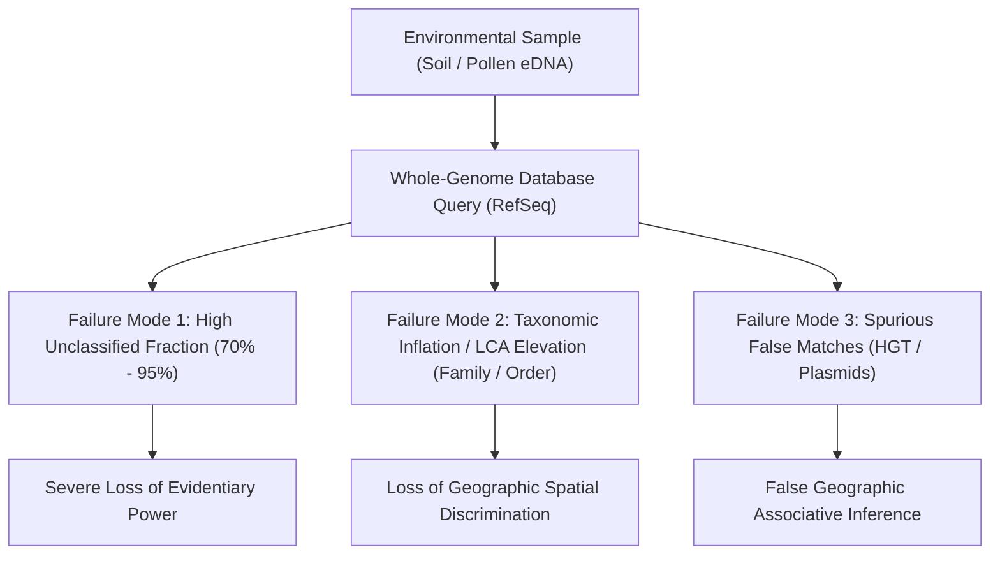
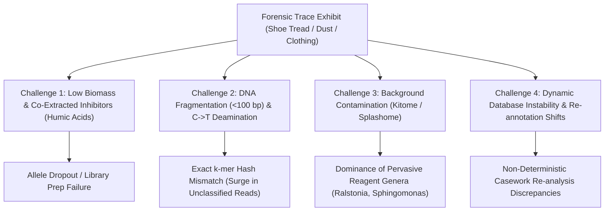

# Metagenomic and Environmental DNA Taxonomic Classification in Forensic Soil Provenance and Palynology: Algorithmic Mechanics, Database Topology, and Casework Translation

> **FORENZA Research Specification**  
> **Target Subsystems:** Pillar 7 (Geo-Forensic Intelligence & Spatial Biogeochemistry) — Subsystem 35: Forensic Soil Pedology & Geochemical CoDa (`SOIL-CODA`), Subsystem 36: Forensic Palynology & Environmental eDNA (`PALYNOLOGY`), Subsystem 38: Multi-Criteria Bayesian Evidence Fusion (`FUSION`), and Pillar 4 — Subsystem 23: Forensic Microbiome & Thanatometagenomics (`MICROBIOME`).  
> **Domain Focus:** Comparative Bioinformatic Classifiers (Kraken 2, Bracken, MetaPhlAn 4, KrakenUniq, Centrifuge, Kaiju, sourmash), Reference Database Architectures (RefSeq, GTDB, SILVA, UNITE, BOLD, PlanT), Amplicon Metabarcoding vs. Shotgun Metagenomics, Compositional Data Analysis (CoDa CLR), and Evidentiary Admissibility (SWGDAM, OSAC, ISFG, Daubert/Frye).

---

## 1. Core Algorithms and Taxonomic Classification Mechanics

The bioinformatic characterization of environmental DNA (eDNA) and metagenomic mixtures relies on distinct computational paradigms designed to translate high-throughput sequencing reads into taxonomic profiles. While originally developed for human microbiome characterization and clinical pathogen discovery, these algorithms operate under mathematical and structural constraints that dictate their performance when applied to forensic trace evidence.

Modern taxonomic classifiers fall into four broad computational strategies:
1. **Nucleotide Exact-Match $k$-mer Hashing against Lowest Common Ancestors (LCA):** High-speed exact lookups on raw reads (e.g., Kraken 2, KrakenUniq).
2. **Clade-Specific Marker Gene Alignment:** High-specificity abundance profiling via non-redundant marker catalogs (e.g., MetaPhlAn 4).
3. **Compressed Full-Text Indexing with Iterative Score Redistribution:** Memory-efficient Burrows-Wheeler Transform (BWT) / FM-index search with Expectation-Maximization (EM) multi-hit allocation (e.g., Centrifuge).
4. **Reduced-Representation Sketches:** Scalable MinHash and Fractional MinHash (FracMinHash) containment estimators (e.g., sourmash, MASH).

---

### 1.1 Kraken 2: Exact-Match $k$-mer Classification and Lowest Common Ancestor Mechanics

Kraken 2 assigns taxonomic labels to individual sequencing reads by matching nucleotide $k$-mers against a pre-indexed reference database using a **Compact Hash Table (CHT)** architecture. In contrast to first-generation exact-match algorithms that indexed every overlapping $k$-mer ($k=31$), Kraken 2 implements a **minimizer-based spaced seed strategy** to compress index size and accelerate memory lookups.

#### Minimizer-Based Indexing and Compact Hash Table (CHT)
For a sequencing read $R$, the algorithm extracts all canonical $k$-mers of length $k$ (default $k = 35$) and computes their corresponding minimizers of length $m$ (default $m = 31$, where $m \le k$). A minimizer is defined as the lexicographically smallest $m$-mer within a sliding window of $k - m + 1$ adjacent $m$-mers. The hash value of each minimizer is queried against the CHT, which maintains a direct mapping from the minimizer hash to a specific NCBI Taxonomy Identifier ($\text{TaxID}$).

$$\text{Minimizer}(W_k) = \min_{0 \le j \le k-m} \{ \text{hash}(m\text{-mer}_{j}) \}$$

#### Weighted Lowest Common Ancestor (LCA) Traversal
The taxonomic assignment relies on a weighted Lowest Common Ancestor (LCA) traversal over the rooted directed acyclic graph (DAG) of the NCBI taxonomy:
1. **Database Construction Phase:** If an identical $k$-mer appears in multiple reference genomes spanning divergent phylogenetic lineages, the database builder assigns that $k$-mer directly to the LCA of those genomes.
2. **Classification Phase:** Kraken 2 constructs a pruned classification tree representing all $\text{TaxIDs}$ identified across the minimizers of the read. Each node in this pruned tree is assigned a weight corresponding to the number of minimizers that mapped directly to that taxon or its descendants.
3. **Path Scoring & Assignment:** The algorithm evaluates all root-to-leaf paths through the taxonomy tree. The score for each path is computed as the sum of node weights along that specific lineage:
   $$\text{Score}(\text{Path}_p) = \sum_{v \in \text{Path}_p} \text{Weight}(v)$$
   Kraken 2 classifies the read to the leaf node of the highest-scoring path. If multiple paths yield equivalent maximum scores, the assignment is elevated to their common ancestor node to prevent overconfident classification.

#### Operational Memory Constraints
Kraken 2 uses a memory-mapped flat hash architecture. The CHT must reside entirely in physical RAM during execution to avoid disk paging bottlenecks:
- **Standard Microbial (Bacteria + Archaea + Viral):** 50 GB to 75 GB RAM.
- **PlusPFP (Standard + Eukaryotic, Fungal, Plant, Protozoa):** Exceeds 100 GB to 500 GB RAM.

---

### 1.2 MetaPhlAn 4: Clade-Specific Marker Gene Abundance Profiling

MetaPhlAn (Metagenomic Phylogenetic Analysis, version 4) uses a marker-gene approach rather than whole-genome $k$-mer matching. Instead of classifying every sequencing read across complete genomes, MetaPhlAn estimates relative taxonomic abundance by mapping reads against a curated database of clade-specific marker genes.

#### Clade-Specific Marker Gene Criteria
A clade-specific marker gene is defined as a coding sequence that satisfies two strict evolutionary criteria:
- **Ubiquity:** Present in all sequenced isolates/assemblies of a target taxonomic clade.
- **Exclusivity:** Completely absent from all sequenced isolates outside that clade.

MetaPhlAn 4 expands this marker catalog to over **5.1 million unique genes** extracted from approximately **1 million microbial genomes** (comprising isolate assemblies and Metagenome-Assembled Genomes, MAGs) curated in the Genome Taxonomy Database (GTDB), covering more than **26,900 Species-level Genome Bins (SGBs)**.

#### Analytical Workflow & Robust Coverage Normalization
1. **Read Alignment:** Raw sequencing reads are aligned against the marker catalog using Bowtie2 (operating on a Burrows-Wheeler Transform and FM-index).
2. **Raw Marker Coverage ($C_j$):** For each detected clade $i$, let $M_i$ denote the set of markers for clade $i$, and let $L_j$ denote the nucleotide length of marker $j \in M_i$. If $X_j$ represents the number of reads aligning to marker $j$, the raw coverage $C_j$ is defined as:
   $$C_j = \frac{X_j}{L_j}$$
3. **Robust Truncated Average Coverage ($\bar{C}_i$):** To mitigate false-positive alignments from non-specific read mapping, horizontal gene transfers, or gene duplication events, MetaPhlAn calculates a robust truncated average coverage by trimming the upper and lower quantiles (discarding the top and bottom 10% to 20% of marker coverage values):
   $$\bar{C}_i = \frac{1}{|M_i^*|} \sum_{j \in M_i^*} C_j$$
   where $M_i^*$ represents the interquartile subset of markers.
4. **Relative Taxonomic Abundance ($A_i$):** Relative abundance $A_i$ for clade $i$ is calculated by normalizing its robust coverage against the sum of coverages across all detected clades at a given taxonomic rank:
   $$A_i = \frac{\bar{C}_i}{\sum_{k} \bar{C}_k} \times 100 \quad \text{such that} \quad \sum_{i} A_i = 100.0\%$$

MetaPhlAn excludes reads mapping to non-marker regions (which typically constitute $>95\%$ of environmental shotgun reads).

---

### 1.3 Comparative Operational Matrix: Kraken 2 vs. MetaPhlAn 4

| Operational Metric | $k$-mer Exact Match (Kraken 2) | Marker-Gene Profiling (MetaPhlAn 4) |
| :--- | :--- | :--- |
| **Primary Output** | Per-read taxonomic classification ($\text{TaxID}$ per read) | Relative taxonomic abundance proportions ($A_i$) |
| **Data Utilization** | High: attempts assignment on 100% of sequencing reads | Low: utilizes only reads matching marker loci (<5% of total) |
| **Genome Size Bias** | Severe: large genomes yield more $k$-mers, inflating read counts | Inherently normalized: marker coverage accounts for length |
| **Taxonomic Resolution** | Conservative LCA: ambiguous reads assigned to genus/family | Species/Strain: markers designed to resolve specific SGBs |
| **Novel / Dark Taxa** | Assigns to higher LCA or leaves unclassified | Entirely invisible if markers are missing from reference index |
| **Optimal Use Case** | Trace detection, read binning, low-biomass forensic screening | Community composition profiling in well-characterized systems |

> **Forensic Practice Directive:** MetaPhlAn is preferred when studying well-characterized host-associated microbiomes where relative community composition is the primary objective and genome-size bias must be minimized. Conversely, Kraken 2 is preferred for trace forensic detection, viral and pathogen identification, and low-biomass environmental samples where every available read must be queried against reference databases to detect rare evidentiary markers.

---

### 1.4 Bracken: Bayesian Re-estimation of Abundance from Read-Level Classifications

Kraken 2 does not generate accurate species-level abundance profiles because sequence homology across closely related species forces non-unique $k$-mers to be classified at the genus, family, or higher LCA nodes. Bracken (Bayesian Reestimation of Abundance after Classification with KrakEN) addresses this by probabilistically redistributing reads from higher taxonomic nodes down to species-level leaves.

#### Bracken Mathematical Model
Bracken relies on an offline precomputation step (`bracken-build`) that simulates reads of length $l$ (matching the experimental read length) across all reference genomes in the database and classifies them back against the Kraken 2 index. This precomputation derives the conditional probability $P(G_j \mid S_i)$: the probability that a read originating from species $S_i$ is assigned by Kraken 2 to ancestor node $G_j$.

During sample re-estimation:
- Let $N_j$ denote the number of reads assigned by Kraken 2 directly to higher-level node $G_j$.
- Let $S = \{S_1, S_2, \dots, S_n\}$ represent the candidate species belonging to the taxonomic subtree of $G_j$ that have an initial read count above a user-defined threshold $t$.
- Let $P(S_i)$ represent the estimated prior probability of species $S_i$ in the sample.

Bracken applies Bayes' theorem to calculate the posterior probability that a read classified to node $G_j$ originated from species $S_i$:

$$P(S_i \mid G_j) = \frac{P(G_j \mid S_i) P(S_i)}{\sum_{k=1}^{n} P(G_j \mid S_k) P(S_k)}$$

The estimated number of reads reassigned from node $G_j$ to species $S_i$, denoted $\hat{N}_{S_i \leftarrow G_j}$, is computed as:

$$\hat{N}_{S_i \leftarrow G_j} = N_j \times P(S_i \mid G_j)$$

This reassignment is evaluated iteratively across all taxonomic levels from root down to species, updating the priors $P(S_i)$ until the species-level abundance estimates reach numerical convergence ($|\Delta P| < 10^{-6}$).

---

### 1.5 Alternative Metagenomic Classifiers

#### Centrifuge
Compresses reference genome databases using the Burrows-Wheeler Transform (BWT) and FM-index. Identical sequence blocks across closely related bacterial strains are collapsed into single representation blocks within the FM-index. Centrifuge searches for variable-length maximal exact matches (MEMs) between the query read and the index. When a read matches multiple taxa, Centrifuge implements an **Expectation-Maximization (EM)** algorithm to assign fractional taxonomic weights across multiple genomes rather than immediately defaulting to the LCA. This allows Centrifuge to store entire bacterial and viral reference collections within **4 GB to 8 GB of RAM**.

#### KrakenUniq
Addresses the vulnerability of standard $k$-mer classifiers to false positives caused by low-complexity sequence matches, repetitive elements, or localized sequencing artifacts. Standard Kraken 2 reports high read counts if many reads match the exact same single $k$-mer. KrakenUniq integrates the **HyperLogLog cardinality estimation algorithm** to count the number of unique $k$-mers across the reference genome supported by matching reads. A taxon supported by 1,000 reads mapping to only 2 unique $k$-mers is flagged as an artifact, whereas a true biological identification requires unique $k$-mers distributed evenly across the reference genome (high horizontal genome coverage).

#### sourmash and MASH
Utilize bottom-MinHash and Fractional MinHash (FracMinHash) sketching algorithms to represent genomic and metagenomic datasets as reduced sub-samples of $k$-mers. MASH computes fixed-size sketches of size $s$ to estimate the Jaccard index:
$$J(A, B) = \frac{|A \cap B|}{|A \cup B|}$$
sourmash utilizes FracMinHash, which samples a deterministic fraction of all $k$-mers ($\text{scale factor } s = 1/H$, retaining hashes below a threshold). FracMinHash supports containment search:
$$C(A, B) = \frac{|A \cap B|}{|A|}$$
enabling compositional decomposition of complex soil mixtures against reference sketches with memory consumption under **2 GB RAM**.

#### Kaiju
Translates nucleotide reads in all six open reading frames into amino acid sequences and queries them against a protein reference database (e.g., NCBI nr, proGenomes) indexed via an FM-index. Kaiju identifies Maximum-Exact-Match Protein Segments (MEMs) and scores them using the **BLOSUM62 substitution matrix**. Because protein coding sequences diverge slower than nucleotide sequences over evolutionary timescales, Kaiju achieves higher sensitivity when classifying divergent, uncultivated environmental taxa that share amino acid homology but lack nucleotide identity with reference genomes.

#### Emerging Classifiers (2024–2026 Era)
- **Emu:** Utilizes Expectation-Maximization to resolve ambiguous multi-mappings for full-length 16S long-read sequencing (Oxford Nanopore / PacBio), outperforming standard short-read classifiers.
- **Tronko:** Implements a fast approximate likelihood method for phylogenetic placement of eDNA reads onto pre-calculated phylogenetic trees, calculating posterior probabilities at internal nodes under a Jukes-Cantor evolutionary model in linear time.

---

### 1.6 Metagenomic Classifier Architecture Benchmark Matrix

| Metric / Attribute | Kraken 2 | KrakenUniq | Centrifuge | MetaPhlAn 4 | Kaiju | sourmash |
| :--- | :--- | :--- | :--- | :--- | :--- | :--- |
| **Index Structure** | Minimizer Hash Table | Hash + HyperLogLog | Compressed BWT / FM-Index | Bowtie2 Marker Index | Protein BWT / FM-Index | FracMinHash Sketch |
| **Sequence Space** | Nucleotide | Nucleotide | Nucleotide | Nucleotide (Coding) | Amino Acid (6-frame) | Nucleotide / Protein |
| **RAM (Standard DB)**| 50–100 GB | 60–120 GB | 4–8 GB | 4–8 GB | 12–120 GB | < 2 GB |
| **False-Positive Mitigation** | Confidence threshold $C$ | Unique $k$-mer cardinality ($k_{\text{uniq}}$) | EM multi-hit scoring | Truncated mean depth | BLOSUM62 score threshold | Hash containment threshold |
| **Profiling Strategy** | LCA classification | LCA + Horizontal Coverage | EM distribution | Clade marker normalization | Protein LCA classification | Direct containment index |

---

### 1.7 Classification Confidence and False-Positive Control

Environmental DNA contains degraded fragments, chimeric PCR products, and non-target eukaryotic host sequences. Robust classification requires mathematical thresholding to prevent erroneous assignments:

#### Kraken 2 Confidence Filtering
Governed by the `--confidence` parameter $C \in [0, 1]$. For a read $R$ with $k_{\text{total}}$ valid $k$-mers, let $k_{\text{classified}}$ be the number of $k$-mers mapped to any taxon in the database, and let $k_{\text{path}}(T)$ be the number of $k$-mers mapped to taxon $T$ or any of its descendants. Kraken 2 assigns the label $T$ if and only if:

$$\frac{k_{\text{path}}(T)}{k_{\text{total}}} \ge C$$

If no taxon satisfies this inequality, the assignment defaults to the lowest ancestor that meets the condition; if no ancestor qualifies, the read is designated as unclassified:
- $C = 0.0$ (Default): Maximizes sensitivity at the cost of high false-positive rates.
- $C \in [0.1, 0.5]$: Suppresses spurious matches at the cost of leaving shorter, degraded reads unclassified.

#### KrakenUniq Orthogonal Filtering
Parameterized by two orthogonal metrics:
1. Minimum number of unique $k$-mers ($k_{\text{uniq}}$).
2. Horizontal reference coverage depth ($D_{\text{horiz}}$).

> [!IMPORTANT]
> Casework studies demonstrate that filtering for $k_{\text{uniq}} \ge 2,000$ eliminates greater than **99% of false-positive bacterial assignments** in low-biomass environmental metagenomes.

---

## 2. Reference Databases: Structural Coverage, Curation Gaps, and Environmental Bias

The accuracy of any taxonomic assignment is bounded by the composition of its underlying reference index. Forensic provenance methods encounter structural database biases when clinical pipelines are transferred to soil or pollen analysis.

### 2.1 Catalog of Major Reference Databases

| Database System | Primary Target Organisms | Sequence Domain / Loci | Curation Mechanism | Update Frequency |
| :--- | :--- | :--- | :--- | :--- |
| **NCBI RefSeq** | Bacteria, Archaea, Viruses, Eukaryota | Whole genomes, transcripts, proteins | Automated & expert curated | Continuous / Bi-monthly |
| **GTDB** | Bacteria and Archaea exclusively | Whole genomes and high-quality MAGs | 120/53 marker gene phylogenetics | Bi-annual releases |
| **SILVA** | Bacteria, Archaea, Eukaryota | 16S/18S (SSU) and 23S/28S (LSU) rRNA | Secondary-structure aligned | Periodic (1–2 years) |
| **UNITE** | Fungi exclusively (with outgroups) | Nuclear ITS1-5.8S-ITS2 | Species Hypothesis (SH) clustering | Annual releases |
| **BOLD / PlanT** | Eukaryota (Animals, Plants, Fungi) | Specific barcodes: $rbcL$, $matK$, ITS2, COI | Specimen-vouchered curation | Continuous |

---

### 2.2 Environmental Representation Deficits in Soil and Palynology

Standard metagenomic databases constructed for clinical diagnostic or human microbiome profiling exhibit critical coverage gaps when applied to forensic soil and palynological matrices:

#### Soil Microbiota Coverage Gaps
Soil represents one of the most genetically diverse and uncharacterized ecosystems on Earth. Less than 1% of soil microorganisms are cultivable by standard laboratory techniques. As a result, standard RefSeq indexes fail to cover dominant soil phyla such as **Acidobacteriota, Verrucomicrobiota, Planctomycetota**, and **Candidate Phyla Radiation (CPR)** lineages with finished reference genomes. While GTDB MAGs have mitigated this gap for prokaryotes, soil fungal and micro-eukaryotic (nematodes, protozoa, rotifers) genomes remain heavily underrepresented.

#### Palynology and Plant Taxa Deficits
Forensic palynology analyzes pollen grains from anemophilous (wind-pollinated) and entomophilous (insect-pollinated) plants. The vast majority of angiosperm and gymnosperm taxa have not undergone whole-genome sequencing due to massive, repetitive, and polyploid nuclear genomes (e.g., *Pinus* genomes exceeding 20–30 Gb). Reference databases for plant identification are therefore exclusively locus-specific barcode repositories—specifically targeting the chloroplast genes **$rbcL$, $matK$, $trnL$ (UAA) intron/P6 loop**, and the nuclear ribosomal **ITS2** region. Standard Kraken 2 or MetaPhlAn whole-genome databases contain negligible non-crop plant reference assemblies, rendering them incapable of direct whole-genome palynological deconvolution.

---

### 2.3 Consequences of Database Gaps on Forensic Casework

1. **High Unclassified Fraction:** In whole-genome shotgun sequencing of surface soils, between **70% and 95% of reads fail to match** standard RefSeq microbial databases, resulting in substantial loss of potential evidentiary information.
2. **Taxonomic Inflation and LCA Elevation:** Reads originating from unrepresented soil taxa that match conserved housekeeping regions in distant reference relatives are forced up the taxonomic tree to Order, Class, or Phylum. This loss of granularity undermines forensic discrimination, as two distinct geographic locations may appear identical if their unique species profiles are collapsed into ubiquitous family-level designations (e.g., *Bacillaceae* or *Pseudomonadaceae*).
3. **Spurious False Matches:** If a database lacks the true environmental genome but contains a related taxon that shares localized horizontal gene transfers or plasmid elements, the classifier will misassign reads to that taxon. In forensic casework, this can falsely associate an evidence sample with an incorrect geolocation or reference crime scene.

---

## 3. Existing Forensic and Environmental Applications in the Literature

The application of molecular genetics to forensic geology and botany represents an active transition from traditional physical and optical methods (e.g., polarized light microscopy, SEM, XRD, XRF) to high-throughput environmental DNA profiling.

### 3.1 Forensic Soil Provenance: Amplicon Metabarcoding vs. Shotgun Metagenomics

In published forensic soil provenance studies, **targeted amplicon metabarcoding overwhelmingly dominates shotgun metagenomic sequencing**. Amplicon approaches circumvent the low biomass, high host DNA contamination, and extreme degradation common in trace soil evidence.

#### Genetic Markers Targeted
- **Prokaryotes:** The hypervariable regions of the 16S rRNA gene, predominantly **V4, V3-V4, and V4-V5**. Primers such as **515F/806R** (Earth Microbiome Project) are standard.
- **Fungi:** The nuclear ribosomal **ITS1 and ITS2** regions, amplified using primers like **ITS1F/ITS2** or **ITS3/ITS4**, providing high taxonomic discrimination for local saprophytic and mycorrhizal soil communities.
- **Micro-Eukaryotes:** The **18S rRNA** gene (V4 or V9 regions) and mitochondrial **COI** (Cytochrome c Oxidase Subunit I) for environmental metazoa and nematodes.

#### Discriminatory Power and Spatial Resolution
Empirical forensic literature demonstrates that soil microbial community composition can resolve provenance down to distances ranging from **meters to tens of kilometers**, depending entirely on environmental heterogeneity, soil chemistry (pH, organic carbon, moisture), and vegetation cover.

Supervised classification models (Random Forest, SVM, QDA) trained on bacterial 16S and fungal ITS Amplicon Sequence Variants (ASVs) achieve spatial classification accuracies between **75% and 98%** across distinct land-use types (e.g., forest vs. agricultural vs. urban). Fungal ITS profiles consistently exhibit higher fine-scale spatial patchiness and geographic discrimination than bacterial 16S profiles, due to the restricted dispersal mechanisms and specific plant-host associations of fungal mycelia.

#### Temporal Decay and Evidence Transfer Dynamics
Forensic soil signatures degrade and shift following deposition on physical carriers (e.g., footwear, clothing, vehicle tires, tools):
- **Desiccation and Temperature:** Storing soil-stained footwear in warm, dry indoor environments triggers a systematic shift in microbial composition: desiccation-tolerant taxa (e.g., *Actinomycetota*, endospore-forming *Bacillus*) artificially increase in relative abundance, while obligate anaerobes and desiccation-sensitive Gram-negative bacteria decline within 7 to 30 days.
- **Seasonal Variation:** Soil microbiomes exhibit seasonal turnover; comparative reference samples collected months after an alleged crime show reduced predictive accuracy when compared against baseline models.
- **Carrier Contamination:** Transfer of trace soil onto synthetic fabrics introduces background fibers and skin microbiome components (*Cutibacterium*, *Staphylococcus*), requiring bioinformatic filtering prior to statistical provenance matching.

---

### 3.2 Forensic Palynology: Transition from Visual Morphology to Pollen eDNA Metabarcoding

Traditional forensic palynology relies on light microscopy and scanning electron microscopy (SEM) to count and morphologically identify pollen grains recovered from exhibits. While morphology can identify plant family and sometimes genus, it rarely achieves species-level resolution (e.g., *Poaceae* and *Asteraceae* pollen are morphologically uniform across hundreds of species). Furthermore, manual palynological analysis requires rare taxonomic expertise and is labor-intensive.

Pollen DNA metabarcoding is an emerging and increasingly validated technique within forensic botany, directly complementing or replacing microscopic palynology.

#### Plant Multi-Locus Barcoding Strategy
No single universal genetic barcode resolves all land plants (*Embryophyta*). Consequently, the plant barcoding community employs a multi-locus strategy:
- **ITS2 (Nuclear Ribosomal):** Offers high species-level discriminatory power due to rapid evolutionary substitution rates; widely amplified across angiosperms.
- **$rbcL$ (Chloroplastic):** Coding gene within the RuBisCO large subunit. Highly universal across all land plants with robust PCR amplification, but lower species-level resolving power (often limited to genus or family).
- **$matK$ (Chloroplastic):** Maturase K coding region. High sequence variation and species resolution, but hampered by variable primer binding efficiency across non-model plant clades.
- **$trnL$ (UAA) Intron / P6 Loop (Chloroplastic):** The short P6 loop (10–143 bp) is optimized for highly degraded eDNA from aged forensic exhibits, honey, settled dust, and ancient soils, despite lower taxonomic resolution than full-length ITS2.

#### Standardized Amplicon Pipeline Workflow
Whole-genome taxonomic classifiers like Kraken 2 and MetaPhlAn are virtually absent from forensic palynology casework and research due to the lack of plant nuclear genome references. The standardized field workflow relies on targeted amplicon pipelines:
1. **Denoising and Exact Sequence Inference:** **DADA2** (Divisive Amplicon Denoising Algorithm 2) or **Deblur** integrated within the **QIIME 2** ecosystem to infer exact Amplicon Sequence Variants (ASVs) and remove PCR chimeras.
2. **Taxonomic Classification:** Querying ASVs against curated plant databases (NCBI Taxonomy, BOLD, PlanT-Chr, Bellcord) using local alignment tools (**BLASTn, VSEARCH**) or machine learning classifiers (**QIIME 2 q2-feature-classifier Naïve Bayes** trained on specific primer-trimmed reference sets).

---

## 4. Practical Implementation Considerations

Deploying metagenomic or eDNA pipelines in forensic intelligence and trace analysis requires careful consideration of data types, compute infrastructure, software licensing, and downstream statistical modeling.

### 4.1 Input Data Requirements: Shotgun Metagenomics vs. Targeted Amplicon

| Feature | Targeted Amplicon Metabarcoding (16S / ITS / $rbcL$) | Whole-Genome Shotgun Metagenomics (WGS) |
| :--- | :--- | :--- |
| **Input DNA Quantity** | Ultra-low (< 0.1–1.0 ng total DNA; PCR amplified) | Moderate to high (> 1–10 ng; unamplified library prep) |
| **DNA Integrity** | Tolerates fragmentation; short amplicons (<150 bp) | Requires high molecular weight or deep coverage of fragments |
| **Host / Matrix DNA** | Amplifies only target clade; host background excluded | Host DNA (human, plant) consumes 90–99% of sequencing reads |
| **Compatible Tools** | DADA2, QIIME 2, VSEARCH, Mothur, Emu | Kraken 2, MetaPhlAn 4, Centrifuge, Kaiju, sourmash |
| **Marker Resolution** | Single gene locus; vulnerable to copy-number variations | Genome-wide coverage; reconstructs functional gene profiles |
| **Casework Suitability**| **High:** current standard for trace evidence and dust | **Emerging:** limited by sequencing cost and database gaps |

---

### 4.2 Computational Resource Architecture and Benchmarking

| Tool | Algorithmic Approach | Peak RAM (Standard Reference DB) | Storage Footprint (Disk) | Processing Speed (10M PE Reads) |
| :--- | :--- | :--- | :--- | :--- |
| **Kraken 2** | Minimizer Hash Table | 50 – 100 GB (Microbial) / >250 GB (PlusPFP) | 60 – 120 GB | ~1 – 3 minutes (Fastest) |
| **Bracken** | Bayesian Re-estimation | < 1 GB (Post-Kraken report processing) | < 5 GB (Intermediate files) | < 30 seconds |
| **Centrifuge** | Compressed BWT / FM-Index | 4 – 8 GB (Microbial + Viral) | 5 – 10 GB | ~15 – 30 minutes |
| **MetaPhlAn 4** | Marker Alignment (Bowtie2) | 4 – 8 GB | ~15 GB (Marker DB) | ~20 – 60 minutes |
| **KrakenUniq** | Hash + HyperLogLog | 60 – 120 GB | 70 – 150 GB | ~2 – 5 minutes |
| **Kaiju** | Protein 6-Frame FM-Index | 12 – 120 GB (nr vs. proGenomes) | 15 – 150 GB | ~10 – 25 minutes |
| **sourmash** | FracMinHash Sketching | < 2 GB | < 5 GB (Precomputed sketches) | ~1 – 5 minutes |

---

### 4.3 Software Licensing, Versioning, and Maintenance

| Tool | Developer / Originating Institution | Current Version (2025/2026) | Software License | Active Maintenance Status |
| :--- | :--- | :--- | :--- | :--- |
| **Kraken 2** | Johns Hopkins University (Salzberg Lab) | v2.1.3 | MIT License | Actively Maintained |
| **Bracken** | Johns Hopkins University (Lu & Salzberg) | v2.9 / v3.0 | GPL-3.0 License | Actively Maintained |
| **MetaPhlAn**| University of Trento (Segata Lab) | v4.1.x | MIT License | Actively Maintained |
| **KrakenUniq**| Johns Hopkins / J. Breitwieser et al. | v1.0.4+ | GPL-3.0 License | Actively Maintained |
| **Centrifuge**| Johns Hopkins University (Kim et al.) | v1.0.4.x | GPL-3.0 License | Low Maintenance / Stable |
| **Kaiju** | Max Planck Institute / P. Menzel et al. | v1.10.x | GPL-3.0 License | Actively Maintained |
| **sourmash** | UC Davis (Brown Lab / Titus Brown) | v4.8.x+ | BSD 3-Clause | Actively Maintained |

---

### 4.4 Output Formats and Downstream Statistical Provenance Modeling

Metagenomic classifiers generate distinct tabular and structured outputs:
- **Kraken 2 / Bracken (`.kreport`):** Standard 6-column hierarchical report format containing percentage of total reads, cumulative read counts covering the subtree, direct read counts assigned to the node, taxonomic rank code (U, R, D, K, P, C, O, F, G, S), NCBI TaxID, and scientific name.
- **MetaPhlAn 4 (`.tsv`):** Tab-delimited relative abundance profile containing full clade lineage strings (`k__Bacteria|p__Proteobacteria|...|s__Pseudomonas_fluorescens`) and estimated relative percentage.

Converting taxonomic profiles into a forensic geographic provenance determination requires multivariate statistical modeling and machine learning frameworks:

#### 1. Compositional Data (CoDa) Transformation
Metagenomic count data are compositional and subject to simplex closure constraints (values sum to a constant, e.g., 100% or 1.0). Standard Euclidean distances cause spurious correlations. Data must be transformed using the **Centered Log-Ratio (CLR)** or **Isometric Log-Ratio (ILR)** transformations prior to distance calculations (**Aitchison distance**):

$$\text{clr}(\mathbf{x}) = \left[ \ln\left(\frac{x_1}{g(\mathbf{x})}\right), \ln\left(\frac{x_2}{g(\mathbf{x})}\right), \dots, \ln\left(\frac{x_D}{g(\mathbf{x})}\right) \right]$$

where $g(\mathbf{x}) = \left(\prod_{i=1}^D x_i\right)^{1/D}$ is the geometric mean of the relative abundance vector.

#### 2. Supervised Machine Learning Geolocation
Random Forest classifiers and Support Vector Machines (SVM) trained on CLR-transformed abundance matrices predict categorical habitat types or discrete reference geographic coordinates. Feature importance metrics (e.g., Gini impurity decrease) identify specific microbial taxa driving regional separation.

#### 3. Calibrated Likelihood Ratio (LR) Framework
For forensic court reporting, evidence $E$ (the microbial profile of a soil stain) must be evaluated under competing prosecution and defense propositions:
- $H_p$: The soil trace on the evidence originated from the crime scene location.
- $H_d$: The soil trace originated from an alternative, unspecified geographic location.

$$\text{LR} = \frac{P(E \mid H_p)}{P(E \mid H_d)}$$

Calibrated log-likelihood ratios ($\log_{10}\text{LR}$) are computed using density estimation models over multivariate similarity scores (e.g., Bray-Curtis dissimilarity, Jaccard distances, or Mahalanobis distances) derived from within-site versus between-site variance distributions.

#### 4. Bayesian Source Tracking
Tools such as **SourceTracker2** and **FEAST** (Fast Expectation-Maximization for Microbial Source Tracking) treat the questioned forensic evidence sample as a mixture/sink and reference geographic sites as potential sources, estimating the percentage contribution of each reference environment to the evidence.

---

## 5. Forensic Limitations, Evidentiary Standards, and Open Problems

The translation of metagenomic and eDNA profiling into courtroom-admissible evidence faces substantial technical, environmental, and legal hurdles that distinguish it from standard human forensic short tandem repeat (STR) typing.

### 5.1 Forensic-Specific Technical and Environmental Challenges

1. **Low Biomass and PCR Inhibition:** Forensic trace exhibits (dust on clothing, scraping from shoe treads) frequently yield sub-nanogram quantities of DNA. Soil matrices contain high concentrations of humic acids, fulvic acids, polyphenols, and heavy metals that co-purify with DNA and inhibit DNA polymerases, causing allele dropout or library preparation failure.
2. **DNA Fragmentation and Post-Mortem Damage:** Environmental DNA in exposed soils undergoes oxidative and hydrolytic degradation, resulting in average fragment sizes under 100 bp. In aged forensic samples, post-mortem cytidine deamination ($C \to T$ transitions) introduces false-positive nucleotide substitutions that disrupt exact $k$-mer matching in tools like Kraken 2, causing unclassified read rates to surge.
3. **Contamination, "Kitome", and "Splashome":** In ultra-low biomass samples, background DNA contaminants present in extraction reagents and plasticware (the "kitome") or ambient laboratory environments (the "splashome") become dominant sequence components. Genera such as *Ralstonia*, *Sphingomonas*, *Burkholderia*, and *Bradyrhizobium* are pervasive contaminants that can skew multivariate soil models if not controlled through strict extraction blanks and negative controls.
4. **Database Instability and Bioinformatic Reproducibility:** Reference databases are dynamic: NCBI RefSeq and GenBank continually add, rename, and reclassify organisms. Re-running the identical bioinformatic pipeline on the same raw sequence data two years later against updated reference databases can alter the resulting taxonomic profile and species designations. This non-deterministic behavior creates vulnerabilities during cross-examination under legal evidentiary scrutiny.

---

### 5.2 Forensic Validation Standards and Regulatory Landscape

Mainstream forensic genetics operates under rigorous developmental and internal validation standards established by regulatory bodies:
- **SWGDAM** (Scientific Working Group on DNA Analysis Methods)
- **OSAC** (Organization of Scientific Area Committees for Forensic Science)
- **ISFG** (International Society for Forensic Genetics)

These standards mandate established developmental validation guidelines for human STR typing, massively parallel sequencing (MPS) of human panels, and mitochondrial DNA sequencing.

> [!WARNING]
> **Regulatory Reality Notice:** Formal forensic validation guidelines specifically governing metagenomic and eDNA-based soil or pollen provenance **do not currently exist** within SWGDAM, OSAC, or ISFG standards.
> 
> While ISFG and SWGDAM have issued general guidance for non-human animal and plant single-source identification (e.g., tracking illegal timber logging or wildlife poaching using dedicated STR or Sanger sequencing markers), these guidelines **do not extend to complex, multi-species environmental mixtures, metabarcoding, or whole-genome shotgun classification**.

The forensic science community classifies soil and pollen eDNA profiling as **investigative intelligence tools** rather than definitive, court-admissible identifying evidence. Legal admissibility under **Daubert or Frye** standards in US jurisdictions (or equivalent global frameworks) faces substantial resistance due to the absence of:
- Universally standardized standard operating procedures (SOPs) for DNA extraction, marker amplification, and bioinformatic pipelines.
- Quantifiable, universally accepted false-match error rates.
- Standardized, proficiency-tested national reference databases corresponding to the FBI's CODIS system.

---

## 6. Conclusions & FORENZA Architectural Grounding

Metagenomic and eDNA taxonomic classifiers represent powerful computational frameworks originally designed for whole-genome clinical diagnostics and human microbiome characterization. While tools like Kraken 2, MetaPhlAn, Bracken, Centrifuge, and sourmash excel at rapidly profiling unfragmented sequencing reads against established reference collections, their direct transfer to forensic soil provenance and forensic palynology is fundamentally constrained by biological and database realities.

Forensic soil and pollen evidence is characterized by low DNA yield, severe environmental fragmentation, PCR inhibitors, and high non-target background. Furthermore, environmental soils and botanical taxa reside primarily in "genomic dark matter," where reference whole-genome assemblies are scarce. Consequently, whole-genome shotgun classifiers suffer from massive unclassified read fractions, taxonomic elevation via Lowest Common Ancestor mechanics, and vulnerabilities to database annotation errors.

Because of these constraints, FORENZA adopts a bifurcated implementation approach:

1. **Bioinformatic Workflow Reality:** Forensic soil provenance and palynology casework rely on **targeted amplicon metabarcoding** (prokaryotic 16S rRNA, fungal ITS, plant $rbcL$/$matK$/ITS2) rather than whole-genome shotgun sequencing. Data processing is anchored in the **DADA2 / QIIME 2 ecosystem** to generate exact Amplicon Sequence Variants (ASVs), which are classified against curated marker-specific databases (**SILVA, UNITE, BOLD, PlanT**) using BLASTn, VSEARCH, or Naïve Bayes models.
2. **Statistical Interpretation:** Downstream provenance prediction relies on **Compositional Data (CoDa) transformations (CLR)**, supervised machine learning algorithms (**Random Forest**), and Bayesian Likelihood Ratio ($\text{LR}$) frameworks to assess similarity against reference geographic sites.
3. **Casework Status:** Molecular soil provenance and pollen eDNA remain valuable tools for **forensic intelligence and investigative lead generation**. Establishing standardized reference databases, quantifying cross-laboratory error rates, and formalizing validation guidelines represent the critical path forward for forensic metagenomics.