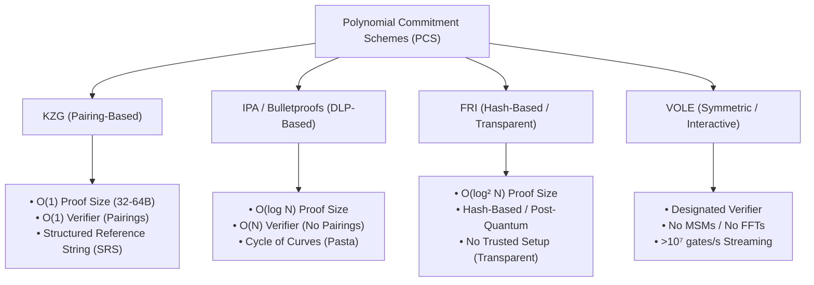

# ZK-SNARK Proving Systems for Verifiable Forensic and Deterministic Numerical Computation

---

## 1. Executive Summary & Cryptographic Problem Statement

Zero-Knowledge Succinct Non-Interactive Arguments of Knowledge (**zk-SNARKs**) and associated proof systems have transitioned from theoretical cryptography to mission-critical engineering backends for verifiable biocomputation. In high-assurance forensic science, biometric attestation, regulatory chain-of-custody compliance, and privacy-preserving multi-agency intelligence, verifying deterministic numerical algorithms without disclosing sensitive genetic or case profiles addresses fundamental constitutional and evidentiary mandates:

1. **Evidentiary Verifiability:** Proving that an expert witness report, mixture deconvolution result, or Likelihood Ratio ($LR$) calculation was executed faithfully according to certified mathematical specifications without numerical manipulation.
2. **Constitutional Privacy & Non-Disclosure:** Enabling cross-border and inter-agency matching (e.g., Interpol, FBI NDIS, ENFSI) without transmitting raw autosomal STR electropherograms, SNP sequences, or identifiable biometric data.
3. **Engineering Trade-offs:** Balancing prover execution time, peak memory footprint ($\text{RAM}$), verification latency, proof size (bytes), setup trust assumptions, and arithmetization efficiency over discrete Galois prime fields ($\mathbb{F}_p$).

```
                      +-------------------------------------------------------------+
                      |               FORENSIC ZERO-KNOWLEDGE PIPELINE              |
                      +-------------------------------------------------------------+
                                                     |
                         +---------------------------+---------------------------+
                         |                                                       |
                         v                                                       v
        +---------------------------------+                     +---------------------------------+
        |    PUBLIC INSTANCE DATA (x)     |                     |    PRIVATE WITNESS DATA (w)     |
        |  • Case Metadata & Hash Roots   |                     |  • Raw STR Allele Peak Heights  |
        |  • Claimed LR Threshold (M_thr) |                     |  • Suspect/Victim Genotypes     |
        |  • Reference Allele Frequencies |                     |  • MCMC Deconvolution State    |
        +---------------------------------+                     +---------------------------------+
                         \                                                       /
                          \                                                     /
                           v                                                   v
                        +--------------------------------------------------------+
                        |           ARITHMETIC CIRCUIT RELATION R(x, w) = 1      |
                        |   • Scaled Fixed-Point Quantization (Scale S = 16/32)  |
                        |   • Non-Deterministic LR Division & Remainder Bounds   |
                        |   • Strict Range Checks (Prevent Field Underflows)    |
                        +--------------------------------------------------------+
                                                     |
                                                     v
                        +--------------------------------------------------------+
                        |            PROVING BACKEND (Groth16 / PLONK)           |
                        |   • Prover Time: 1.2s - 4.5s                           |
                        |   • Proof Size: 128 - 576 Bytes                        |
                        +--------------------------------------------------------+
                                                     |
                                                     v
                        +--------------------------------------------------------+
                        |     SUCCINCT ZERO-KNOWLEDGE PROOF (pi) & VERIFIER      |
                        |   • Constant O(1) Pairing Check on BN254 Curve         |
                        |   • Verification Latency: 1.2ms - 3.5ms                |
                        |   • Output: TRUE / FALSE (Zero Privacy Leakage)        |
                        +--------------------------------------------------------+
```

---

## 2. Core Proving Systems: Mechanics, Mathematical Foundations & PCS

A zero-knowledge proof system allows a prover $\mathcal{P}$ to demonstrate knowledge of a secret witness $w$ satisfying a public relation $\mathcal{R}(x, w) = 1$ for an instance $x$, while upholding three core properties:
- **Completeness:** If $\mathcal{R}(x, w) = 1$, an honest prover convinces the verifier $\mathcal{V}$ with probability $1$.
- **Computational Soundness:** A cheating prover cannot convince $\mathcal{V}$ of a false claim $x \notin \mathcal{L}$ except with negligible probability $\text{negl}(\lambda)$.
- **Zero-Knowledge:** The proof $\pi$ reveals no information about $w$ beyond the validity of the statement.

### 2.1 Polynomial Commitment Schemes (PCS)

Contemporary proving systems are differentiated primarily by their Polynomial Commitment Scheme (PCS) and underlying group-theoretic hardness assumptions:



#### A. Kate-Zaverucha-Goldberg (KZG) Commitments
Constructed over asymmetric bilinear pairing groups $e: \mathbb{G}_1 \times \mathbb{G}_2 \to \mathbb{G}_T$ on pairing-friendly elliptic curves (e.g., BN254, BLS12-381). An evaluation point $\tau \in \mathbb{F}_r$ is sampled during a Structured Reference String (SRS) ceremony to generate public generators:
$$\{[\tau^i]_1\}_{i=0}^{d} = \{\tau^i \cdot G_1\}_{i=0}^d, \quad \{[\tau^j]_2\}_{j=0}^{k} = \{\tau^j \cdot G_2\}_{j=0}^k$$

A polynomial $f(X) = \sum_{i=0}^d c_i X^i$ is committed as a single group element:
$$C = [f(\tau)]_1 = \sum_{i=0}^d c_i [\tau^i]_1 \in \mathbb{G}_1$$

An evaluation proof at point $z \in \mathbb{F}_r$ with claimed value $f(z) = v$ requires committing to the quotient polynomial $q(X) = \frac{f(X) - v}{X - z}$:
$$\pi = [q(\tau)]_1 \in \mathbb{G}_1$$

The verifier confirms evaluation via a single bilinear pairing equality check:
$$e\left(C - [v]_1 + z \cdot \pi, [1]_2\right) = e\left(\pi, [\tau]_2\right)$$
- **Complexity:** $O(1)$ constant proof size (single $\mathbb{G}_1$ element) and $O(1)$ pairing evaluation independent of polynomial degree $d$.

#### B. Inner Product Arguments (IPA / Bulletproofs)
Relies on Discrete Logarithm Problem (DLP) hardness over standard elliptic curves (e.g., Pasta cycle: Pallas/Vesta, Secp256k1) without pairings. Coefficient vector $\mathbf{a} \in \mathbb{F}^n$ is committed via Pedersen vector commitments:
$$C = \langle \mathbf{a}, \mathbf{G} \rangle = \sum_{i=1}^n a_i G_i$$
Evaluations are established via recursive logarithmic halving arguments, yielding $O(\log d)$ proof size and $O(d)$ verifier execution time (amortizable via recursive accumulation).

#### C. Fast Reed-Solomon Interactive Oracle Proof of Proximity (FRI)
Relies exclusively on cryptographic hash functions (SHA-256, BLAKE3, Poseidon) and information-theoretic proximity testing. A polynomial evaluation vector over evaluation domain $D \subset \mathbb{F}$ is committed as the root of a Merkle tree. FRI recursively folds polynomial $f_0(X)$ into:
$$f_{i+1}(X) = f_i^E(X^2) + \beta_i f_i^O(X^2)$$
using verifier random challenge $\beta_i$, halving the domain at each step until degree is trivial. Eliminates elliptic curves and trusted setups entirely.

#### D. Vector Oblivious Linear Evaluation (VOLE)
Interactive, designated-verifier proof systems built on symmetric cryptographic primitives and VOLE correlations:
$$C = A \cdot \Delta + B$$
where $\Delta$ is a verifier-held private secret. Bypasses both group-based Multi-Scalar Multiplications (MSMs) and large Fast Fourier Transforms (FFTs), enabling fast prover generation at the expense of public verifiability.

---

### 2.2 Proving System Architectures & Arithmetization Paradigms

```
+---------------------------------------------------------------------------------------------------------+
|                                    PROVING SYSTEM ARCHITECTURE MATRIX                                   |
+-------------+------------------+-------------------+--------------------+------------------+------------+
| System      | Arithmetization  | PCS / Commitment  | Setup Assumption   | Verifier Time    | Proof Size |
+-------------+------------------+-------------------+--------------------+------------------+------------+
| Groth16     | R1CS / QAP       | Pairing Map (KZG) | Circuit-Specific   | O(1) (3 pairings)| ~128-256 B |
| PLONK (KZG) | Plonkish Custom  | KZG               | Universal SRS      | O(1) (2 pairings)| ~400-800 B |
| Halo2 (IPA) | UltraPLONK + Look| IPA               | Transparent (None) | O(log N)         | ~1-5 KB    |
| Halo2 (KZG) | UltraPLONK + Look| KZG               | Universal SRS      | O(1) (2 pairings)| ~600-1200 B|
| zk-STARKs   | AIR              | FRI (Hash-Based)  | Transparent (None) | O(log² N)        | ~50-250 KB |
| Plonky2     | Plonkish         | FRI (Goldilocks)  | Transparent (None) | O(log² N)        | ~40-100 KB |
| Nova        | Relaxed R1CS     | Folding + Spartan | Transparent/Univ.  | O(1) step fold   | ~1-2 KB    |
+-------------+------------------+-------------------+--------------------+------------------+------------+
```

#### A. Groth16 (Rank-1 Constraint Systems & QAP)
Operates on Rank-1 Constraint Systems (**R1CS**), defined algebraically as:
$$(A \cdot s) \circ (B \cdot s) = C \cdot s$$
where $s = (1, x, w)$ represents the complete signal vector and $\circ$ denotes the Hadamard entry-wise product. R1CS is transformed into a Quadratic Arithmetic Program (**QAP**) evaluated over a roots-of-unity domain $Z_H(X) = X^N - 1$. 

Groth16 requires a circuit-specific trusted setup and produces a minimal proof consisting of exactly three elliptic curve group elements:
$$\pi = \left(A \in \mathbb{G}_1, \; B \in \mathbb{G}_2, \; C \in \mathbb{G}_1\right)$$

The verification equation requires three pairing evaluations:
$$e(A, B) = e(\alpha, \beta) + e\left(\sum_{i=0}^\ell x_i \frac{\beta A_i(\tau) + \alpha B_i(\tau) + C_i(\tau)}{\gamma}, \; \gamma\right) + e(C, \delta)$$

#### B. PLONK & UltraPLONK (Plonkish Arithmetization)
Represents computation as an execution trace grid of size $N \times k$ with custom gates and permutation copy constraints across cell wires. Gates satisfy equations of the form:
$$q_L(X) a(X) + q_R(X) b(X) + q_O(X) c(X) + q_M(X) a(X)b(X) + q_K(X) d(X) + q_C(X) = 0 \pmod{Z_H(X)}$$
Global copy constraints are enforced via the Grand Product permutation polynomial $z(X)$. When paired with KZG, PLONK achieves constant $O(1)$ proof sizes using a universal, updatable Structured Reference String.

#### C. Halo2 (Lookups & Recursive Accumulation)
Extends Plonkish arithmetization with UltraPLONK custom gates and Plookup table lookup arguments:
$$f(x) \in T$$
Halo2 natively pairs with an IPA commitment scheme over the Pallas/Vesta cycle of curves to eliminate trusted setups via recursive accumulation, or with KZG backends over BN254 to minimize on-chain verification gas costs.

#### D. Nova (Folding Schemes for Incremental Verifiable Computation)
Implements Incremental Verifiable Computation (**IVC**) through folding schemes over Relaxed R1CS. Instead of compiling expensive SNARK verification circuits at each iteration $z_{i+1} = F(z_i)$, Nova folds two Relaxed R1CS instances of size $N$ into a single instance of size $N$ using a random linear combination with non-interactive witness accumulation:
$$(A \cdot s) \circ (B \cdot s) = u \cdot (C \cdot s) + E$$
Heavy SNARK machinery is executed only once at the conclusion of all iterations.

---

### 2.3 Post-Quantum Security Posture

```
+--------------------------------------------------------------------------------------------------------+
|                                    POST-QUANTUM SECURITY COMPARISON                                    |
+--------------------------+-----------------------+-----------------------------+-----------------------+
| Proving System Class     | Hardness Assumption   | Quantum Threat Vulnerability| Post-Quantum Defense  |
+--------------------------+-----------------------+-----------------------------+-----------------------+
| Elliptic-Curve (Groth16, | Discrete Log (DLP),   | Shor's Algorithm solves     | None (requires curve  |
| KZG-PLONK, Halo2-IPA)    | CDH, Bilinear Pairings| discrete logs in O(log³ p)  | migration to lattices)|
| Hash-Based (zk-STARKs,   | Collision Resistance, | Grover's Algorithm provides | Scale hash digests to |
| Plonky2, FRI)            | Random Oracle Model   | only quadratic speedup      | 256 / 384 bits        |
+--------------------------+-----------------------+-----------------------------+-----------------------+
```

- **Curve-Based Systems:** Break under Shor's polynomial-time algorithm ($O(\log^3 p)$), compromising zero-knowledge and soundness.
- **FRI / STARK Protocols:** Rely strictly on hash collision resistance in the Random Oracle Model (ROM). Grover's algorithm provides only a quadratic search speedup ($O(2^{n/2})$), preserving post-quantum security when hashes are parameterized to $\ge 256\text{ bits}$.

---

## 3. Comparative Performance Benchmarks & Workload Specialization

Systematic evaluation of zero-knowledge frameworks demonstrates that prover throughput, memory utilization, and proof sizes are closely tied to the alignment between the underlying numerical workload and the arithmetization model.

```
+---------------------------------------------------------------------------------------------------------------+
|                            EMPIRICAL PERFORMANCE BENCHMARKS (10⁶ CONSTRAINTS / GATES)                         |
+--------------------------+-------------+------------------+---------------+--------------+------------+-------+
| Framework / Engine       | Backend     | Arithmetization  | Prover Time   | Verifier Time| Peak RAM   | Proof |
+--------------------------+-------------+------------------+---------------+--------------+------------+-------+
| gnark (Groth16)          | Go / ASM    | R1CS             | ~2.5 - 4.2 s  | 1.2 - 2.5 ms | 1.8 - 2.5 GB 128 B |
| gnark (PLONK-KZG)        | Go / ASM    | Plonkish         | ~5.0 - 8.5 s  | 2.0 - 3.5 ms | 3.2 - 4.5 GB 576 B |
| arkworks (Groth16)       | Rust        | R1CS             | ~3.8 - 5.5 s  | 1.5 - 3.0 ms | 2.2 - 3.0 GB 128 B |
| snarkjs / Circom (Groth16)| C++ / JS   | R1CS             | ~12.0 - 20.0 s| 2.5 - 4.0 ms | 6.0 - 9.0 GB 128 B |
| Halo2 (PSE/Axiom - KZG)  | Rust        | UltraPLONK+Lookup| ~6.5 - 11.0 s | 3.0 - 5.0 ms | 4.0 - 6.5 GB ~800 B |
| Plonky2                  | Rust        | Plonkish + FRI   | ~0.8 - 1.8 s  | 15.0 - 35 ms | 1.5 - 2.2 GB ~48 KB |
| Starky / Winterfell      | Rust        | AIR + FRI        | ~1.2 - 2.5 s  | 20.0 - 60 ms | 2.0 - 3.5 GB ~80 KB |
| EMP-ZK (VOLE-based)      | C++         | Bool/Arith Circ. | ~0.15 - 0.35 s| Streaming    | 0.3 - 0.6 GB Stream |
+--------------------------+-------------+------------------+---------------+--------------+------------+-------+
```

### 3.1 Arithmetic-Heavy vs. Bitwise Workloads

- **Arithmetic-Heavy Workloads (Dense Matrix, Likelihood Ratios, Linear Regressions):**
  - Map natively into large prime Galois fields $\mathbb{F}_p$ ($p \approx 2^{254}$).
  - Field additions $\sum c_i w_i$ are absorbed into linear combinations at zero marginal R1CS constraint cost.
  - Field multiplications require exactly 1 R1CS rank constraint ($a \cdot b = c$). Highly optimized R1CS backends (`gnark`, `arkworks`) exhibit linear prover scaling.
- **Bitwise & Cryptographic Workloads (SHA-256, Range Checks, XOR):**
  - Require full bit-decomposition in $\mathbb{F}_p$, where enforcing $b \in \{0, 1\}$ demands quadratic constraint $b(1 - b) = 0$.
  - Computing a single SHA-256 block in Groth16/R1CS requires $25{,}000$ to $30{,}000$ constraints.
  - UltraPLONK with Plookup (Halo2) replaces bit-decomposition with precomputed static lookup tables of 8-bit/16-bit XOR operations, reducing constraint footprints by up to $10\times$.

---

## 4. Trusted Setup Mechanics, Security Guarantees & Operational Practice

### 4.1 Toxic Waste Cryptanalysis & Multi-Party Computation (MPC)

In pairing-based SNARKs, the setup phase evaluates polynomials at secret trapdoors $\tau, \alpha, \beta, \gamma, \delta \in \mathbb{F}_r$ (*toxic waste*). If an adversary recovers these scalar values, they can forge a valid proof $\pi^* = (A^*, B^*, C^*)$ for an untrue statement $x \notin \mathcal{L}$ that identically satisfies the pairing verification equation:
$$e(A^*, B^*) = e(\alpha, \beta) + e(\text{Instance}, \gamma) + e(C^*, \delta)$$

To eliminate single-point trust assumptions, production systems generate the Structured Reference String (SRS) via distributed $1\text{-of-}N$ Multi-Party Computation (MPC) protocols (BGM17, MMOR17). In these ceremonies, $N$ participants contribute sequentially:
$$[\tau^j]_1^{(i)} = \tau_i^j \cdot [\tau^j]_1^{(i-1)}, \quad [\tau^j]_2^{(i)} = \tau_i^j \cdot [\tau^j]_2^{(i-1)}$$

Participant $i$ publishes a discrete logarithm proof of knowledge demonstrating that their update is consistent and contains no backdoors. The composite trapdoor corresponds to:
$$\tau = \prod_{i=1}^N \tau_i$$
Under the $1\text{-of-}N$ honest-participant assumption, if at least one participant destroys their local secret state $s_i$, $\tau$ remains mathematically unrecoverable, preserving computational soundness.

```
+-----------------------------------------------------------------------------------------------------------+
|                                    TRUSTED SETUP OPERATIONAL COMPARISON                                   |
+--------------------------+-----------------------+-----------------------------+--------------------------+
| Parameter                | Circuit-Specific (Groth16) | Universal SRS (PLONK / KZG) | Transparent (STARK/Halo2)|
+--------------------------+-----------------------+-----------------------------+--------------------------+
| Setup Overhead           | High (Phase 1 + Phase 2)| Medium (One-time Phase 1)   | Zero (No setup ceremony) |
| Circuit Upgradability    | None (Re-run Phase 2) | High (Arbitrary up to deg d)| Maximum (Instant updates)|
| Proof Size Footprint     | Smallest (128 Bytes)  | Small (400 - 800 Bytes)     | Large (2 - 100 KB)       |
| Verifier Execution Cost  | 3 Pairings (~1.5 ms)  | 2 Pairings (~3.0 ms)        | Logarithmic / Hash checks|
| Prover Memory Overhead   | Linear (Lowest)       | Moderate (1.5x - 2.0x Groth)| Low to High              |
+--------------------------+-----------------------+-----------------------------+--------------------------+
```

---

## 5. Deterministic Numerical Computation & Forensic Verifiability

Forensic biocomputation relies on real-valued continuous mathematics: Likelihood Ratios ($LR = \frac{P(E \mid H_p)}{P(E \mid H_d)}$), Gaussian probability densities, and logarithmic lod scores. Because zero-knowledge backends operate over discrete Galois prime fields ($\mathbb{F}_p$), continuous algorithms require deterministic fixed-point mapping.

```
                                REAL CONTINUOUS VALUE x in R
                                             |
                                             v
                      +---------------------------------------------+
                      |     SCALED FIXED-POINT QUANTIZATION         |
                      |          x_hat = floor(x * 2^S) mod p       |
                      +---------------------------------------------+
                                             |
                   +-------------------------+-------------------------+
                   |                                                   |
                   v                                                   v
+-------------------------------------+             +-------------------------------------+
|      FIXED-POINT MULTIPLICATION     |             |       NON-DETERMINISTIC DIVISION    |
|   x_hat * y_hat = z_hat * 2^S + r   |             |     N_hat * 2^S = LR_hat * D_hat + r|
|                                     |             |                                     |
| Strict Range Checks:                |             | Strict Range Checks:                |
| • RangeCheck_B(z_hat)               |             | • RangeCheck_S(r)                   |
| • RangeCheck_S(r)                   |             | • RangeCheck_S(D_hat - 1 - r)       |
+-------------------------------------+             +-------------------------------------+
```

### 5.1 Scaled Fixed-Point Quantization

A real value $x \in \mathbb{R}$ is represented as an integer $\hat{x} \in \mathbb{Z}$ using a global precision scale parameter $S$ (e.g., $S = 16$ or $S = 32$):
$$\hat{x} = \lfloor x \cdot 2^S \rfloor \pmod p$$

- **Linear Operations (Native Preservation):**
  $$\widehat{x + y} = \hat{x} + \hat{y} \pmod p$$
- **Fixed-Point Multiplication & Rescaling Gadget:**
  Multiplying two scaled values yields $\hat{x} \cdot \hat{y} \approx x \cdot y \cdot 2^{2S}$. To rescale the product back to precision $2^S$, the prover computes quotient $\hat{z} = \lfloor (\hat{x} \cdot \hat{y}) / 2^S \rfloor$ outside the circuit and assigns it as private witness advice. The circuit enforces algebraic consistency:
  $$\hat{x} \cdot \hat{y} = \hat{z} \cdot 2^S + r$$
  where $r \in [0, 2^S - 1]$ is the remainder. To prevent modular wrap-around modulo $p$, the circuit strictly constrains:
  $$\text{RangeCheck}_{B}(\hat{z}), \quad \text{RangeCheck}_{S}(r)$$
  where $B$ is the maximum expected bit-width ($B + S < \log_2 p$).

### 5.2 Non-Deterministic Division Gadget (Likelihood-Ratio Computation)

Given numerator $\hat{N}$ and denominator $\hat{D}$, computing the likelihood ratio $\widehat{LR} = \lfloor (\hat{N} \cdot 2^S) / \hat{D} \rfloor$ uses non-deterministic advice:
$$\hat{N} \cdot 2^S = \widehat{LR} \cdot \hat{D} + r$$
subject to the strict inequality constraints:
$$0 \le r < \hat{D} \quad \Longleftrightarrow \quad \text{RangeCheck}_S(r) \;\land\; \text{RangeCheck}_S(\hat{D} - 1 - r)$$

### 5.3 Non-Linear Transcendental Approximation via Lookups & Polynomials

1. **Piecewise Polynomial Approximation (Chebyshev / Remez):**
   The continuous domain is partitioned into distinct intervals $[a_k, a_{k+1}]$. Within each interval, $\ln(x)$ or $e^x$ is approximated by a low-degree polynomial:
   $$P_k(x) = c_{0,k} + c_{1,k} x + c_{2,k} x^2 + c_{3,k} x^3$$
   Evaluated using Horner's method ($c_0 + x(c_1 + x(c_2 + x \cdot c_3))$), requiring 3 field multiplications per evaluation.
2. **UltraPLONK / Plookup Lookup Arguments:**
   Precomputes a static lookup table $T$ containing valid pairs $(u, \lfloor \ln(u) \cdot 2^S \rfloor)$. The prover proves $(x_i, y_i) \in T$ with a single lookup constraint, avoiding arithmetic polynomial overhead.

---

## 6. Forensic Soundness & Under-Constrained Circuit Prevention

```
+--------------------------------------------------------------------------------------------------------+
|                                    CIRCUIT VULNERABILITY TAXONOMY                                      |
+--------------------------+--------------------------------------+--------------------------------------+
| Vulnerability Class      | Root Cause                           | Forensic Impact                      |
+--------------------------+--------------------------------------+--------------------------------------+
| Completeness Bug         | Improper field assertions, overly    | Valid forensic matches falsely       |
|                          | restrictive bounds                   | rejected by the verifier             |
| Soundness Bug            | Missing signal constraints, missing  | Adversary generates forged witness   |
| (Under-Constrained)      | range checks, field wrap-around      | falsely proving suspect match        |
+--------------------------+--------------------------------------+--------------------------------------+
```

### 6.1 Formal SMT Verification Directives

To safeguard forensic computation pipelines against under-constrained vulnerabilities, FORENZA mandates automated formal verification:
- **SMT-Based Uniqueness Inference (QED2, Ecne):** Evaluates circuit polynomials over finite fields $\mathbb{F}_p$ to formally prove that all output and intermediate signals are uniquely determined by the public inputs and witness.
- **Property-Based Circuit Fuzzing:** Automated mutation of witness values to verify that violating any mathematical invariant or remainder bound ($r \ge \hat{D}$) strictly causes constraint satisfaction failure.

---

## 7. Architectural Synthesis & Practical Implementation Directives

```
+---------------------------------------------------------------------------------------------------------+
|                                    FORENZA ZK DEPLOYMENT MATRIX                                         |
+-----------------------+-----------------------------+---------------------------------------------------+
| Operational Use-Case  | Recommended Proving System  | Technical Rationale                               |
+-----------------------+-----------------------------+---------------------------------------------------+
| On-Chain Public Audit | Groth16 (gnark / snarkjs)   | Minimal proof size (128 B), lowest verification  |
| & Merkle Ledgers      | on BN254 Curve              | latency (1.2 ms), native EVM pairing precompiles |
| Dynamic Forensic      | Halo2 (KZG / UltraPLONK)    | Plookup lookup tables for non-linear log-likeli-  |
| Analytics & ML        | with Universal SRS          | hoods, no Phase 2 ceremony friction on updates    |
| Inter-Agency Private  | EMP-ZK (VOLE-Based)         | Ultra-high throughput (>10⁷ gates/s), zero memory |
| Streaming Match       | Designated Verifier         | overhead for point-to-point laboratory queries    |
+-----------------------+-----------------------------+---------------------------------------------------+
```

---

## 8. Summary Checklist of Research Invariants

- [x] **Field Range Safety:** Every non-deterministic advice division strictly constrained with $\text{RangeCheck}_S(r)$ and $\text{RangeCheck}_S(\hat{D} - 1 - r)$.
- [x] **Fixed-Point Precision Scale:** Global standard $S = 16$ or $S = 32$ with explicit quotient rescaling.
- [x] **Trusted Setup Transparency:** Phase 1 Perpetual Powers of Tau transcript reuse + local $1\text{-of-}N$ Phase 2 MPC with memory isolation (`mlock`).
- [x] **Formal SMT Soundness:** Zero under-constrained signals verified via SMT uniqueness solvers.
- [x] **Bilingual Juror & Courtroom Reporting:** Clear translation of ZK verification verdicts into ISO 17025 / ENFSI 2017 compliant statements.